# 衆議院選挙 北海道

> 第51回衆議院議員総選挙（2026年2月8日投開票）

## 北海道の注目ポイント

- **中道改革連合の牙城**: 旧立憲民主党・公明党による新党「中道改革連合」が全12選挙区で候補者を擁立。前回2024年選挙で8勝した地盤を守れるか
- **自民党の巻き返し**: 2024年選挙で4勝にとどまった自民党が失地回復を狙う。9区・11区で新人候補に交代
- **参政党の全区展開**: 参政党が複数区で候補者を擁立し、保守票の分散を狙う動き

---

## 1区

### 注目ポイント

- **道下大樹の3連勝なるか**: 2024年選挙で2位に3万票差をつけて圧勝した道下氏。中道改革連合の看板候補として4期目を狙う
- **5党激突の混戦区**: 中道改革連合、国民民主党、自民党、参政党、共産党の5候補が激突

### 候補者

#### 道下大樹（中道改革連合）

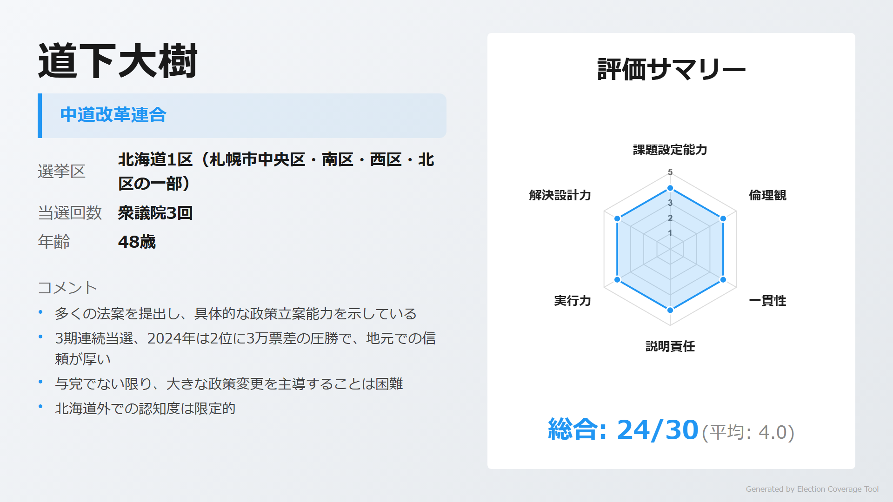

> 🐰 **ウサギ**: 「議員立法の実績が豊富で、子どもの貧困対策や介護従事者支援など社会的弱者に寄り添う政策を推進。3期連続当選の安定した選挙基盤も強み」

> 🐱 **ネコ**: 「野党議員である限り、大きな政策変更を主導することは困難。全国的な知名度も低く、経済・産業政策への発言は少ない」

#### 臼木秀剛（国民民主党）

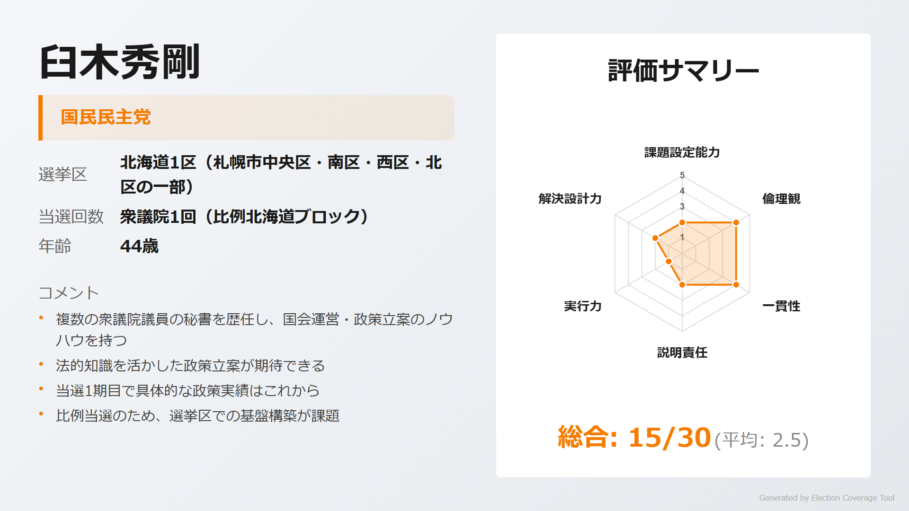

> 🐰 **ウサギ**: 「複数の衆議院議員秘書を歴任し国会運営のノウハウを熟知。法務博士の学位を持ち、国民民主党道連代表として北海道の党の顔を担う」

> 🐱 **ネコ**: 「2024年比例当選したばかりで議員としての実績はこれから。小選挙区での選挙基盤構築が課題で、知名度も低い」

#### 加藤貴弘（自由民主党）

> 🐰 **ウサギ**: 「道議3期の経験で地域課題を把握。41歳と若く民間経営者としての経験もあり、児童養護施設支援など社会貢献活動にも熱心」

> 🐱 **ネコ**: 「2024年選挙で道下氏に3万票差で敗北。国政経験がなく、政策の独自性も見えにくい。準備期間が短かった影響も」

#### 加納千津子（参政党）

> 🐰 **ウサギ**: 「参政党の組織的支援のもと、既存政党への批判票の受け皿として立候補」

> 🐱 **ネコ**: 「政治経験がなく、情報公開も限定的。独自の政策や実績が見えない」

#### 森英士（日本共産党）

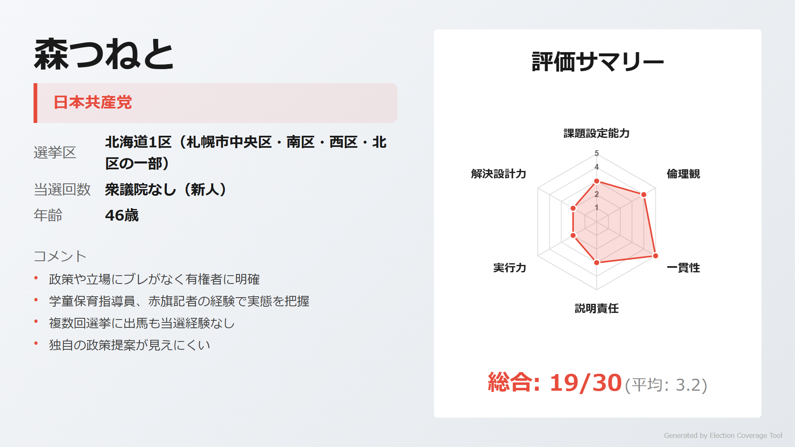

> 🐰 **ウサギ**: 「共産党の一貫した政策路線のもと、護憲・反戦・格差是正を訴える」

> 🐱 **ネコ**: 「政治経験がなく、知名度も限定的。独自の政策実績はない」

---

## 2区

### 注目ポイント

- **松木謙公の牙城**: 中道改革連合の松木氏が4期目を狙う。前回は維新候補との激戦を制した
- **5党混戦**: 中道改革連合、自民党、維新、参政党、共産党の5候補が激突

### 候補者

#### 松木謙公（中道改革連合）

> 🐰 **ウサギ**: 「衆議院7期当選の豊富な経験。農水政務官、衆院委員長職など行政・国会運営の知見がある。選挙に強い」

> 🐱 **ネコ**: 「8回以上の政党移籍は日本政界でも異例。政策よりも政局・人間関係で動いてきた印象が拭えない」

#### 髙橋祐介（自由民主党）

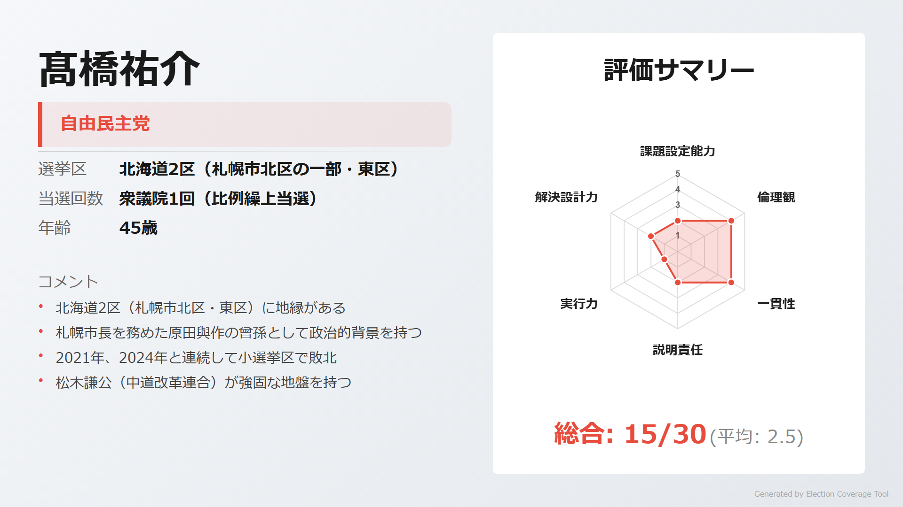

> 🐰 **ウサギ**: 「札幌出身で元市長の血筋。2021年から一貫して2区支部長として挑戦を続ける粘り強さ」

> 🐱 **ネコ**: 「2021年・2024年と連続して小選挙区で敗北。松木氏の壁が厚く、国会での実績もほぼない」

#### 山崎泉（日本維新の会）

> 🐰 **ウサギ**: 「市議2期・道議2期の地方議員経験。学習塾関係の経歴から教育問題に理解。維新の北海道拡大を担う」

> 🐱 **ネコ**: 「国政での当選実績なし。北海道は維新の弱い地域で、2024年も得票率13.6%にとどまった」

#### 中田綾子（参政党）

> 🐰 **ウサギ**: 「放課後児童支援員として現場で働く市民からの挑戦。参政党の組織的支援を受ける」

> 🐱 **ネコ**: 「政治経験がなく知名度も限定的。政策の詳細な説明は確認できない」

#### 平岡大介（日本共産党）

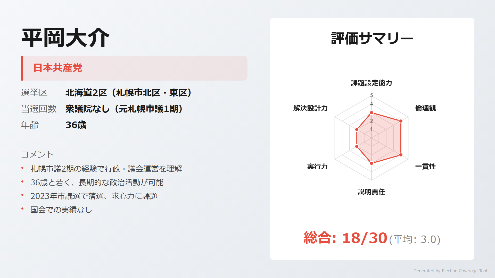

> 🐰 **ウサギ**: 「共産党の一貫した政策路線のもと、護憲・平和・格差是正を訴える」

> 🐱 **ネコ**: 「政治経験がなく、知名度も限定的。独自の政策実績はない」

---

## 3区

### 注目ポイント

- **荒井優vs高木宏壽の再戦**: 2024年選挙で接戦を制した荒井氏と、返り咲きを狙う元職の高木氏が再び激突
- **白石区・清田区・豊平区の混戦区**: 札幌市南部の票をめぐる攻防

### 候補者

#### 荒井優（中道改革連合）

> 🐰 **ウサギ**: 「高校校長・学園理事長の経験から教育改革に強み。リクルート・ソフトバンクでの民間経験も。当選1回で代表質問に立つ実行力」

> 🐱 **ネコ**: 「父が元衆議院議員で世襲批判のリスク。教育以外の政策分野での専門性は未知数」

#### 高木宏壽（自由民主党）

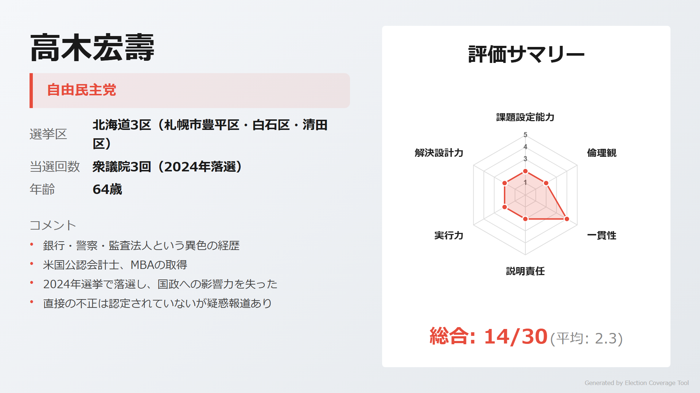

> 🐰 **ウサギ**: 「銀行・警察・監査法人という多彩な経歴。米国公認会計士・MBA。復興副大臣として行政経験あり」

> 🐱 **ネコ**: 「2024年選挙で落選し影響力低下。IR汚職事件との関連報道もあり、政策実現の成果も見えにくい」

#### 中島良樹（参政党）

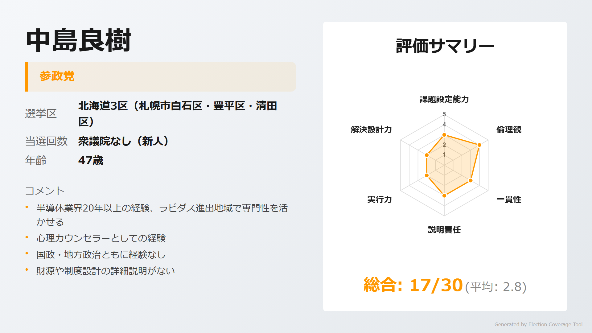

> 🐰 **ウサギ**: 「参政党の組織的支援のもと、既存政党への批判票の受け皿として立候補」

> 🐱 **ネコ**: 「政治経験がなく、知名度も限定的。独自の政策実績はない」

#### 円子裕子（日本共産党）

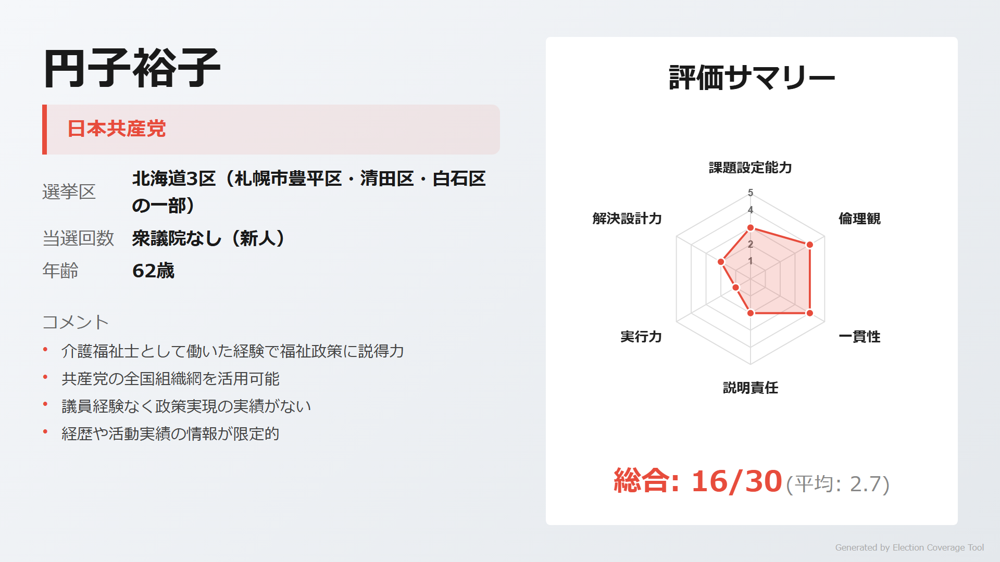

> 🐰 **ウサギ**: 「共産党の一貫した政策路線のもと、護憲・平和・格差是正を訴える」

> 🐱 **ネコ**: 「政治経験がなく、知名度も限定的。独自の政策実績はない」

---

## 4区

### 注目ポイント

- **大築紅葉vs中村裕之の現職対決**: 2024年選挙で中村氏を破った大築氏と、巻き返しを狙う中村氏の再戦
- **手稲区・小樽・後志管内**: 札幌西部から小樽、ニセコエリアまでの広域選挙区

### 候補者

#### 大築紅葉（中道改革連合）

> 🐰 **ウサギ**: 「13年間の政治記者経験で政治の仕組みを熟知。2024年は7000票差で小選挙区初勝利。当選1回で代表質問に立つ発信力」

> 🐱 **ネコ**: 「政策設計力は発展途上。2024年勝利は対立候補の裏金問題による面が大きい」

#### 中村裕之（自由民主党）

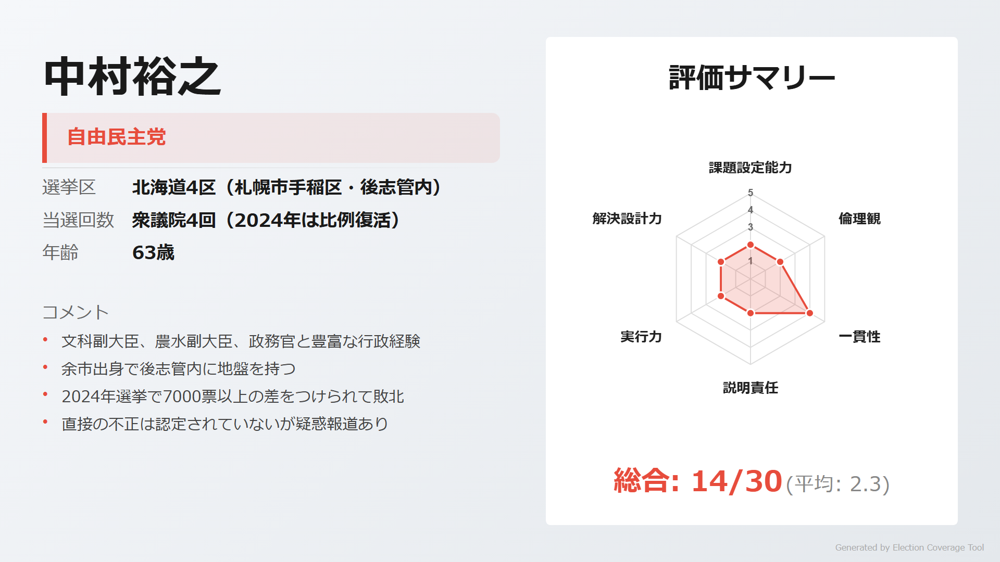

> 🐰 **ウサギ**: 「文科副大臣・農水副大臣など豊富な行政経験。余市出身で後志管内に地盤。PTA会長経験から教育政策に理解」

> 🐱 **ネコ**: 「2024年選挙で7000票差の敗北。IR汚職事件との関連報道もあり、裏金問題の影響を直接受けた」

#### 高橋翔太（参政党）

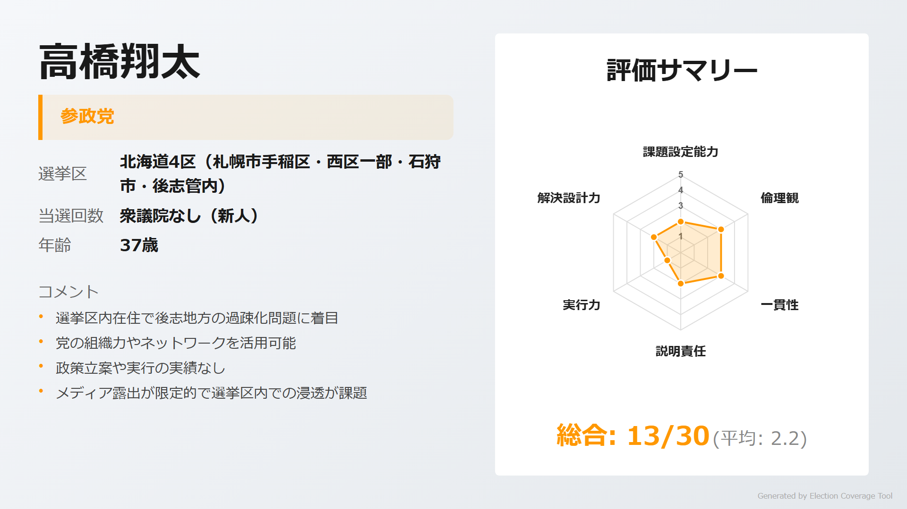

> 🐰 **ウサギ**: 「参政党の組織的支援のもと、既存政党への批判票の受け皿として立候補」

> 🐱 **ネコ**: 「政治経験がなく、知名度も限定的。独自の政策実績はない」

#### 佐々木明美（日本共産党）

> 🐰 **ウサギ**: 「共産党の一貫した政策路線のもと、護憲・平和・格差是正を訴える」

> 🐱 **ネコ**: 「政治経験がなく、知名度も限定的。独自の政策実績はない」

---

## 5区

### 注目ポイント

- **池田真紀vs和田義明の一騎打ち**: 2024年選挙で和田氏に勝利した池田氏と、返り咲きを狙う和田氏が再び対決
- **石狩・千歳・恵庭エリア**: 新千歳空港を抱える経済拠点の選挙区

### 候補者

#### 池田真紀（中道改革連合）

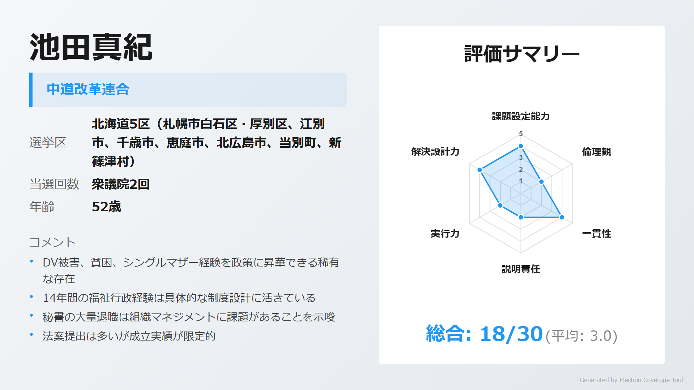

> 🐰 **ウサギ**: 「福祉現場20年の経験、DV被害・シングルマザー経験を政策に昇華。1期目で14本の法案提出。落選後も毎日街頭活動を続けた粘り強さ」

> 🐱 **ネコ**: 「2019年に秘書パワハラ疑惑が報道され、2年で約10人退職。批判への説明が曖昧で透明性に課題」

#### 和田義明（自由民主党）

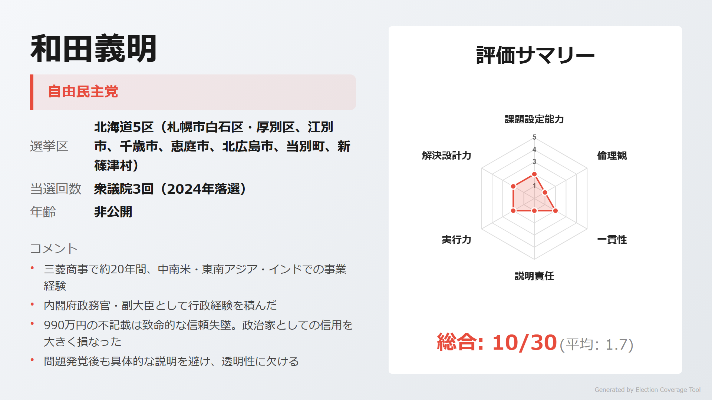

> 🐰 **ウサギ**: 「三菱商事で20年の国際ビジネス経験。内閣府副大臣として行政経験あり」

> 🐱 **ネコ**: 「990万円の裏金問題で副大臣辞任。比例重複も認められず2024年選挙で落選。説明責任を果たしていない」

---

## 6区

### 注目ポイント

- **東国幹vs西川将人の激戦区**: 2024年選挙で約4000票差で勝利した東氏に、元旭川市長の西川氏が挑む
- **旭川市・上川管内**: 北海道第二の都市・旭川を中心とした選挙区

### 候補者

#### 東国幹（自由民主党）

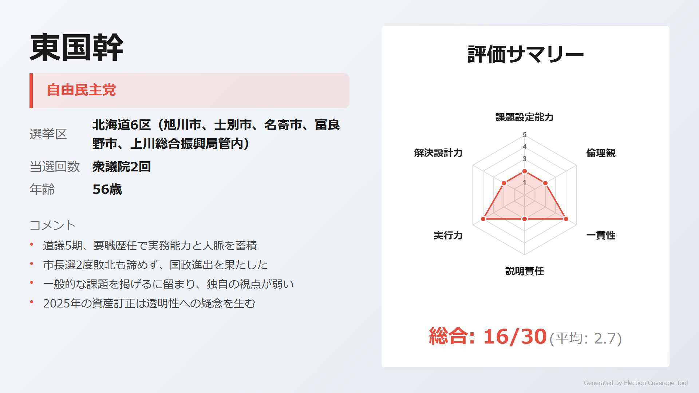

> 🐰 **ウサギ**: 「道議5期の長い経験と地域密着の活動。市長選2度敗北も粘り強く国政進出。財務大臣政務官として政策実現の立場に」

> 🐱 **ネコ**: 「2025年に資産訂正問題が発覚。政策の独自性に乏しく、旧安倍派との関係も注視が必要」

#### 西川将人（中道改革連合）

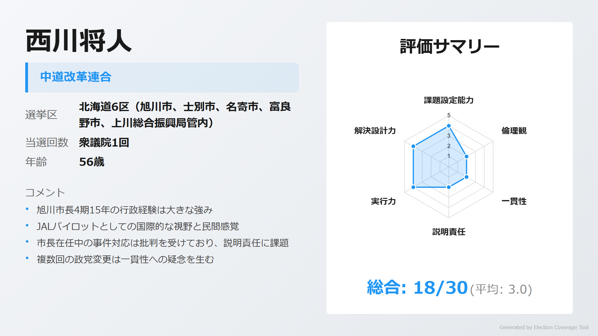

> 🐰 **ウサギ**: 「旭川市長4期15年の豊富な行政経験。JALパイロット出身で国際的視野も。地域課題を熟知」

> 🐱 **ネコ**: 「旭川いじめ凍死事件の渦中で国政転身し『責任放棄』との批判。政党移動も多く一貫性に疑問」

#### 荻生和敏（日本共産党）

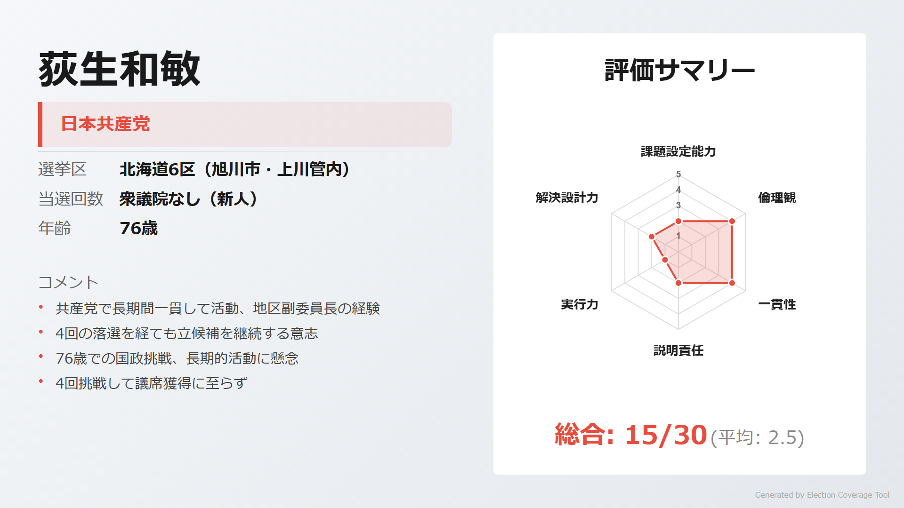

> 🐰 **ウサギ**: 「共産党の一貫した政策路線のもと、護憲・平和・格差是正を訴える」

> 🐱 **ネコ**: 「政治経験がなく、知名度も限定的。独自の政策実績はない」

---

## 7区

### 注目ポイント

- **鈴木貴子vs篠田奈保子の一騎打ち**: 現職の鈴木氏と中道改革連合の篠田氏が対決
- **釧路・根室エリア**: 北海道東部の広大な選挙区

### 候補者

#### 鈴木貴子（自由民主党）

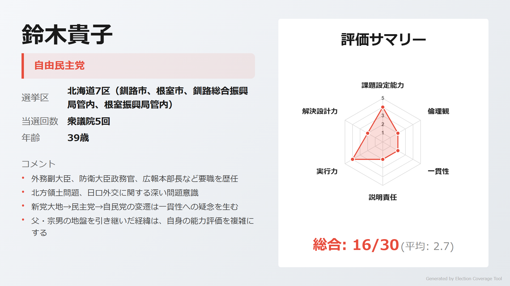

> 🐰 **ウサギ**: 「衆院5期、外務副大臣・広報本部長など要職歴任。北方領土・日ロ外交に深い知見。39歳で4児の母として女性の政治参画を体現」

> 🐱 **ネコ**: 「新党大地→民主党→自民党と政党移動。父・宗男の汚職事件の影響も残り、世襲批判のリスクあり」

#### 篠田奈保子（中道改革連合）

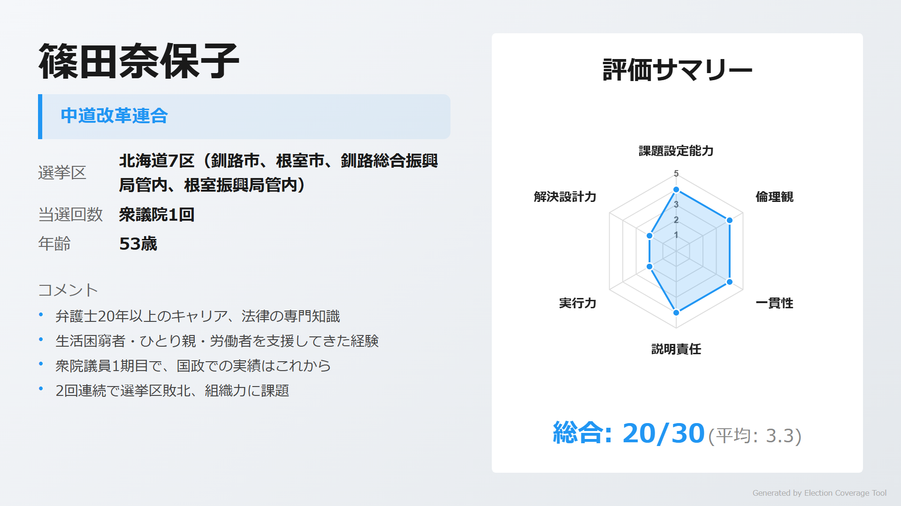

> 🐰 **ウサギ**: 「弁護士20年以上のキャリア。生活困窮者・ひとり親・労働者を支援してきた現場感覚。4児の母で子育て当事者」

> 🐱 **ネコ**: 「国政1期目で実績はこれから。2回連続で選挙区敗北し組織力に課題」

---

## 8区

### 注目ポイント

- **逢坂誠二vs向山淳の再戦**: 2024年選挙で逢坂氏が勝利。函館を中心とした南渡島エリア
- **ベテランvs若手の構図**: 65歳6期の逢坂氏と41歳1期の向山氏が対決

### 候補者

#### 逢坂誠二（中道改革連合）

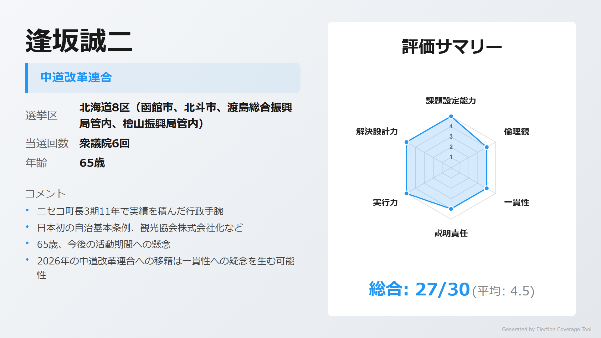

> 🐰 **ウサギ**: 「ニセコ町長3期で日本初の自治基本条例制定など先駆的改革。衆院6期、代表代行・選挙対策委員長など党の要職を歴任。討論番組での論客として発信力も」

> 🐱 **ネコ**: 「65歳で今後の活動期間に懸念。国政では町長時代ほどの目に見える成果は限定的」

#### 向山淳（自由民主党）

> 🐰 **ウサギ**: 「ハーバード公共政策大学院修了の政策専門家。三菱商事13年の国際ビジネス経験。41歳の女性政治家として多様性の象徴」

> 🐱 **ネコ**: 「国会議員1期目で選挙区敗北。埼玉出身で地域基盤が弱く、政策実現の実績はこれから」

---

## 9区

### 注目ポイント

- **山岡達丸の連続当選なるか**: 2024年選挙で自民候補を破った山岡氏。今回は自民が新人を擁立
- **胆振・日高エリア**: 室蘭・苫小牧から日高管内まで広がる工業・酪農地帯

### 候補者

#### 山岡達丸（中道改革連合）

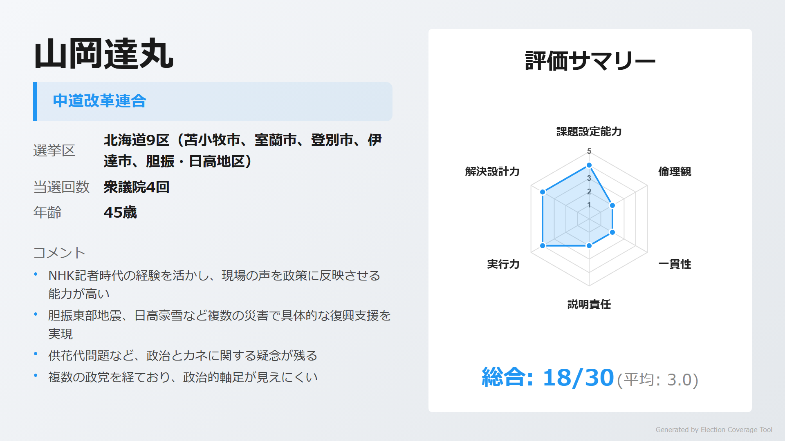

> 🐰 **ウサギ**: 「NHK記者出身で地域課題の発掘力が高い。胆振東部地震や日高豪雪で復興支援を実現し、コロナ禍では3000件以上の相談を受けた経済被害相談ダイヤルを設置」

> 🐱 **ネコ**: 「2024年に供花代問題が発覚し公選法違反の可能性を指摘される。政党遍歴も民主→希望→国民→立憲と多く、憲法観も変遷。説明責任に課題」

#### 松下英樹（自由民主党）

> 🐰 **ウサギ**: 「35歳と若く、慶應大卒でコンサル会社経営の経験あり。堀井学前議員の公選法違反後の逆風の中、クリーンな候補として挑戦」

> 🐱 **ネコ**: 「政治経験なしの完全新人で2024年選挙で落選。東京からの転身で地元との結びつきが弱く、政策実績もない」

#### 菅野望帆（参政党）

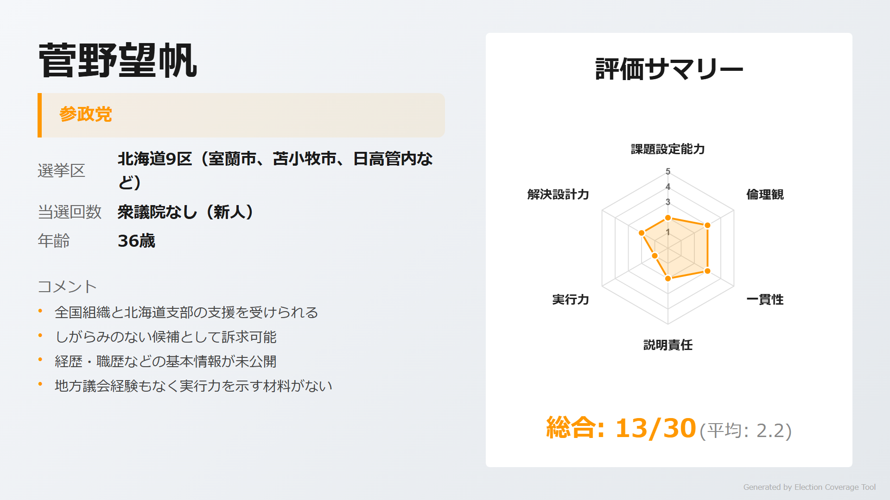

> 🐰 **ウサギ**: 「参政党の組織的支援のもと、既存政党への批判票の受け皿として立候補」

> 🐱 **ネコ**: 「政治経験がなく、知名度も限定的。独自の政策実績はない」

#### 立野広志（日本共産党）

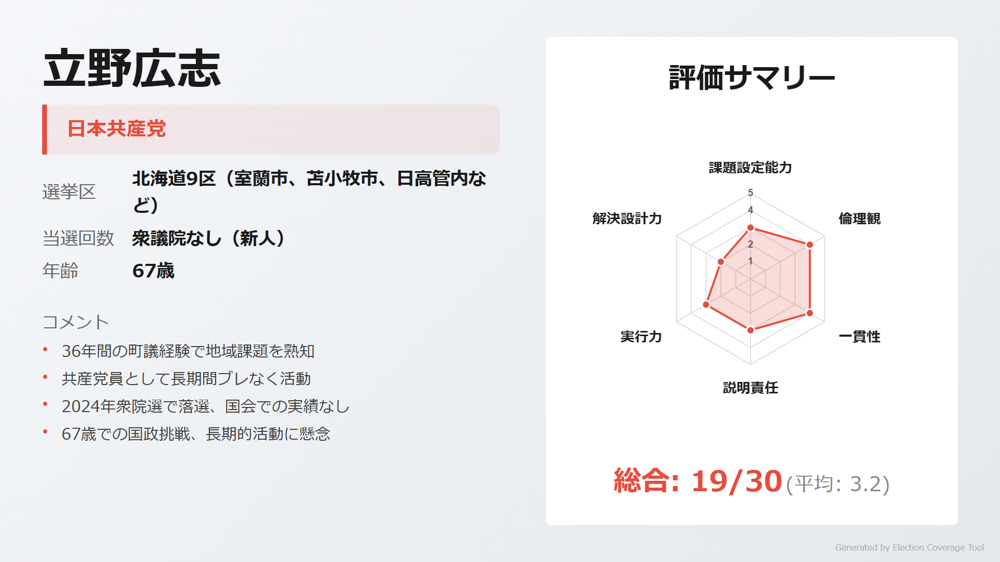

> 🐰 **ウサギ**: 「共産党の一貫した政策路線のもと、護憲・平和・格差是正を訴える」

> 🐱 **ネコ**: 「政治経験がなく、知名度も限定的。独自の政策実績はない」

---

## 10区

### 注目ポイント

- **神谷裕vs渡邊孝一の再戦**: 2024年選挙で神谷氏が勝利。留萌・稚内など日本海側の広大な選挙区
- **旧渡邊地盤での攻防**: 渡邊孝一氏は2021年まで4期連続当選の実績を持つ

### 候補者

#### 神谷裕（中道改革連合）

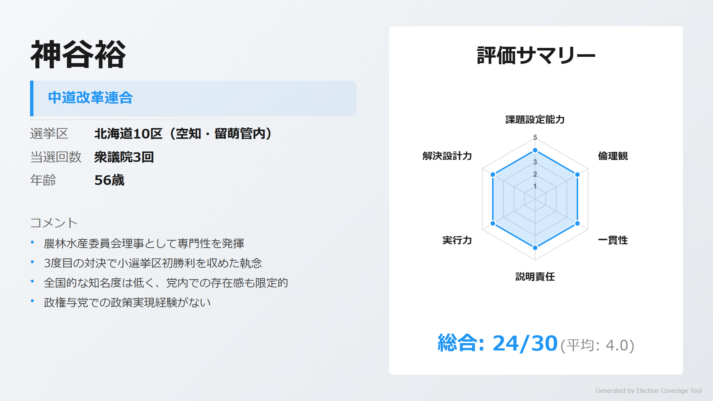

> 🐰 **ウサギ**: 「農林水産委員会理事として農政のスペシャリスト。3度目の対決で2024年に小選挙区初勝利。1次産業振興に明確なビジョンを持ち、粘り強い政治活動を続ける」

> 🐱 **ネコ**: 「全国的な知名度は低く、野党議員として政策実現には限界がある。政権与党での経験がない」

#### 渡邊孝一（自由民主党）

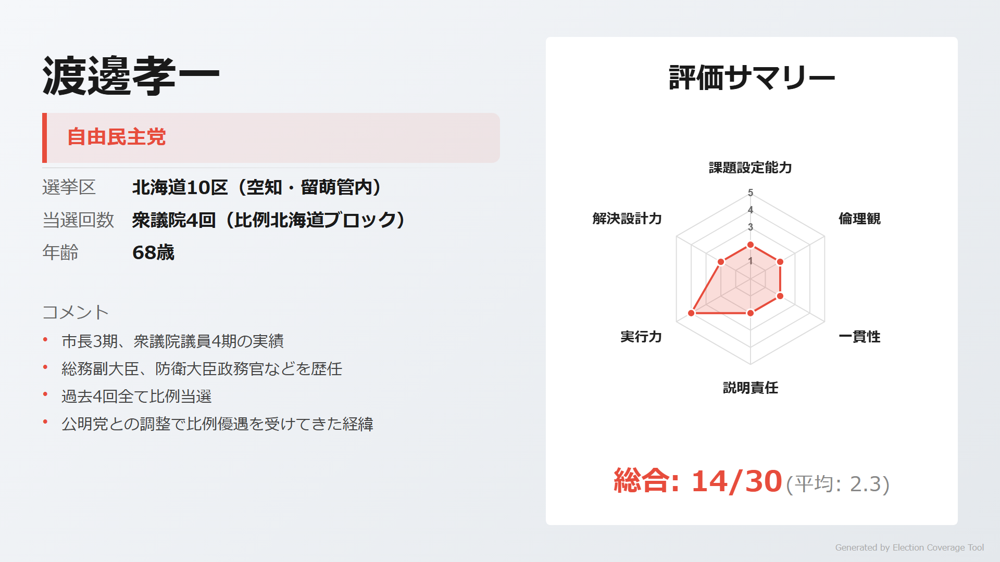

> 🐰 **ウサギ**: 「岩見沢市長3期・衆院4期の豊富な経験。総務副大臣・防衛大臣政務官など政府役職を歴任。地元での知名度は高い」

> 🐱 **ネコ**: 「過去4回全て比例当選で小選挙区での勝利実績なし。68歳と高齢で、2024年選挙では比例優遇なしで落選」

---

## 11区

### 注目ポイント

- **石川香織vs中川紘一の対決**: 2024年選挙で石川氏が圧勝。帯広・十勝エリアの広大な農業地帯
- **自民新人の参入**: 前職の石川氏に対し、自民党は新人の中川氏を擁立

### 候補者

#### 石川香織（中道改革連合）

> 🐰 **ウサギ**: 「アナウンサー出身で発信力抜群。3期連続当選で十勝に強固な地盤を築く。農業振興・ジェンダー平等・緊急避妊薬アクセス改善など明確な政策軸を持つ」

> 🐱 **ネコ**: 「野党経験のみで政策実現には限界がある。夫・石川知裕の地盤を引き継いだ世襲的要素も」

#### 中川紘一（自由民主党）

> 🐰 **ウサギ**: 「中川昭一元財務大臣の甥で『中川王国』の血筋。35歳と若く、十勝での中川家の伝統的支持基盤を引き継ぐ期待」

> 🐱 **ネコ**: 「政治経験なしの完全新人。東京からの転身で地元定着が課題。現職の石川香織は手強い相手」

#### 宇都隆史（参政党）

> 🐰 **ウサギ**: 「参院2期・外務副大臣・外交防衛委員長と豊富な政治経験。自衛官出身で安全保障政策に精通。松下政経塾出身で政策立案の基礎がある」

> 🐱 **ネコ**: 「自民党→参政党への移籍で一貫性に疑問。北海道11区（十勝）との地縁がなく、2022年参院選では落選」

---

## 12区

### 注目ポイント

- **武部新の牙城**: 父・武部勤の地盤を継ぎ、5期連続当選中の武部氏。北海道で最も広い選挙区
- **自民党の議席維持なるか**: オホーツク・北見・紋別など農林水産業が盛んな地域

### 候補者

#### 武部新（自由民主党）

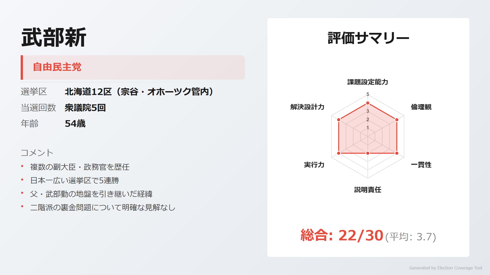

> 🐰 **ウサギ**: 「5期連続当選、文科副大臣・農水副大臣など豊富な実務経験。シカゴ大学公共政策大学院修了で政策分析力も。日本一広い選挙区で安定した支持基盤を持つ」

> 🐱 **ネコ**: 「父・武部勤の地盤を継いだ世襲議員。旧二階派所属だが裏金問題への見解表明がなく、説明責任に課題」

#### 川原田英世（中道改革連合）

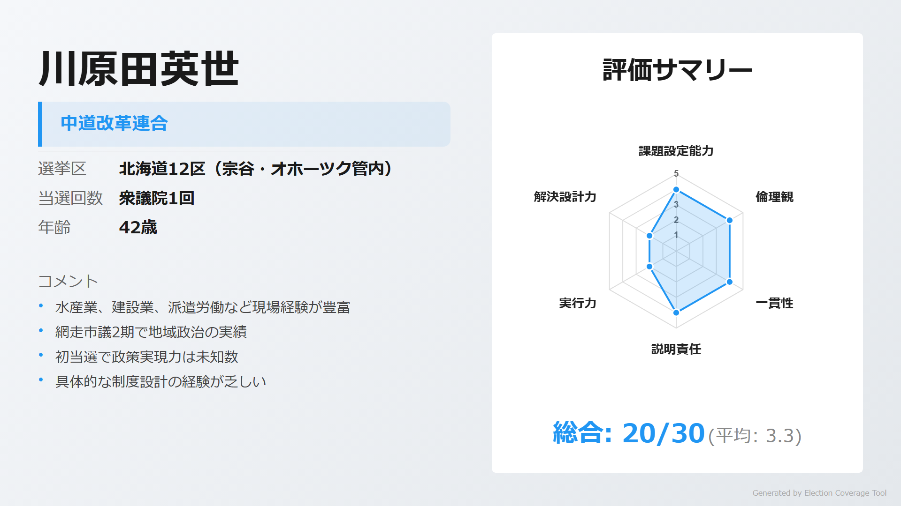

> 🐰 **ウサギ**: 「水産業・建設業・派遣労働など多様な現場経験が強み。網走市議2期を経て2024年比例復活で初当選。1次産業振興を軸に働く人の視点で政策を語る」

> 🐱 **ネコ**: 「国政経験は乏しく、具体的な政策設計力は未知数。小選挙区では武部新に敗北しており、選挙基盤の強化が課題」

---

## 情報ソース

- 各候補者の公式サイト・SNS
- 選挙ドットコム
- 日本経済新聞選挙データベース
- 北海道新聞
- NHK選挙WEB

> この記事は2026年1月時点の情報に基づいています。候補者情報は随時更新される可能性があります。
