# 衆議院選挙 青森県

> 第51回衆議院議員総選挙（2026年2月8日投開票）

## 青森県の注目ポイント

- **38年続いた「木村王国」崩壊**: 3区で木村次郎が裏金・パワハラ問題で落選、岡田華子が青森3区初の非自民当選者に
- **野党分裂の構図**: 中道改革連合、国民民主党、共産党、れいわが乱立し、自民党に有利な展開
- **世代交代の波**: 1区・津島淳（58歳）、2区・神田潤一（54歳）と自民ベテラン・中堅が議席を守れるか

## 目次

- [1区](#1区)
- [2区](#2区)
- [3区](#3区)

---

## 1区

### 注目ポイント

- **自民vs野党乱立**: 津島淳（自民・5期）に対し、升田世喜男（中道改革連合）、斎藤美緒（共産）、加藤勉（参政）が挑戦
- **太宰治の孫**: 津島淳は作家・太宰治を祖父に持つ名門出身、父も元衆院議員

### 候補者

#### 津島淳（自由民主党）

<!-- NOTE: 1区 候補者1 画像 -->
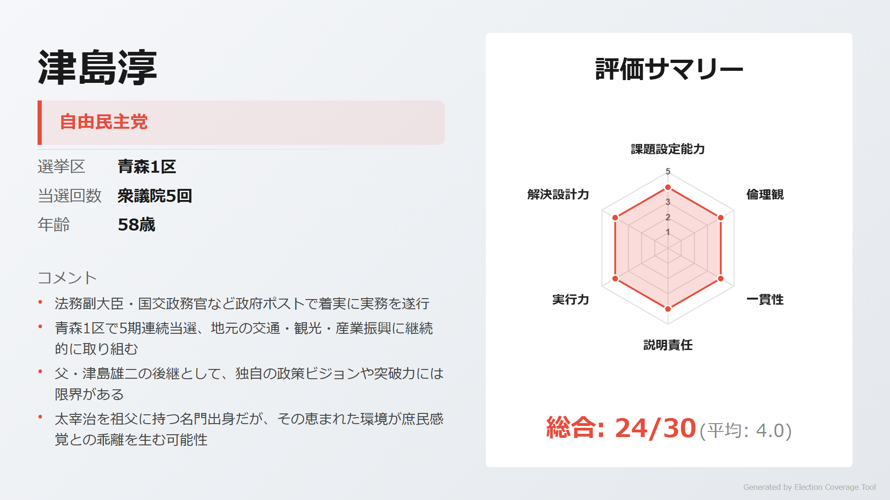

> **ウサギ**: 「法務副大臣・国交政務官を歴任し、安定した政策実行力を持つベテラン。地域公共交通の再構築にも取り組んでいるよ」

> **ネコ**: 「世襲議員で独自色に欠ける。太宰治の孫という恵まれた環境が庶民感覚との乖離を生んでいないかな」

[詳細を見る](https://github.com/estela-works/poliscore2026-/blob/main/result/02_青森県/01区/津島淳.md)

#### 升田世喜男（中道改革連合）

<!-- NOTE: 1区 候補者2 画像 -->
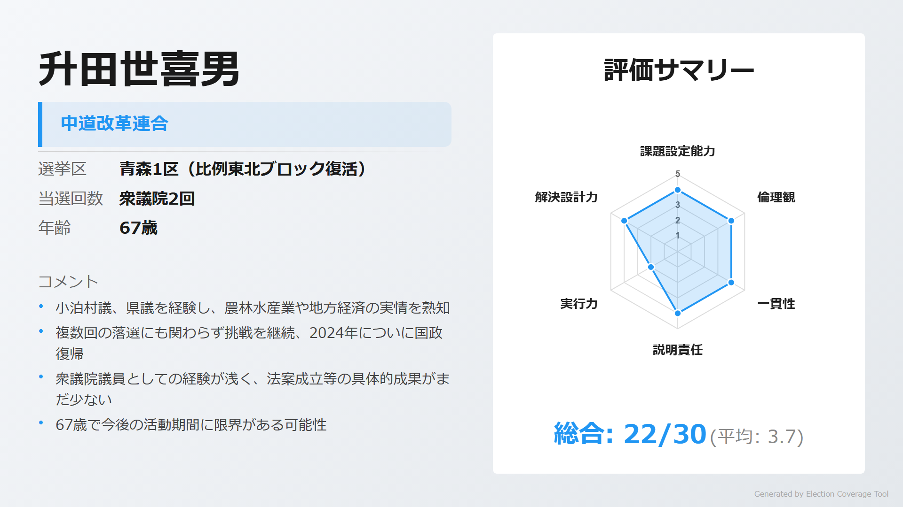

> **ウサギ**: 「村議・県議から国政へ、地方の課題を熟知した政治家。農業戸別所得補償など具体的な数値目標を含む政策を提案しているよ」

> **ネコ**: 「複数回の落選で国政実績が乏しい。67歳という年齢もあり、今後の活動期間に限界があるかも」

[詳細を見る](https://github.com/estela-works/poliscore2026-/blob/main/result/02_青森県/01区/升田世喜男.md)

#### 斎藤美緒（日本共産党）

<!-- NOTE: 1区 候補者3 画像 -->
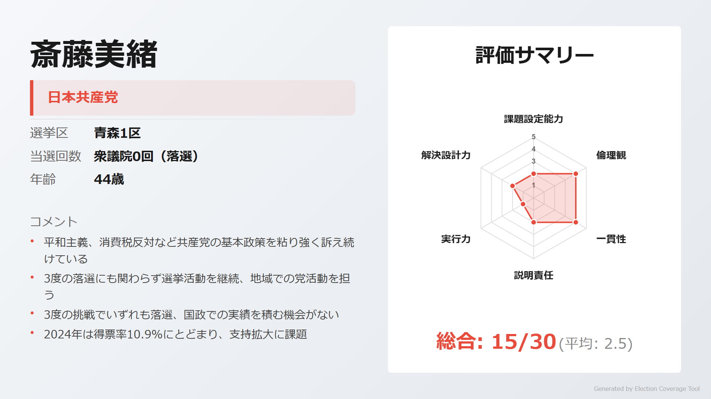

> **ウサギ**: 「平和主義・消費税反対を一貫して訴え続ける姿勢は評価できる。政治資金問題もなくクリーンなイメージ」

> **ネコ**: 「3度の挑戦でいずれも落選、得票率10.9%と支持拡大に課題。党の代弁者にとどまり独自性が見えにくい」

[詳細を見る](https://github.com/estela-works/poliscore2026-/blob/main/result/02_青森県/01区/斎藤美緒.md)

#### 加藤勉（参政党）

<!-- NOTE: 1区 候補者4 画像 -->
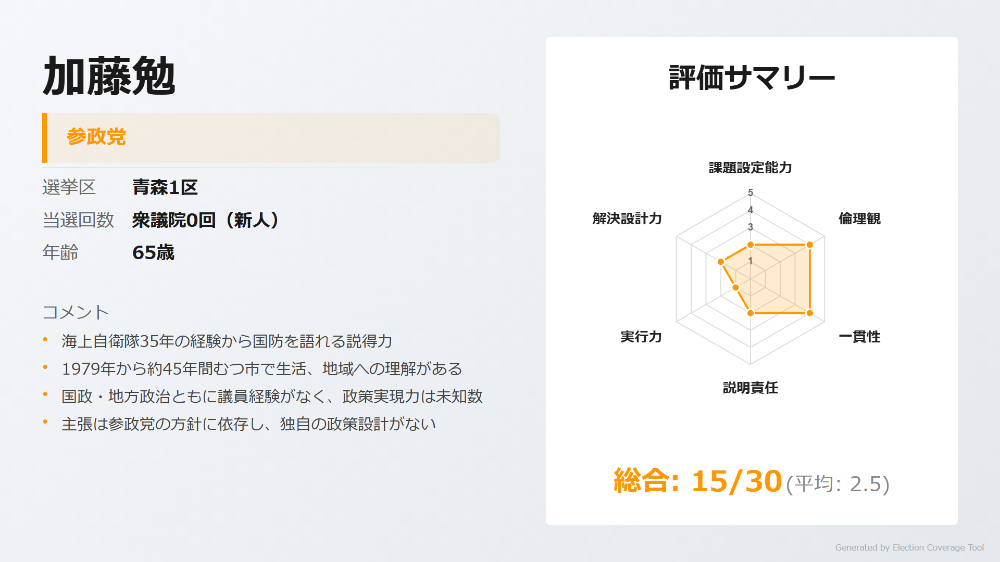

> **ウサギ**: 「新しい政治勢力として参政党から挑戦。既存政党とは異なる視点を持ち込む可能性がある」

> **ネコ**: 「公開情報が極めて限定的で、政策や経歴の詳細が不明。有権者が判断する材料が不足している」

[詳細を見る](https://github.com/estela-works/poliscore2026-/blob/main/result/02_青森県/01区/加藤勉.md)

---

## 2区

### 注目ポイント

- **金融エリートvs若手挑戦者**: 日銀・フィンテック出身の神田潤一（自民）に、36歳の金濱亨（国民民主）らが挑戦
- **政治資金問題**: 神田潤一に100万円の記載漏れ、旧統一教会への祝電問題も

### 候補者

#### 神田潤一（自由民主党）

<!-- NOTE: 2区 候補者1 画像 -->
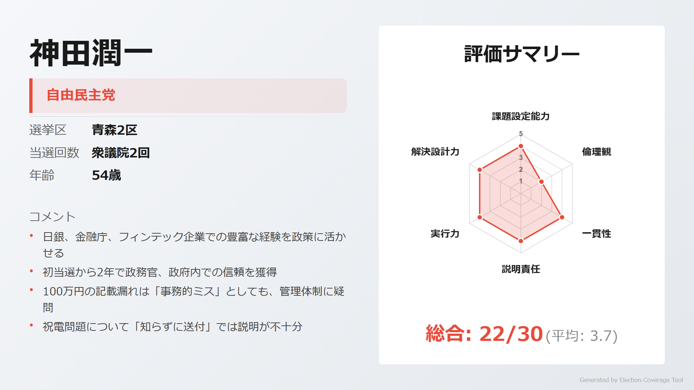

> **ウサギ**: 「日銀・金融庁・フィンテック企業での豊富な経験を持つ金融の専門家。初当選から2年で政務官に抜擢された実力派」

> **ネコ**: 「100万円の政治資金記載漏れ、旧統一教会への祝電問題と、透明性に疑問符がつく。管理体制に課題あり」

[詳細を見る](https://github.com/estela-works/poliscore2026-/blob/main/result/02_青森県/02区/神田潤一.md)

#### 金濱亨（国民民主党）

<!-- NOTE: 2区 候補者2 画像 -->
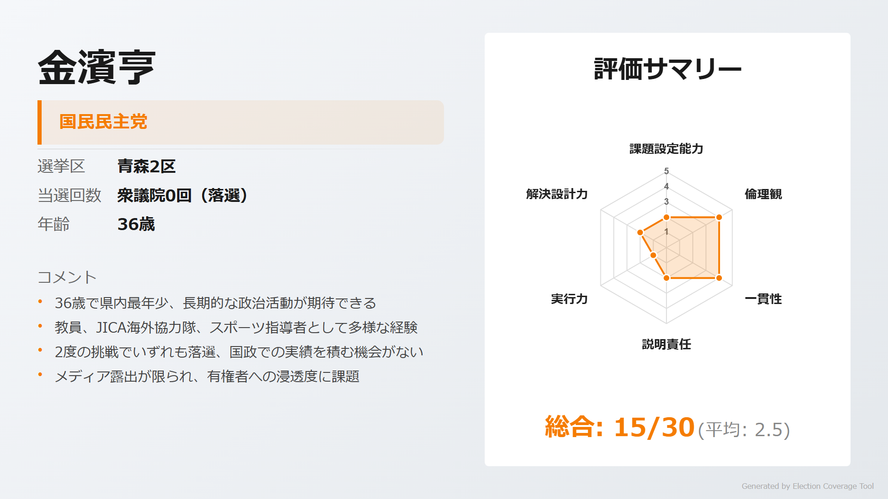

> **ウサギ**: 「36歳の最年少候補。教員・JICA海外協力隊・スポーツ指導者と多様な経験を持ち、クリーンなイメージ」

> **ネコ**: 「2度の挑戦でいずれも落選、知名度不足が課題。国民民主党の政策を踏襲する形で独自性が見えにくい」

[詳細を見る](https://github.com/estela-works/poliscore2026-/blob/main/result/02_青森県/02区/金濱亨.md)

#### 松尾和彦（中道改革連合）

<!-- NOTE: 2区 候補者3 画像 -->
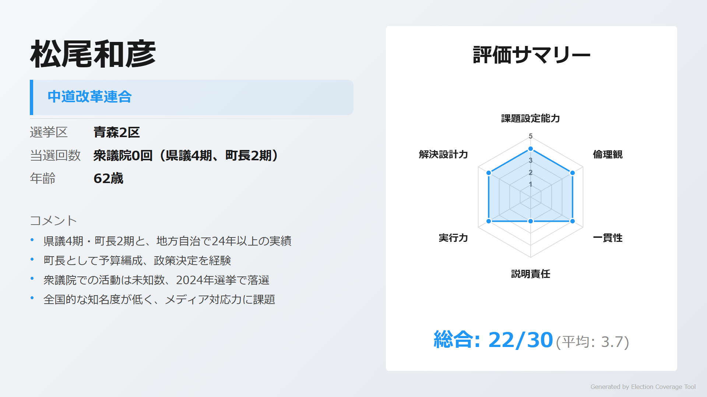

> **ウサギ**: 「前三戸町長として地方自治の経験を持つ。地元の課題を理解した候補者」

> **ネコ**: 「公開情報が極めて限定的で、国政での政策や具体的なビジョンが不明」

[詳細を見る](https://github.com/estela-works/poliscore2026-/blob/main/result/02_青森県/02区/松尾和彦.md)

#### 久保将（日本共産党）

<!-- NOTE: 2区 候補者4 画像 -->
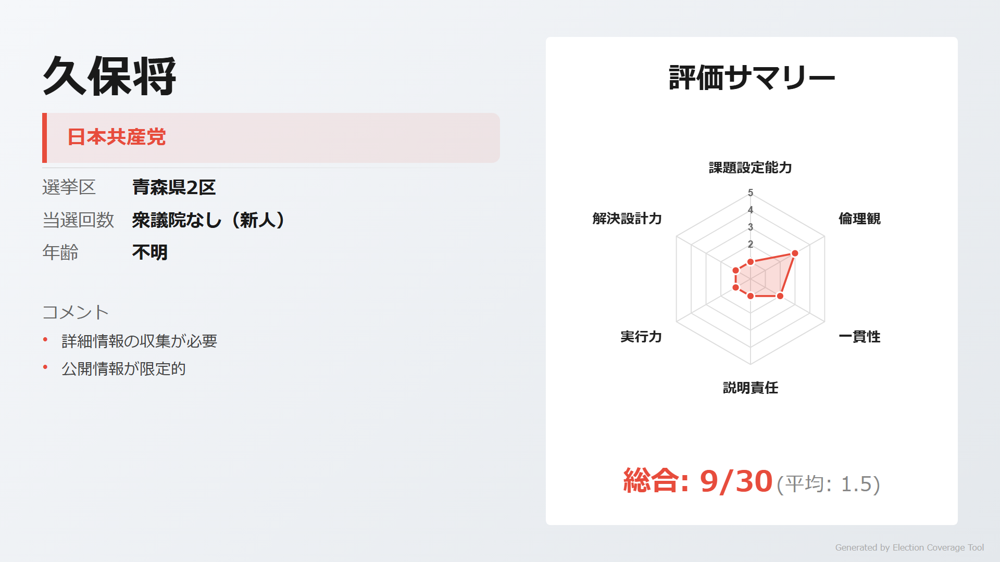

> **ウサギ**: 「共産党から新人として挑戦。護憲・平和の立場から政策を訴える」

> **ネコ**: 「公開情報が極めて限定的で、経歴や具体的な政策の詳細が不明」

[詳細を見る](https://github.com/estela-works/poliscore2026-/blob/main/result/02_青森県/02区/久保将.md)

---

## 3区

### 注目ポイント

- **「木村王国」の行方**: 前回落選した木村次郎（自民）が再挑戦するか注目。裏金236万円・パワハラ問題で大きく信頼を失った
- **歴史的勝利の継続**: 岡田華子が青森3区初の非自民当選者、県内初の小選挙区選出女性議員として議席を守れるか

### 候補者

#### 木村次郎（自由民主党）

<!-- NOTE: 3区 候補者1 画像 -->
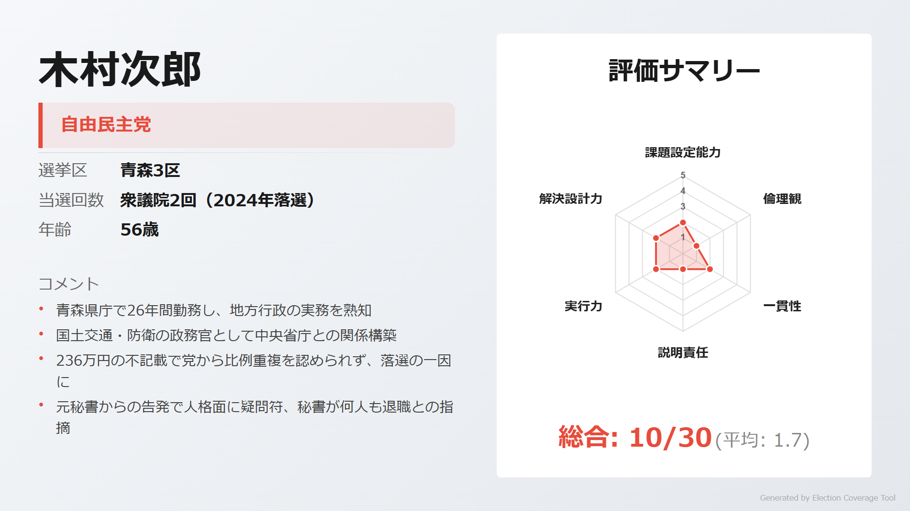

> **ウサギ**: 「県庁で26年間の行政経験、国交・防衛の政務官も歴任。行政実務の知識は豊富」

> **ネコ**: 「236万円の裏金問題、元秘書からのパワハラ告発と問題が山積。政倫審への出席も拒否し説明責任を果たしていない」

[詳細を見る](https://github.com/estela-works/poliscore2026-/blob/main/result/02_青森県/03区/木村次郎.md)

#### 岡田華子（中道改革連合）

<!-- NOTE: 3区 候補者2 画像 -->
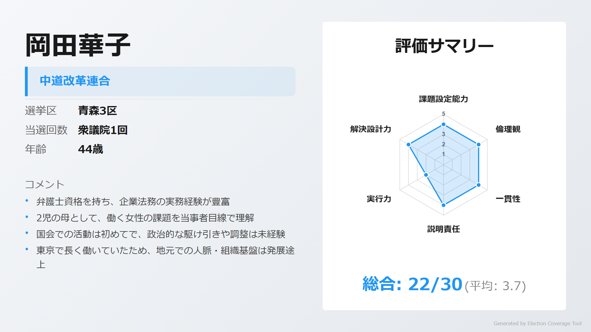

> **ウサギ**: 「弁護士資格を持つ企業法務の専門家。2児の母として働く女性の課題を当事者目線で理解している」

> **ネコ**: 「政治経験ゼロで初当選したばかり。地元基盤が弱く、政治的な調整力は未知数」

[詳細を見る](https://github.com/estela-works/poliscore2026-/blob/main/result/02_青森県/03区/岡田華子.md)

#### 佐原若子（れいわ新選組）

<!-- NOTE: 3区 候補者3 画像 -->
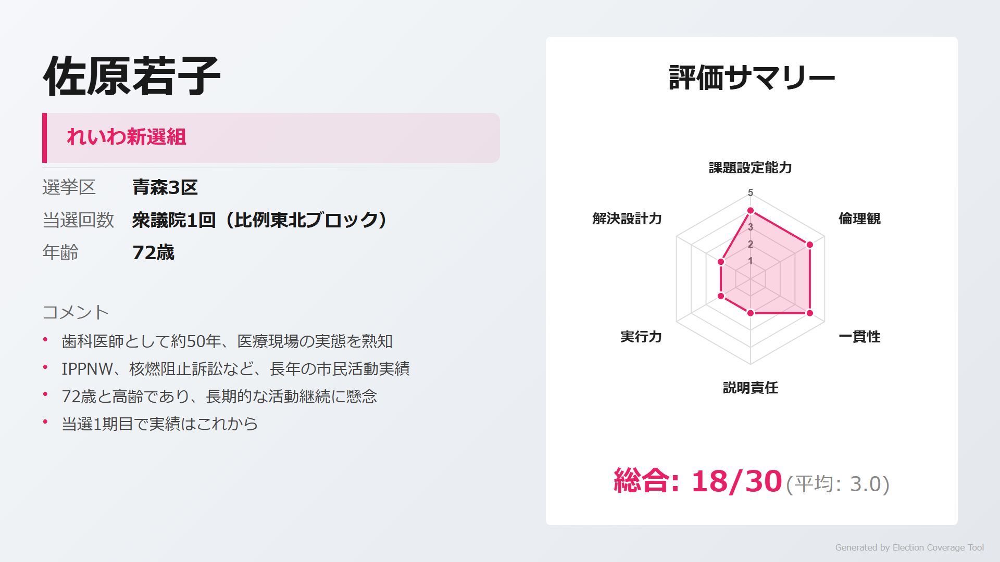

> **ウサギ**: 「比例現職として国会での活動実績がある。れいわ新選組の政策を青森に届ける役割」

> **ネコ**: 「72歳と高齢で、公開情報が限定的。具体的な政策や経歴の詳細が不明」

[詳細を見る](https://github.com/estela-works/poliscore2026-/blob/main/result/02_青森県/03区/佐原若子.md)

---

## 情報ソース

本記事の評価データは以下のリポジトリで公開しています。評価基準・根拠の詳細をご確認いただけます。

**GitHub**: [poliscore2026-](https://github.com/estela-works/poliscore2026-)

- 評価基準: [`data/politician_evaluation_criteria.md`](https://github.com/estela-works/poliscore2026-/blob/main/data/politician_evaluation_criteria.md)
- 各候補者の評価詳細: [`result/`](https://github.com/estela-works/poliscore2026-/tree/main/result)
