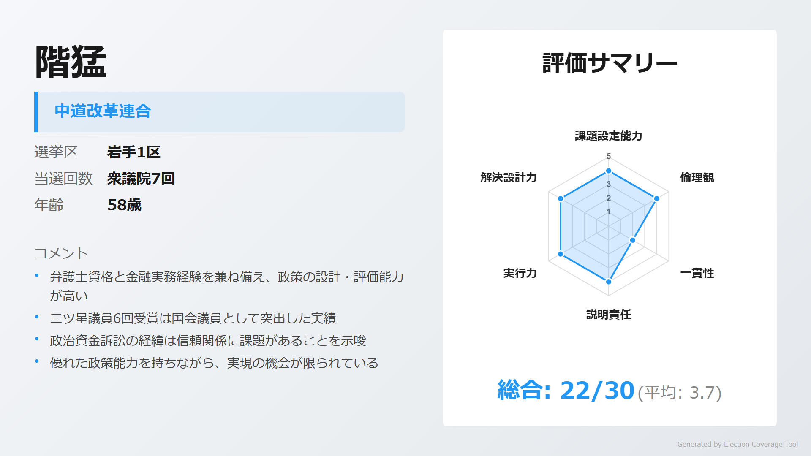
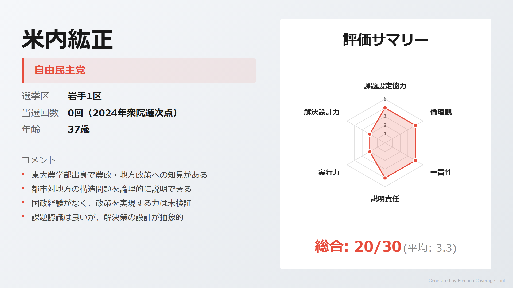
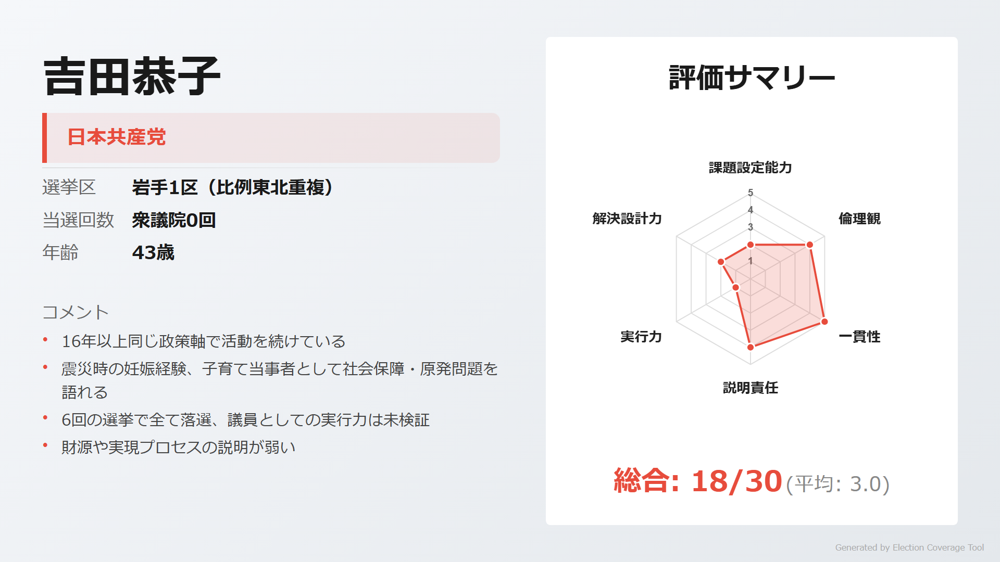
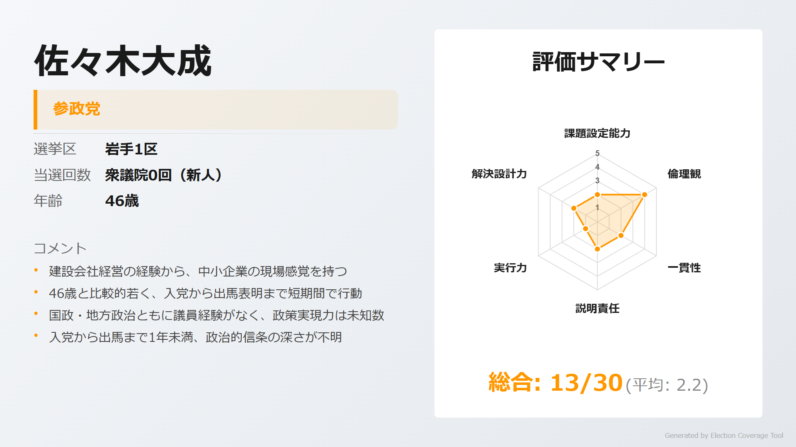
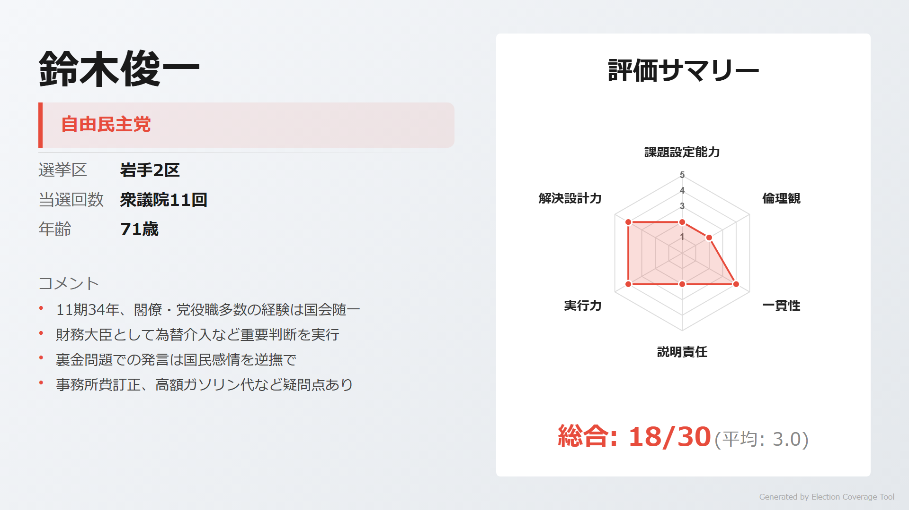
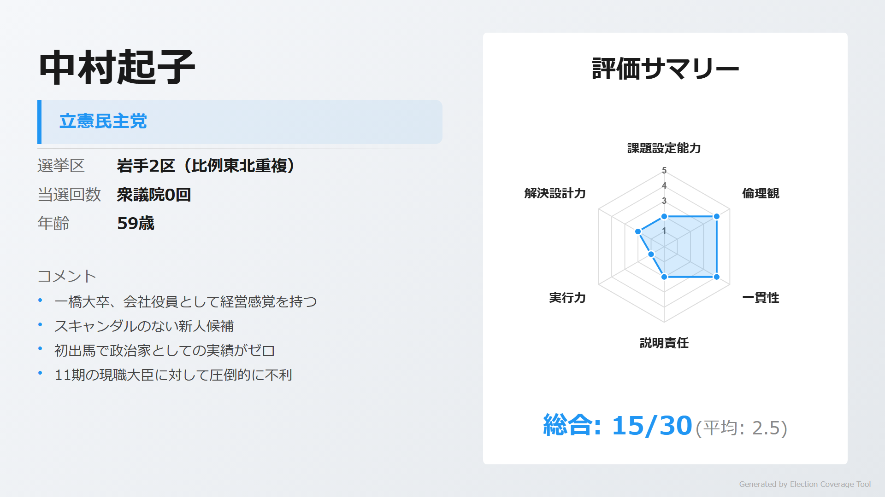
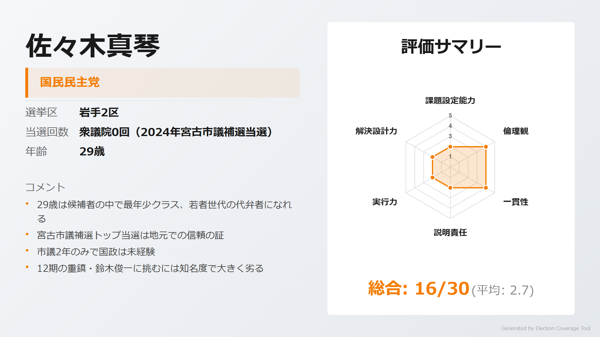
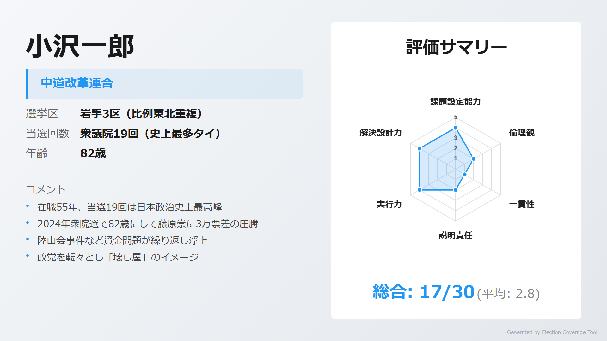
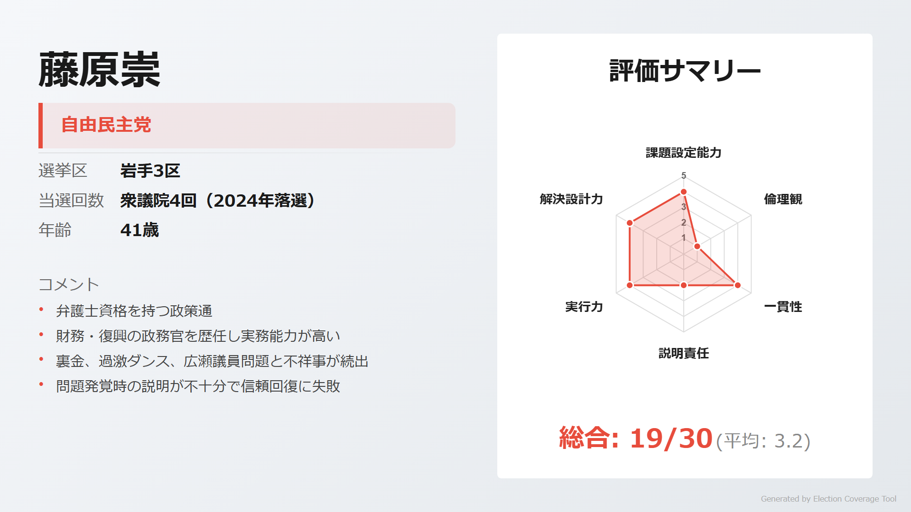
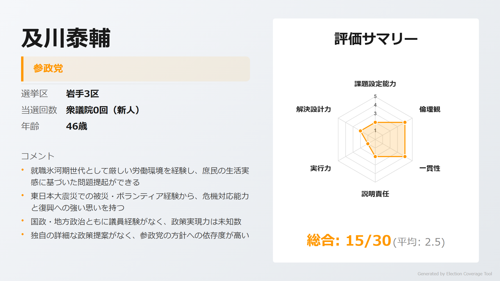

# 衆議院選挙 岩手県

> 第51回衆議院議員総選挙（2026年2月8日投開票）

## 岩手県の注目ポイント

- **小沢一郎vs藤原崇 最終決戦**: 3区で82歳の政界レジェンド・小沢一郎と41歳の藤原崇が激突。前回は藤原が初勝利も裏金問題で落選、今回リベンジなるか
- **鈴木俊一財務大臣の牙城**: 2区で11期の大ベテラン・鈴木俊一に若手が挑むも、圧倒的な知名度の壁
- **世代交代の波**: 1区は階猛（58歳）vs米内紘正（37歳・米内光政の曾孫）、新旧対決の構図

## 目次

- [1区](#1区)
- [2区](#2区)
- [3区](#3区)

---

## 1区

### 注目ポイント

- **階猛の牙城**: 7期連続当選の実力者・階猛に、米内光政の曾孫・米内紘正が挑戦
- **三ツ星議員vs東大出身若手**: 国会質問で6回表彰の階に対し、東大農学部卒の米内が地方重視で対抗

### 候補者

#### 階猛（中道改革連合）

<!-- NOTE: 1区 候補者1 画像 -->

> **ウサギ**: 「弁護士資格と金融実務経験を兼ね備えた政策通。三ツ星議員6回受賞は国会議員として突出した実績だよ」

> **ネコ**: 「政治資金訴訟の経緯は県連との信頼関係に課題があることを示唆。野党のため政策実現の機会が限られている」

[詳細を見る](https://github.com/estela-works/poliscore2026-/blob/main/result/03_岩手県/01区/階猛.md)

#### 米内紘正（自由民主党）

<!-- NOTE: 1区 候補者2 画像 -->

> **ウサギ**: 「東大農学部出身で地方政策への知見が深い。クリーンなイメージで曽祖父・米内光政の遺訓を継承する姿勢」

> **ネコ**: 「国政経験がなく政策を実現する力は未検証。課題認識は良いが解決策の設計が抽象的」

[詳細を見る](https://github.com/estela-works/poliscore2026-/blob/main/result/03_岩手県/01区/米内紘正.md)

#### 吉田恭子（日本共産党）

<!-- NOTE: 1区 候補者3 画像 -->

> **ウサギ**: 「16年以上同じ政策軸で活動を続ける抜群の一貫性。震災時の妊娠経験から原発問題を当事者目線で語れる」

> **ネコ**: 「6回の選挙で全て落選、議員としての実行力は未検証。財源や実現プロセスの説明が弱い」

[詳細を見る](https://github.com/estela-works/poliscore2026-/blob/main/result/03_岩手県/01区/吉田恭子.md)

#### 佐々木大成（参政党）

<!-- NOTE: 1区 候補者4 画像 -->

> **ウサギ**: 「宮古市出身の建設会社社長。経営者視点で減税・国民負担軽減を訴え、4つの明確な課題認識を持つ」

> **ネコ**: 「2025年1月入党と政治活動歴が浅い。政策は参政党頼みで独自性に欠け、知名度も大きく劣る」

[詳細を見る](https://github.com/estela-works/poliscore2026-/blob/main/result/03_岩手県/01区/佐々木大成.md)

---

## 2区

### 注目ポイント

- **財務大臣の選挙区**: 11期の大ベテラン・鈴木俊一に、立憲・中村起子、国民・佐々木真琴が挑戦
- **世代間格差**: 71歳の現職大臣に29歳の佐々木真琴が挑む構図、国民民主党の勢いを活かせるか

### 候補者

#### 鈴木俊一（自由民主党）

<!-- NOTE: 2区 候補者1 画像 -->

> **ウサギ**: 「11期34年の経験は国会随一。財務大臣として為替介入など重要な政策判断を実行してきた」

> **ネコ**: 「裏金問題での『議員が判断すべき』発言は国民感情を逆撫で。高額ガソリン代など政治資金の不透明さも」

[詳細を見る](https://github.com/estela-works/poliscore2026-/blob/main/result/03_岩手県/02区/鈴木俊一.md)

#### 中村起子（立憲民主党）

<!-- NOTE: 2区 候補者2 画像 -->

> **ウサギ**: 「一橋大卒、会社役員として経営感覚を持つ新人候補。東京一極集中是正を明確に訴えている」

> **ネコ**: 「政治経験ゼロで初出馬。11期の現職大臣に対して知名度で圧倒的に不利」

[詳細を見る](https://github.com/estela-works/poliscore2026-/blob/main/result/03_岩手県/02区/中村起子.md)

#### 佐々木真琴（国民民主党）

<!-- NOTE: 2区 候補者3 画像 -->

> **ウサギ**: 「29歳の最年少候補。宮古市議補選トップ当選は地元での信頼の証。国民民主党の勢いを背負う」

> **ネコ**: 「市議2年のみで国政は未経験。12期の重鎮に挑むには知名度で大きく劣る」

[詳細を見る](https://github.com/estela-works/poliscore2026-/blob/main/result/03_岩手県/02区/佐々木真琴.md)

---

## 3区

### 注目ポイント

- **政界レジェンドの最終章**: 82歳・当選19回の小沢一郎が現役続行。「壊し屋」の異名を持つ政治家の行方
- **藤原崇のリベンジ**: 前回落選した藤原崇が再挑戦するか注目。裏金・過激ダンス問題で信頼を大きく失った

### 候補者

#### 小沢一郎（中道改革連合）

<!-- NOTE: 3区 候補者1 画像 -->

> **ウサギ**: 「在職55年、当選19回は日本政治史上最高峰。政権交代可能な二大政党制という日本政治の転換を主導した」

> **ネコ**: 「陸山会事件など政治とカネの問題が繰り返し浮上。政党を転々とし『壊し屋』のイメージが強い」

[詳細を見る](https://github.com/estela-works/poliscore2026-/blob/main/result/03_岩手県/03区/小沢一郎.md)

#### 藤原崇（自由民主党）

<!-- NOTE: 3区 候補者2 画像 -->

> **ウサギ**: 「弁護士資格を持つ政策通。財務・復興の政務官を歴任し、2021年には小沢一郎に選挙区で初勝利」

> **ネコ**: 「裏金14万円、過激ダンス問題と不祥事が続出。比例重複を認められず落選した前科がある」

[詳細を見る](https://github.com/estela-works/poliscore2026-/blob/main/result/03_岩手県/03区/藤原崇.md)

#### 及川泰輔（参政党）

<!-- NOTE: 3区 候補者3 画像 -->

> **ウサギ**: 「就職氷河期世代で飲食店から工場勤務へ、苦労人の庶民派。震災時に自らトラックで避難所に弁当を届けた行動力がある」

> **ネコ**: 「政治経験ゼロで独自の具体的政策がなく、参政党の方針への依存度が高い。知名度も大きく劣る」

[詳細を見る](https://github.com/estela-works/poliscore2026-/blob/main/result/03_岩手県/03区/及川泰輔.md)

---

## 情報ソース

本記事の評価データは以下のリポジトリで公開しています。評価基準・根拠の詳細をご確認いただけます。

**GitHub**: [poliscore2026-](https://github.com/estela-works/poliscore2026-)

- 評価基準: [`data/politician_evaluation_criteria.md`](https://github.com/estela-works/poliscore2026-/blob/main/data/politician_evaluation_criteria.md)
- 各候補者の評価詳細: [`result/`](https://github.com/estela-works/poliscore2026-/tree/main/result)
