# 衆議院選挙 宮城県

> 第51回衆議院議員総選挙（2026年2月8日投開票）

## 宮城県の注目ポイント

- **裏金問題の震源地**: 1区・土井亨、3区・西村明宏が裏金問題で前回落選。復活を狙うか注目
- **元財務大臣の牙城**: 4区で安住淳（10期）が圧倒的強さ、タレント出身の森下千里が挑戦
- **防衛大臣3回の重鎮**: 5区・小野寺五典は自民党税調会長として政策中枢を担う

## 目次

- [1区](#1区)
- [2区](#2区)
- [3区](#3区)
- [4区](#4区)
- [5区](#5区)

---

## 1区

### 注目ポイント

- **女性県連代表代行の戦い**: 岡本章子（中道改革連合・3期）が初の小選挙区勝利を守れるか
- **土井亨のリベンジ**: 裏金問題で前回落選した土井亨（自民・元5期）が再挑戦するか

### 候補者

#### 岡本章子（中道改革連合）

<!-- NOTE: 1区 候補者1 画像 -->
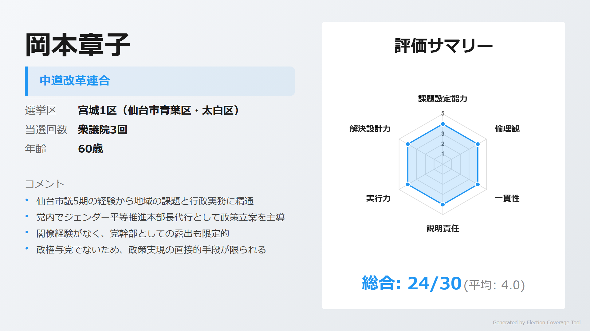

> **ウサギ**: 「仙台市議5期の経験を活かし、復興・ジェンダー・子ども政策に精通。2024年衆院選で初の小選挙区当選を果たした」

> **ネコ**: 「閣僚経験がなく全国的知名度は低い。野党議員として政策実現の直接的手段が限られている」

[詳細を見る](https://github.com/estela-works/poliscore2026-/blob/main/result/04_宮城県/01区/岡本章子.md)

#### 土井亨（自由民主党）

<!-- NOTE: 1区 候補者2 画像 -->
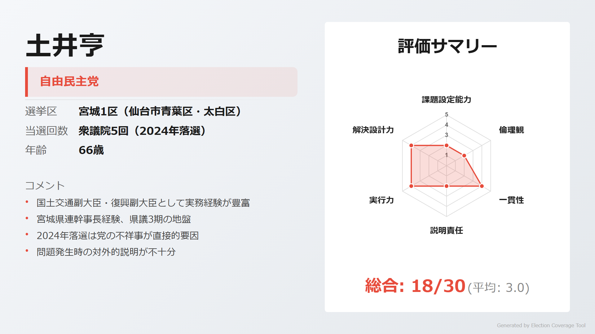

> **ウサギ**: 「国土交通副大臣・復興副大臣を歴任。インフラ整備や復興事業での実務経験が豊富」

> **ネコ**: 「2024年衆院選で落選。裏金問題の影響を受け、説明責任を十分に果たしていない」

[詳細を見る](https://github.com/estela-works/poliscore2026-/blob/main/result/04_宮城県/01区/土井亨.md)

#### 高橋浩司（日本維新の会）

<!-- NOTE: 1区 候補者3 画像 -->
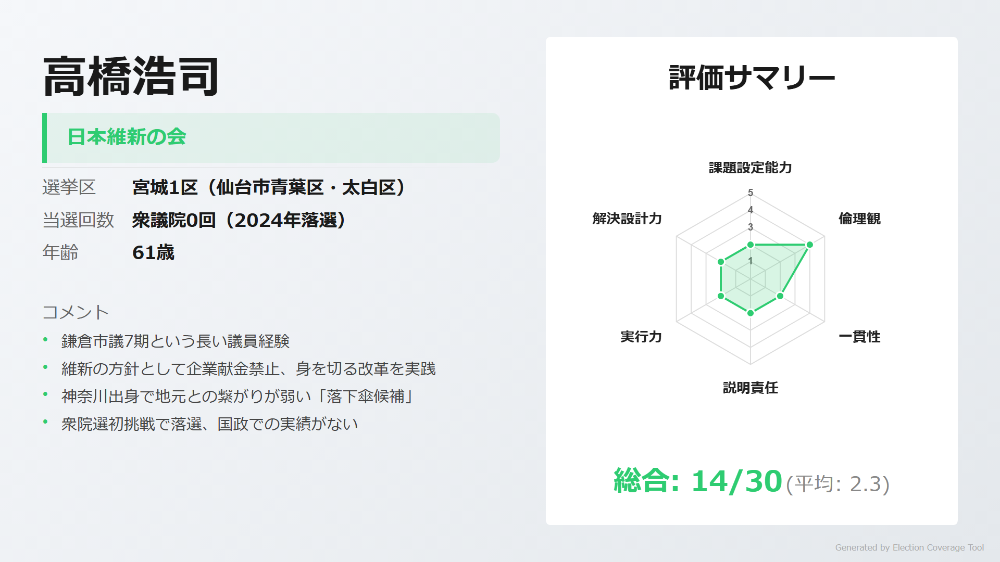

> **ウサギ**: 「鎌倉市議7期という長い議員経験。企業献金禁止など維新のクリーン路線を実践」

> **ネコ**: 「神奈川出身の『落下傘候補』で宮城との関係性が薄い。2024年衆院選は大差での落選」

[詳細を見る](https://github.com/estela-works/poliscore2026-/blob/main/result/04_宮城県/01区/高橋浩司.md)

#### 中嶋廉（日本共産党）

<!-- NOTE: 1区 候補者4 画像 -->
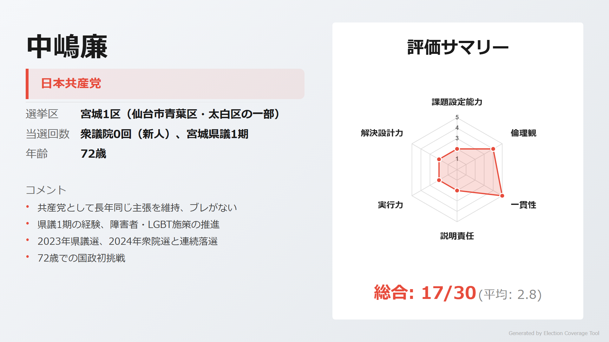

> **ウサギ**: 「元宮城県議。共産党として長年同じ主張を維持し、クリーンなイメージを保持」

> **ネコ**: 「73歳での新人挑戦で国政経験なし。野党少数派で政策実現力に限界」

[詳細を見る](https://github.com/estela-works/poliscore2026-/blob/main/result/04_宮城県/01区/中嶋廉.md)

#### ローレンス綾子（参政党）

<!-- NOTE: 1区 候補者5 画像 -->
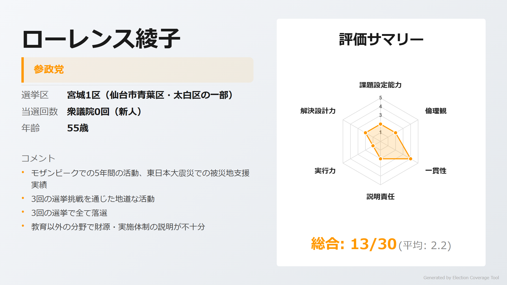

> **ウサギ**: 「新人として清新さをアピール。参政党の全国的なネットワークを活用」

> **ネコ**: 「政治経験がなく、公開情報が限定的。有権者が判断する材料が不足」

[詳細を見る](https://github.com/estela-works/poliscore2026-/blob/main/result/04_宮城県/01区/ローレンス綾子.md)

---

## 2区

### 注目ポイント

- **鎌田さゆりvs和田政宗**: 公選法違反歴の鎌田さゆり（中道改革連合・4期）に、参政党に移籍した和田政宗が挑戦
- **パワハラ疑惑**: 鎌田さゆりの秘書9人連続退職問題が選挙に影響するか

### 候補者

#### 鎌田さゆり（中道改革連合）

<!-- NOTE: 2区 候補者1 画像 -->
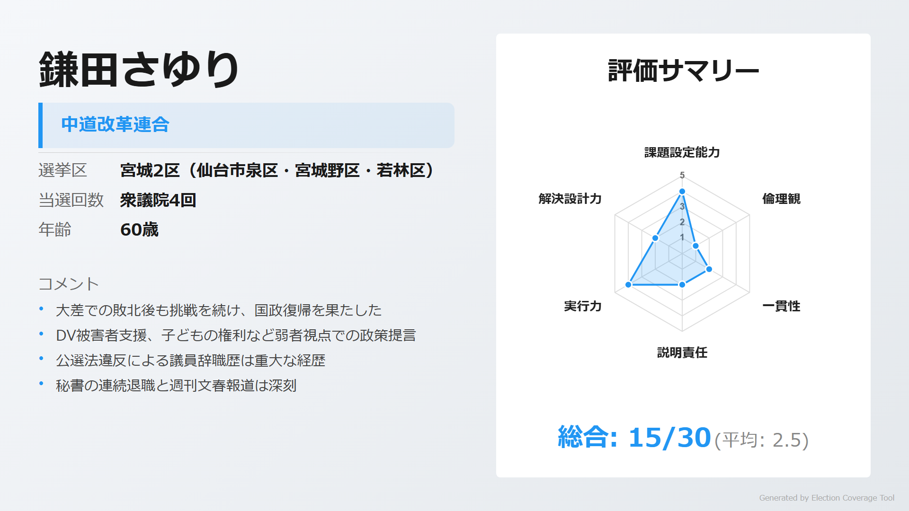

> **ウサギ**: 「16年ぶりの国政復帰を果たした粘り強さ。DV被害者・子どもの権利など弱者視点の政策提言」

> **ネコ**: 「公選法違反による議員辞職歴、パワハラ疑惑と秘書9人連続退職。炎上体質で問題が多い」

[詳細を見る](https://github.com/estela-works/poliscore2026-/blob/main/result/04_宮城県/02区/鎌田さゆり.md)

#### 和田政宗（参政党）

<!-- NOTE: 2区 候補者2 画像 -->
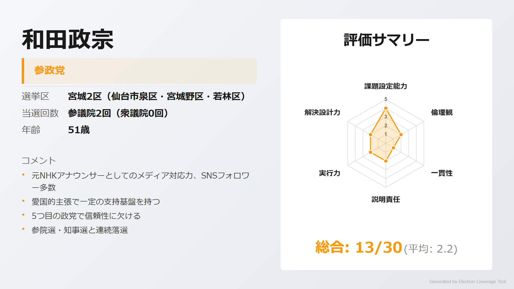

> **ウサギ**: 「元NHKアナウンサーとしての発信力。水道・メガソーラーなど具体的なイシューを提示」

> **ネコ**: 「5つ目の政党で政党遍歴が多すぎる。参院選・知事選と連続落選で選挙の弱さが露呈」

[詳細を見る](https://github.com/estela-works/poliscore2026-/blob/main/result/04_宮城県/02区/和田政宗.md)

#### 渡辺勝幸（自由民主党）

<!-- NOTE: 2区 候補者3 画像 -->
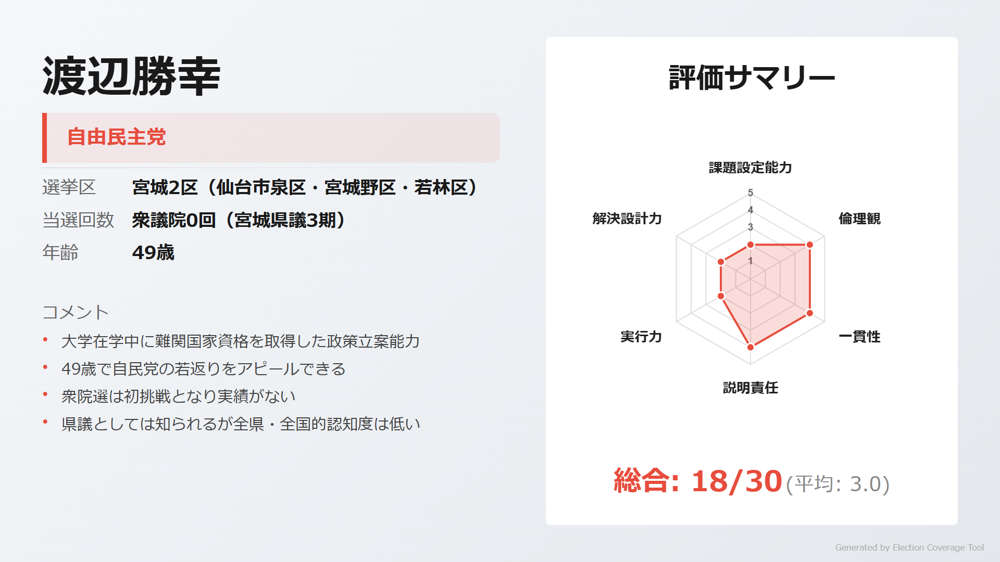

> **ウサギ**: 「県議3期の実績、政策担当秘書資格保有。49歳で自民党の若返りをアピール」

> **ネコ**: 「衆院選は初挑戦で国政経験なし。裏金問題など党のマイナスイメージを背負う」

[詳細を見る](https://github.com/estela-works/poliscore2026-/blob/main/result/04_宮城県/02区/渡辺勝幸.md)

#### 早坂敦（日本維新の会）

<!-- NOTE: 2区 候補者4 画像 -->
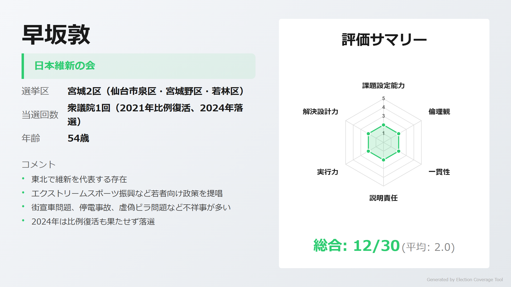

> **ウサギ**: 「東北で維新を代表する存在。福祉施設勤務経験もあり現場感覚を持つ」

> **ネコ**: 「街宣車トラブル、虚偽ビラ問題など不祥事が続出。2024年衆院選で落選」

[詳細を見る](https://github.com/estela-works/poliscore2026-/blob/main/result/04_宮城県/02区/早坂敦.md)

#### 佐藤りりか（国民民主党）

<!-- NOTE: 2区 候補者5 画像 -->
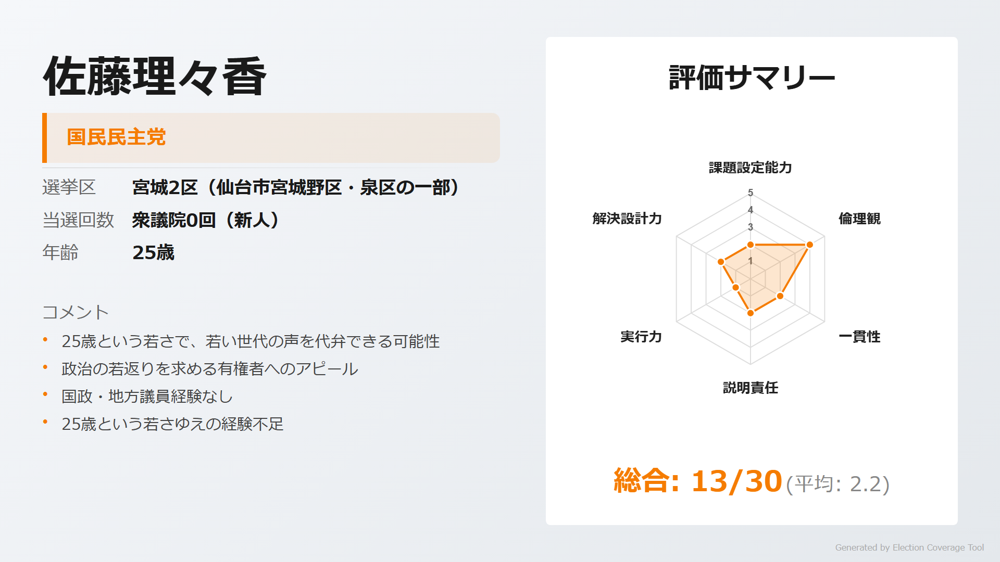

> **ウサギ**: 「25歳という若さで世代交代を象徴。国民民主党の『手取りを増やす』政策を訴える」

> **ネコ**: 「政治経験・社会人経験ともに浅い。知名度不足で評価材料が限られる」

[詳細を見る](https://github.com/estela-works/poliscore2026-/blob/main/result/04_宮城県/02区/佐藤りりか.md)

---

## 3区

### 注目ポイント

- **元環境大臣のリベンジ**: 裏金554万円で前回落選した西村明宏（自民・元7期）が再挑戦するか
- **アナウンサー出身の新人**: 仙台放送の柳沢剛が初当選、議席を守れるか

### 候補者

#### 西村明宏（自由民主党）

<!-- NOTE: 3区 候補者1 画像 -->
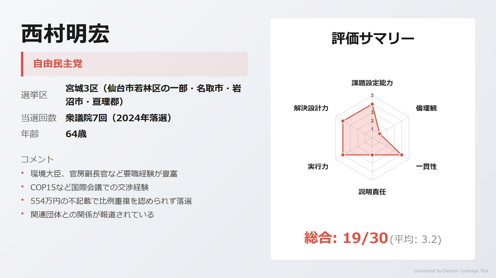

> **ウサギ**: 「環境大臣、内閣官房副長官など要職を歴任。COP15で国際交渉の経験も豊富」

> **ネコ**: 「裏金554万円で比例重複を認められず落選。統一教会関連団体との関係も報道されている」

[詳細を見る](https://github.com/estela-works/poliscore2026-/blob/main/result/04_宮城県/03区/西村明宏.md)

#### 柳沢剛（中道改革連合）

<!-- NOTE: 3区 候補者2 画像 -->
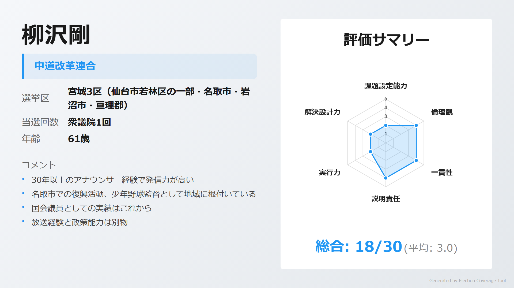

> **ウサギ**: 「仙台放送で36年勤務、アナウンサーとして培った発信力。少年野球監督23年で地域に根付く」

> **ネコ**: 「政治経験ゼロの新人。政策立案能力は未知数で、野党1期生という立場の弱さ」

[詳細を見る](https://github.com/estela-works/poliscore2026-/blob/main/result/04_宮城県/03区/柳沢剛.md)

#### 結城孝（無所属）

<!-- NOTE: 3区 候補者3 画像 -->
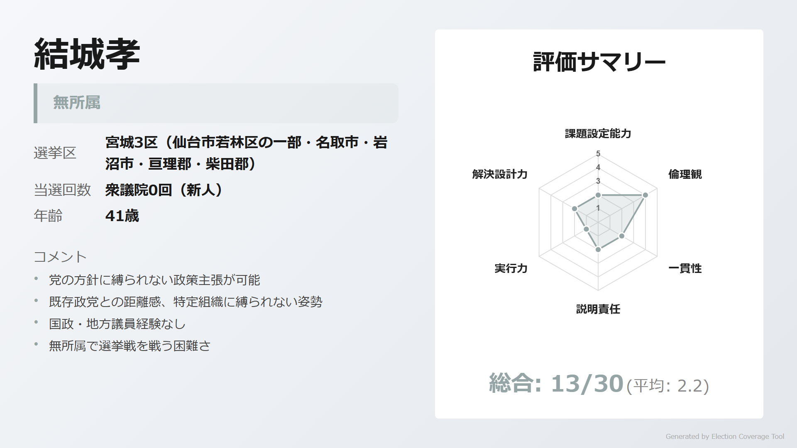

> **ウサギ**: 「無所属として党の方針に縛られない政策主張が可能」

> **ネコ**: 「政治経験なし、組織力も欠如。無所属での選挙戦は極めて困難」

[詳細を見る](https://github.com/estela-works/poliscore2026-/blob/main/result/04_宮城県/03区/結城孝.md)

#### 林萌子（参政党）

<!-- NOTE: 3区 候補者4 画像 -->
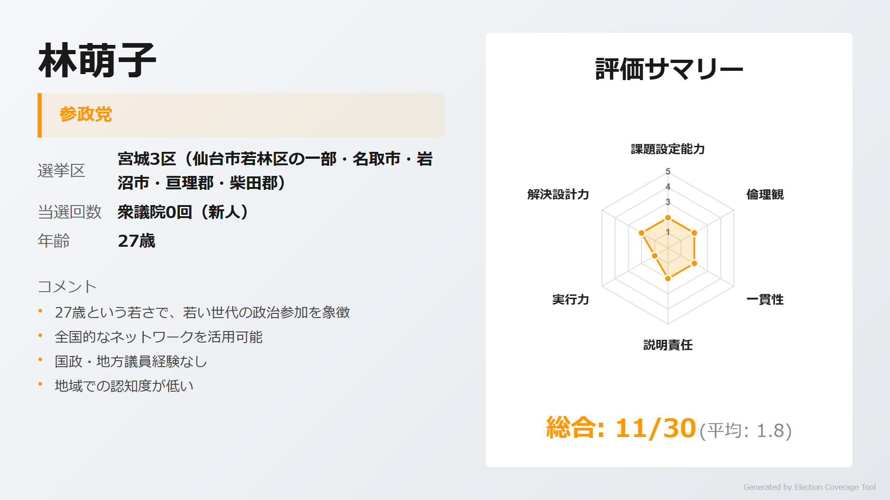

> **ウサギ**: 「27歳という若さで世代交代を象徴。参政党の組織力を活用」

> **ネコ**: 「政治経験なし、公開情報が限定的。評価材料が不足している」

[詳細を見る](https://github.com/estela-works/poliscore2026-/blob/main/result/04_宮城県/03区/林萌子.md)

---

## 4区

### 注目ポイント

- **安住淳の牙城**: 元財務大臣・安住淳（10期）が圧倒的強さで君臨。予算委員長として政界の要
- **現職政務官の小選挙区初挑戦**: 環境大臣政務官・森下千里が初の小選挙区勝利を目指す

### 候補者

#### 安住淳（中道改革連合）

<!-- NOTE: 4区 候補者1 画像 -->
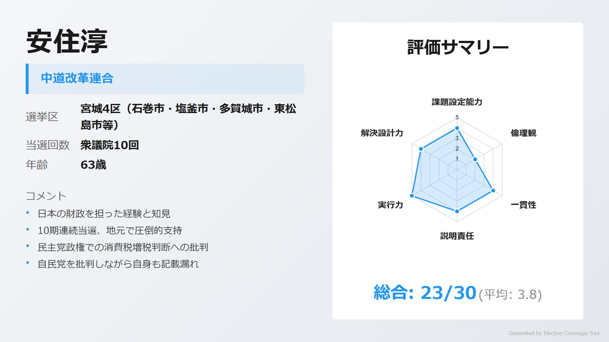

> **ウサギ**: 「財務大臣経験者。10期連続当選で選挙に圧倒的に強い。予算委員長として国会運営を仕切る」

> **ネコ**: 「消費税増税を主導した責任。自身も政治資金230万円の記載漏れが発覚」

[詳細を見る](https://github.com/estela-works/poliscore2026-/blob/main/result/04_宮城県/04区/安住淳.md)

#### 森下千里（自由民主党）

<!-- NOTE: 4区 候補者2 画像 -->
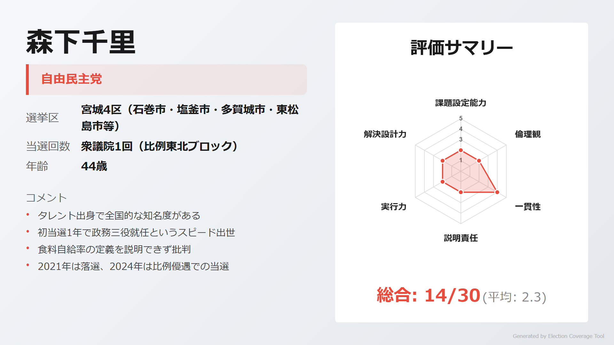

> **ウサギ**: 「タレント出身で全国的な知名度。2024年比例当選後、環境大臣政務官に就任」

> **ネコ**: 「比例単独での当選で小選挙区勝利経験なし。政策説明力に課題（食料自給率の定義説明できず批判）」

[詳細を見る](https://github.com/estela-works/poliscore2026-/blob/main/result/04_宮城県/04区/森下千里.md)

#### 佐野誠（参政党）

<!-- NOTE: 4区 候補者3 画像 -->
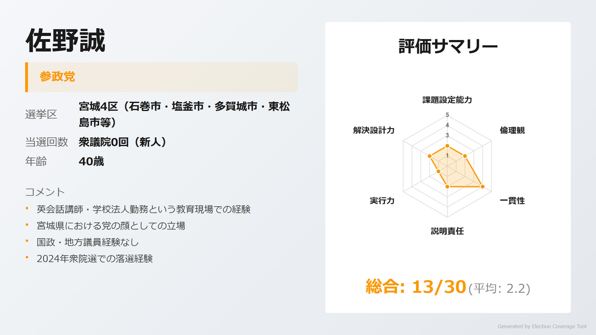

> **ウサギ**: 「新人として清新さをアピール。参政党の組織力を背景に活動」

> **ネコ**: 「政治経験なし、公開情報が限定的。知名度不足が課題」

[詳細を見る](https://github.com/estela-works/poliscore2026-/blob/main/result/04_宮城県/04区/佐野誠.md)

---

## 5区

### 注目ポイント

- **防衛の重鎮**: 小野寺五典（自民・9期）は防衛大臣3回、税調会長として政策中枢を担う
- **政党遍歴の候補**: 境恒春が維新から中道改革連合に移籍して挑戦

### 候補者

#### 小野寺五典（自由民主党）

<!-- NOTE: 5区 候補者1 画像 -->
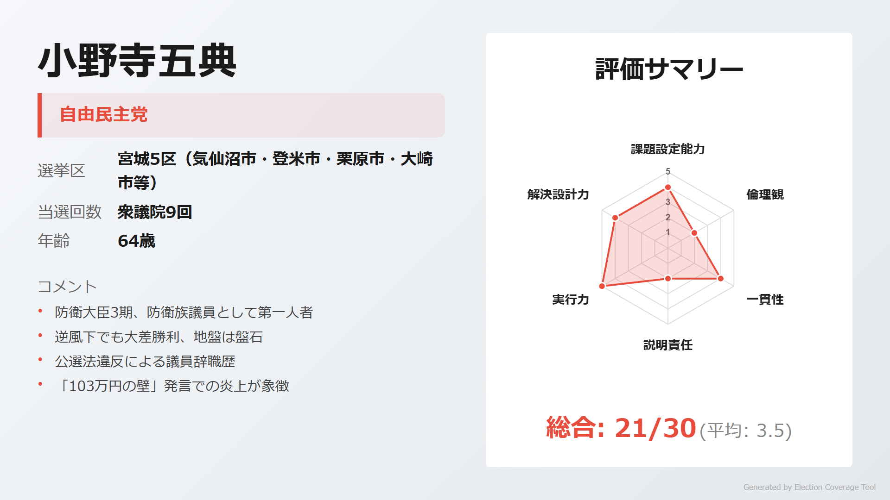

> **ウサギ**: 「防衛大臣3期の実績、税調会長として党の政策立案を主導。選挙では逆風下でも大勝」

> **ネコ**: 「公選法違反による議員辞職歴あり。『103万円の壁』発言で国民感情との乖離を露呈」

[詳細を見る](https://github.com/estela-works/poliscore2026-/blob/main/result/04_宮城県/05区/小野寺五典.md)

#### 境恒春（中道改革連合）

<!-- NOTE: 5区 候補者2 画像 -->
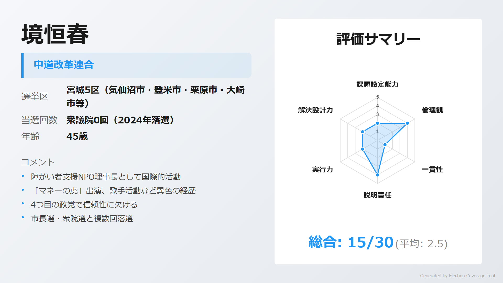

> **ウサギ**: 「障がい者支援NPO理事長として国際的活動。『マネーの虎』出演など異色の経歴で知名度あり」

> **ネコ**: 「4つ目の政党で政党遍歴が多すぎる。市長選・衆院選と複数回落選」

[詳細を見る](https://github.com/estela-works/poliscore2026-/blob/main/result/04_宮城県/05区/境恒春.md)

#### 結城豊（日本共産党）

<!-- NOTE: 5区 候補者3 画像 -->
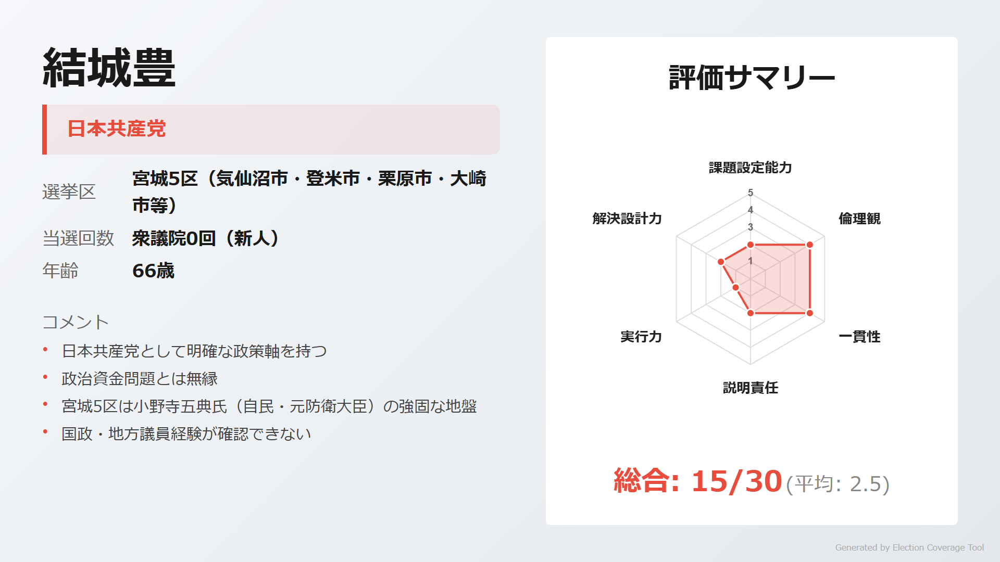

> **ウサギ**: 「共産党として明確な政策軸を持つ。クリーンなイメージで農林水産業問題に取り組む」

> **ネコ**: 「国政経験なし。小野寺五典の強固な地盤では苦戦必至」

[詳細を見る](https://github.com/estela-works/poliscore2026-/blob/main/result/04_宮城県/05区/結城豊.md)

---

## 情報ソース

本記事の評価データは以下のリポジトリで公開しています。評価基準・根拠の詳細をご確認いただけます。

**GitHub**: [poliscore2026-](https://github.com/estela-works/poliscore2026-)

- 評価基準: [`data/politician_evaluation_criteria.md`](https://github.com/estela-works/poliscore2026-/blob/main/data/politician_evaluation_criteria.md)
- 各候補者の評価詳細: [`result/`](https://github.com/estela-works/poliscore2026-/tree/main/result)
