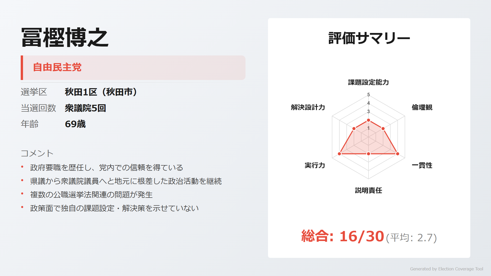
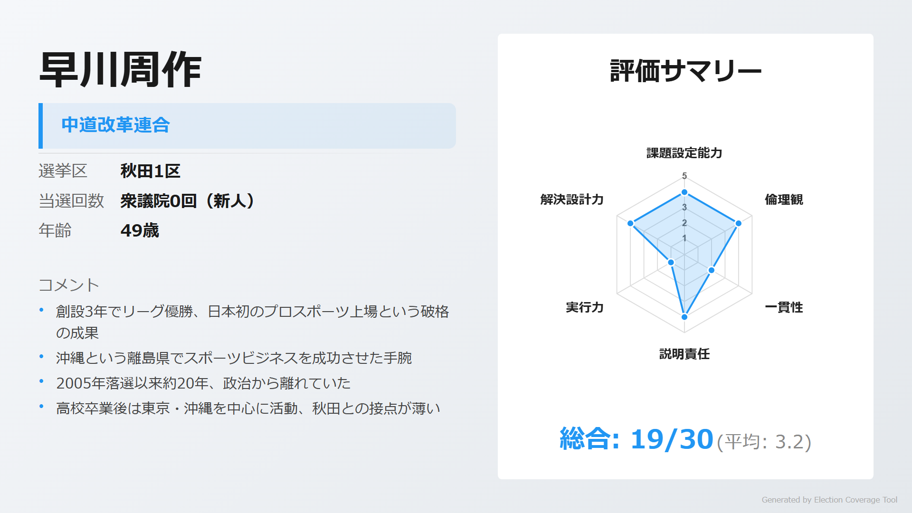
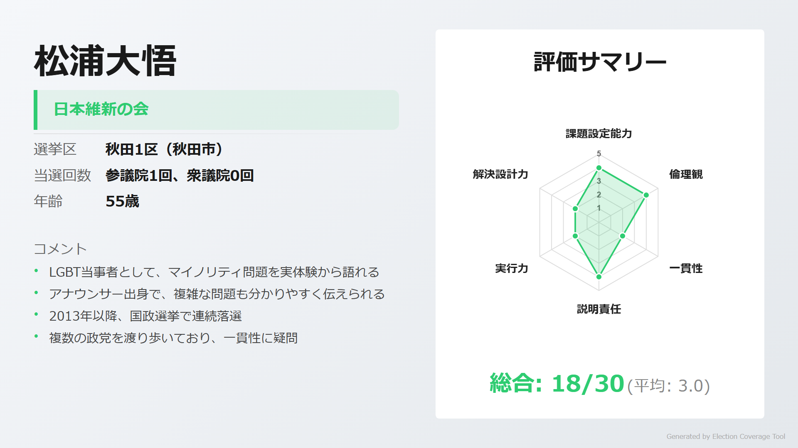
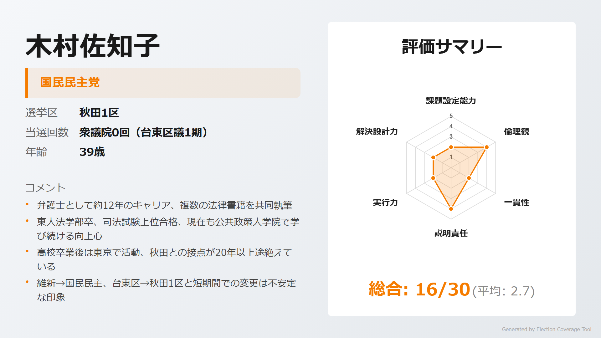
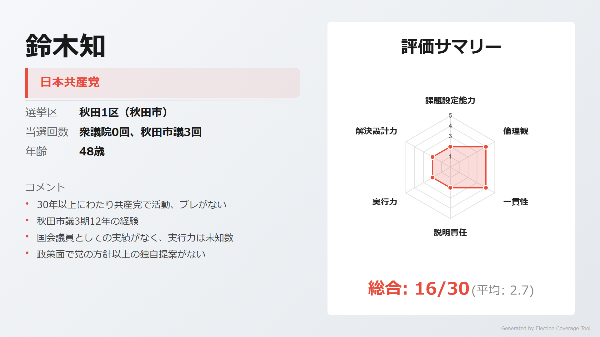
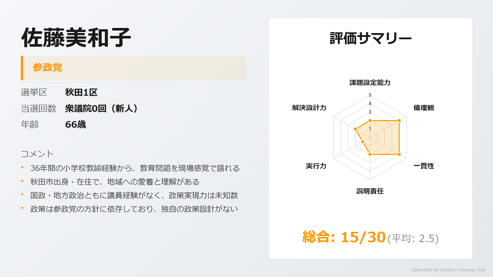
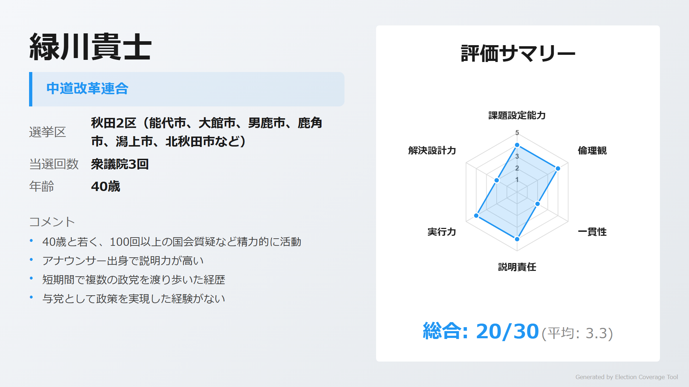
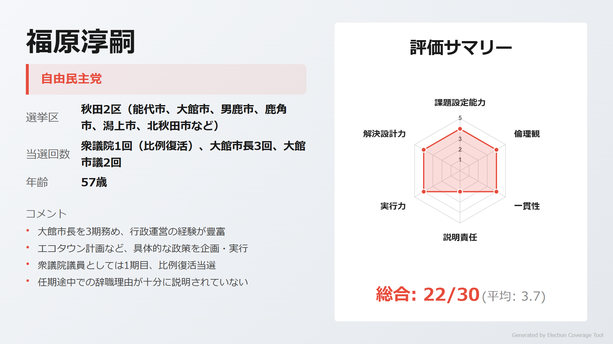

# 衆議院選挙 秋田県

> 第51回衆議院議員総選挙（2026年2月8日投開票）

## 秋田県の注目ポイント

- **新党乱立の1区**: 自民・維新・国民・中道改革連合・参政・共産と6候補が乱立。プロスポーツ経営者の早川周作が中道改革連合から参戦
- **元市長vs元アナウンサー**: 2区は大館市長3期の福原淳嗣（自民）と緑川貴士（中道改革連合・3期）の再戦。前回は緑川が約5,700票差で勝利
- **総務副大臣の牙城**: 1区は総務副大臣・冨樫博之（自民・5期）が872票差の薄氷勝利から再選を狙う

## 目次

- [1区](#1区)
- [2区](#2区)

---

## 1区

### 注目ポイント

- **総務副大臣の苦戦**: 冨樫博之（自民・5期）は2024年衆院選で872票差の薄氷勝利。公選法問題も抱える
- **プロスポーツ経営者の挑戦**: 琉球アスティーダ代表の早川周作が中道改革連合から故郷・秋田に出馬
- **LGBT当事者の元参院議員**: 松浦大悟（維新）は参院1期の実績とLGBT当事者としての発信力

### 候補者

#### 冨樫博之（自由民主党）

<!-- NOTE: 1区 候補者1 画像 -->

> **ウサギ**: 「総務副大臣・復興副大臣など政府要職を歴任。県議5期・衆議院5期と地元に根差した活動を継続」

> **ネコ**: 「公選法違反（選挙区内での酒類提供）が発覚。後援会幹部の書類送検もあり、コンプライアンス意識に課題」

[詳細を見る](https://github.com/estela-works/poliscore2026-/blob/main/result/05_秋田県/01区/冨樫博之.md)

#### 早川周作（中道改革連合）

<!-- NOTE: 1区 候補者2 画像 -->

> **ウサギ**: 「琉球アスティーダを創設3年でリーグ優勝、日本初のプロスポーツ上場を実現。ForbesJAPAN『今年の顔100』選出」

> **ネコ**: 「2005年落選以来約20年、政治から離れていた。高校卒業後は東京・沖縄中心で秋田との接点が薄い」

[詳細を見る](https://github.com/estela-works/poliscore2026-/blob/main/result/05_秋田県/01区/早川周作.md)

#### 松浦大悟（日本維新の会）

<!-- NOTE: 1区 候補者3 画像 -->

> **ウサギ**: 「LGBT当事者として自らカミングアウトし、マイノリティ問題を当事者視点で発信。元参院議員で自殺対策に取り組んだ実績」

> **ネコ**: 「2013年以降、国政選挙で連続落選。無所属→民主→希望→維新と政党遍歴が多い」

[詳細を見る](https://github.com/estela-works/poliscore2026-/blob/main/result/05_秋田県/01区/松浦大悟.md)

#### 木村佐知子（国民民主党）

<!-- NOTE: 1区 候補者4 画像 -->

> **ウサギ**: 「東大法学部卒の弁護士。台東区議選でトップ当選、現在も東大公共政策大学院で学ぶ向上心」

> **ネコ**: 「維新→国民民主と政党移籍、台東区→秋田と選挙区変更。高校卒業後20年以上、秋田との接点が途絶えていた」

[詳細を見る](https://github.com/estela-works/poliscore2026-/blob/main/result/05_秋田県/01区/木村佐知子.md)

#### 鈴木知（日本共産党）

<!-- NOTE: 1区 候補者5 画像 -->

> **ウサギ**: 「18歳で共産党入党以来、30年以上一貫して活動。秋田市議3期12年の経験」

> **ネコ**: 「2024年衆院選で得票率4.7%、4位落選。国政経験がなく、独自の政策提案も見られない」

[詳細を見る](https://github.com/estela-works/poliscore2026-/blob/main/result/05_秋田県/01区/鈴木知.md)

#### 佐藤美和子（参政党）

<!-- NOTE: 1区 候補者6 画像 -->

> **ウサギ**: 「小学校教諭36年の経験から、教育問題を現場感覚で語れる。秋田市出身で地元への愛着」

> **ネコ**: 「政治経験ゼロ、2025年参院選で落選。政策は参政党の方針に依存し独自性がない」

[詳細を見る](https://github.com/estela-works/poliscore2026-/blob/main/result/05_秋田県/01区/佐藤美和子.md)

---

## 2区

### 注目ポイント

- **元市長vs元アナウンサーの再戦**: 大館市長3期の福原淳嗣（自民・1期）と緑川貴士（中道改革連合・3期）が再び激突
- **比例復活の雪辱**: 福原は2024年衆院選で約5,700票差で敗れ比例復活。今度こそ選挙区勝利を狙う
- **野党の牙城**: 緑川は2017年初当選以来、3回連続で選挙区当選を果たす

### 候補者

#### 緑川貴士（中道改革連合）

<!-- NOTE: 2区 候補者1 画像 -->

> **ウサギ**: 「衆院選3回連続で選挙区当選。100回以上の国会質疑を実施し、農林水産委員会理事として活動」

> **ネコ**: 「民主→希望→国民→立憲と6年間で4政党を渡り歩く。埼玉県出身で秋田との縁は就職がきっかけ」

[詳細を見る](https://github.com/estela-works/poliscore2026-/blob/main/result/05_秋田県/02区/緑川貴士.md)

#### 福原淳嗣（自由民主党）

<!-- NOTE: 2区 候補者2 画像 -->

> **ウサギ**: 「大館市長3期9年の行政経験。エコタウン計画の企画立案、コロナ禍での報酬カットなど実績豊富」

> **ネコ**: 「2024年衆院選で選挙区敗北、比例復活。市長を任期途中で辞職した理由の説明が不十分」

[詳細を見る](https://github.com/estela-works/poliscore2026-/blob/main/result/05_秋田県/02区/福原淳嗣.md)

---

## 情報ソース

本記事の評価データは以下のリポジトリで公開しています。評価基準・根拠の詳細をご確認いただけます。

**GitHub**: [poliscore2026-](https://github.com/estela-works/poliscore2026-)

- 評価基準: [`data/politician_evaluation_criteria.md`](https://github.com/estela-works/poliscore2026-/blob/main/data/politician_evaluation_criteria.md)
- 各候補者の評価詳細: [`result/`](https://github.com/estela-works/poliscore2026-/tree/main/result)
