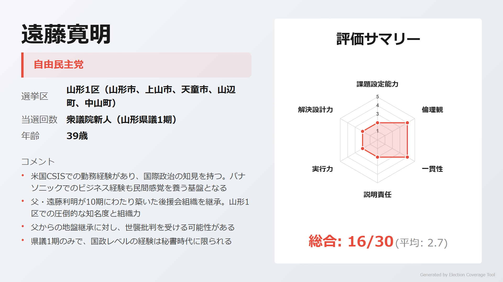
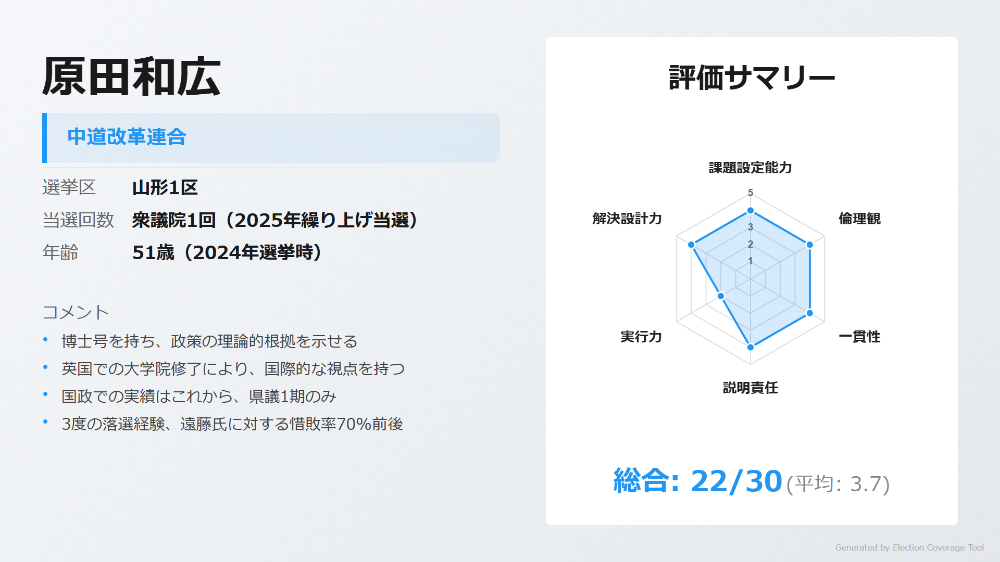
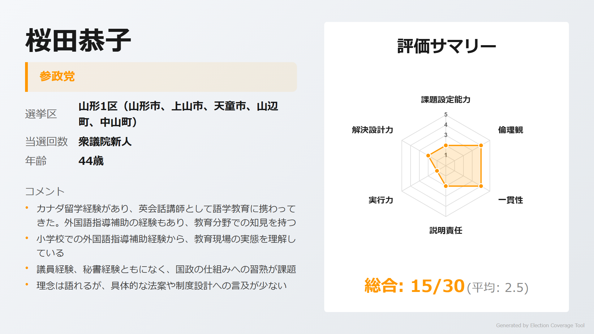
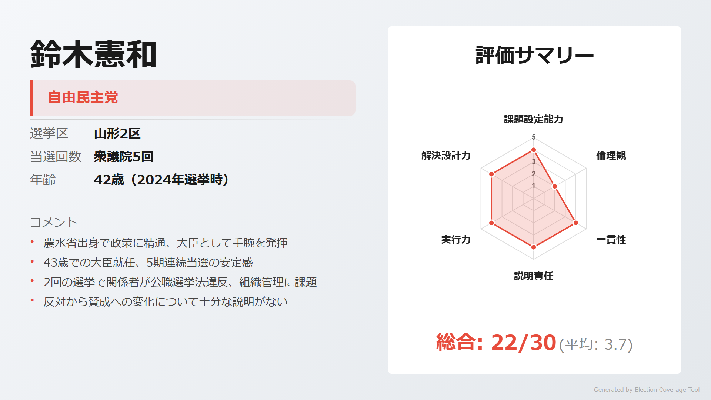
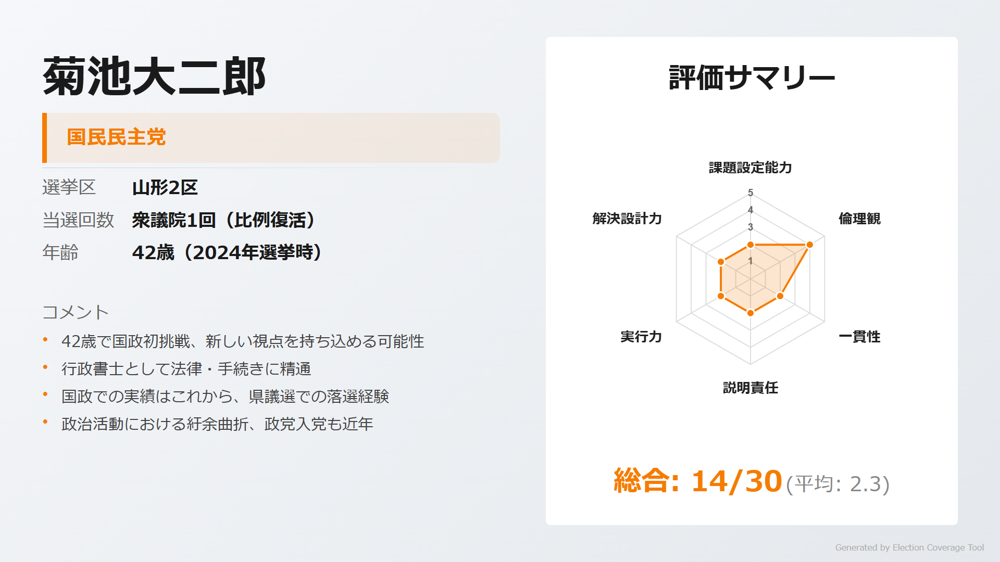
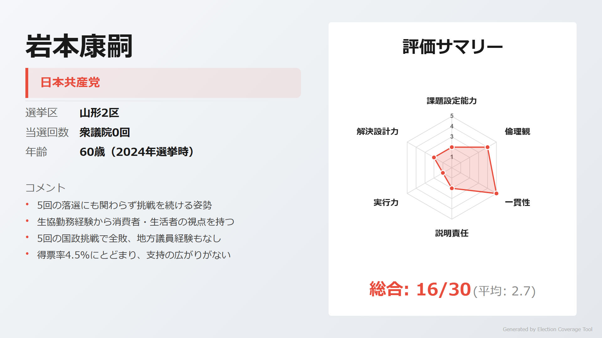
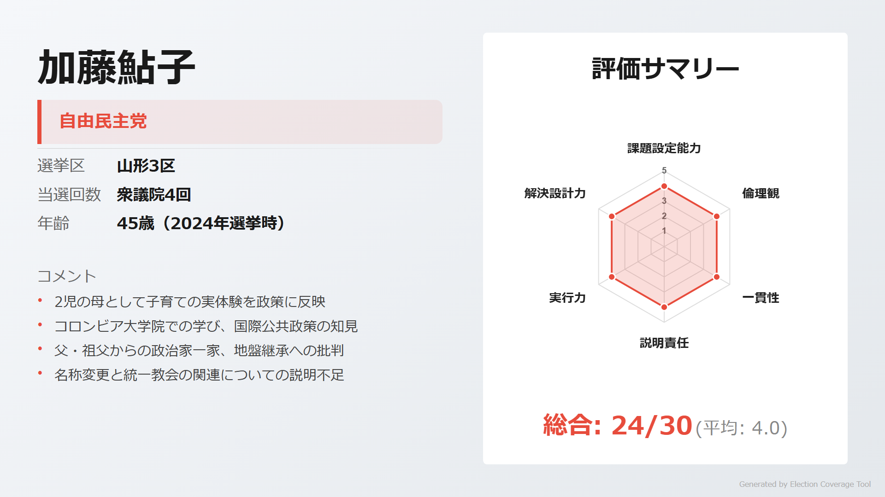
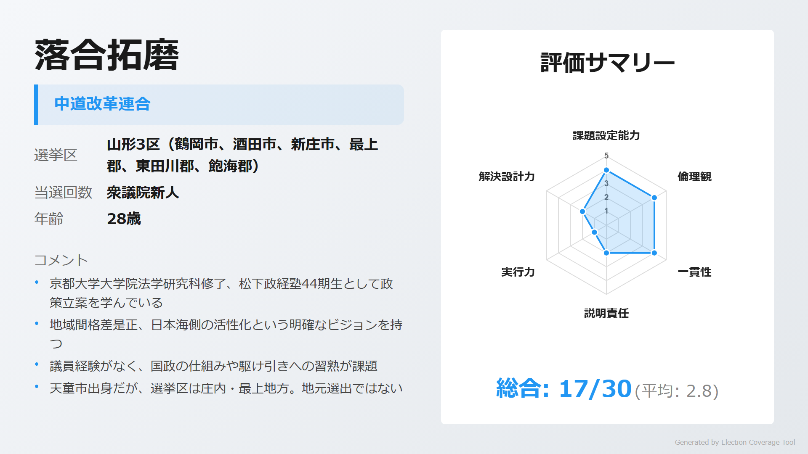
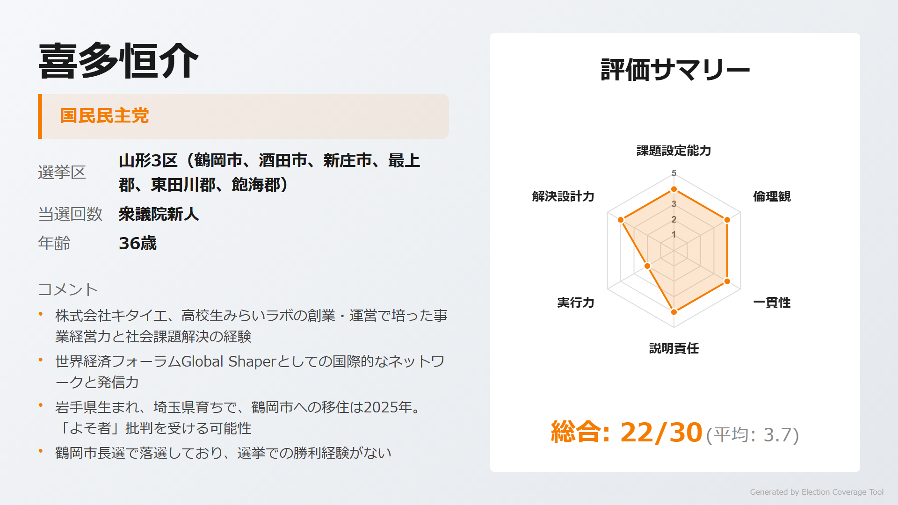
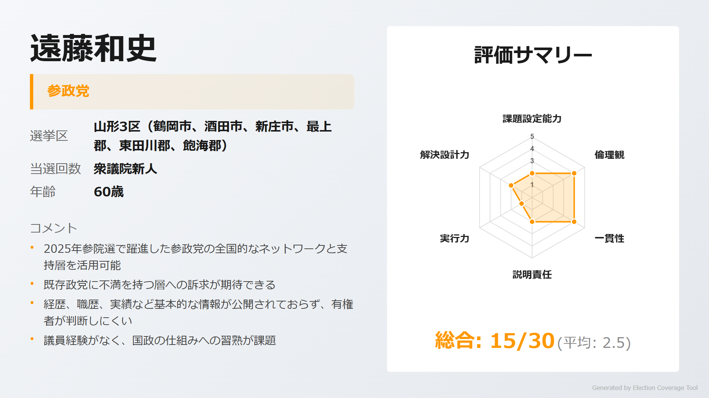

# 衆議院選挙 山形県

> 第51回衆議院議員総選挙（2026年2月8日投開票）

## 山形県の注目ポイント

- **遠藤利明の後継争い**: 1区で元五輪担当大臣・遠藤利明が引退、長男・遠藤寛明が世襲候補として出馬
- **現職農水大臣の選挙区**: 2区は鈴木憲和農林水産大臣（5期）の牙城。43歳での大臣就任は異例の抜擢
- **元こども政策担当大臣の地盤**: 3区・加藤鮎子（4期）は加藤紘一の娘、世襲3代目として地盤を守る

## 目次

- [1区](#1区)
- [2区](#2区)
- [3区](#3区)

---

## 1区

### 注目ポイント

- **世襲vs繰り上げ当選**: 遠藤利明の長男・遠藤寛明（自民・県議1期）に、繰り上げ当選した原田和広（中道改革連合・1期）が挑む
- **博士号を持つ政治家**: 原田和広は社会福祉学博士、英国大学院2校を修了した学術派

### 候補者

#### 遠藤寛明（自由民主党）

<!-- NOTE: 1区 候補者1 画像 -->

> **ウサギ**: 「父・遠藤利明が10期築いた強固な地盤を継承。米国CSISやパナソニックでの勤務経験で国際・ビジネス感覚を持つ」

> **ネコ**: 「県議1期のみで国政経験なし。世襲批判を受けやすく、独自色が見えにくい」

[詳細を見る](https://github.com/estela-works/poliscore2026-/blob/main/result/06_山形県/01区/遠藤寛明.md)

#### 原田和広（中道改革連合）

<!-- NOTE: 1区 候補者2 画像 -->

> **ウサギ**: 「社会福祉学博士、ケンブリッジ・LSE修了の学術派。3度の落選を経て2025年繰り上げ当選、福祉・貧困政策の専門家」

> **ネコ**: 「国政での実績はこれから。3度の落選経験があり、遠藤家への惜敗率70%前後と選挙に弱い」

[詳細を見る](https://github.com/estela-works/poliscore2026-/blob/main/result/06_山形県/01区/原田和広.md)

#### 桜田恭子（参政党）

<!-- NOTE: 1区 候補者3 画像 -->

> **ウサギ**: 「山形市出身の英会話講師。カナダ留学経験があり、教育現場での知見を持つ」

> **ネコ**: 「政治経験なし。政策の具体性に欠け、知名度も低い」

[詳細を見る](https://github.com/estela-works/poliscore2026-/blob/main/result/06_山形県/01区/桜田恭子.md)

---

## 2区

### 注目ポイント

- **現職農水大臣の選挙区**: 鈴木憲和（自民・5期）は43歳で農林水産大臣に就任、農水省出身の専門家
- **陣営の選挙違反問題**: 鈴木憲和陣営では2回の選挙で関係者が公職選挙法違反、組織管理に課題

### 候補者

#### 鈴木憲和（自由民主党）

<!-- NOTE: 2区 候補者1 画像 -->

> **ウサギ**: 「農水省出身で農政のプロフェッショナル。5期連続当選、43歳で農林水産大臣に就任した若手のホープ」

> **ネコ**: 「2回の選挙で陣営が公職選挙法違反。TPP反対から賛成への転換についての説明が不十分」

[詳細を見る](https://github.com/estela-works/poliscore2026-/blob/main/result/06_山形県/02区/鈴木憲和.md)

#### 菊池大二郎（国民民主党）

<!-- NOTE: 2区 候補者2 画像 -->

> **ウサギ**: 「村山市出身の行政書士。市議・県議を経て2024年比例復活当選、地元に根差した活動」

> **ネコ**: 「2023年県議選で落選。比例復活での当選で地盤が脆弱、政治活動に紆余曲折がある」

[詳細を見る](https://github.com/estela-works/poliscore2026-/blob/main/result/06_山形県/02区/菊池大二郎.md)

#### 岩本康嗣（日本共産党）

<!-- NOTE: 2区 候補者3 画像 -->

> **ウサギ**: 「5回の落選にも挑戦を続ける一貫した信念。生協勤務経験から生活者目線を持つ」

> **ネコ**: 「5回の国政挑戦で全敗、得票率4.5%と支持の広がりがない。実績が乏しい」

[詳細を見る](https://github.com/estela-works/poliscore2026-/blob/main/result/06_山形県/02区/岩本康嗣.md)

---

## 3区

### 注目ポイント

- **元こども政策担当大臣の地盤**: 加藤鮎子（自民・4期）は加藤紘一の娘、世襲3代目として庄内を守る
- **野党分裂**: 中道改革連合・落合拓磨（松下政経塾出身）と国民民主党・喜多恒介（社会起業家）が野党票を分け合う

### 候補者

#### 加藤鮎子（自由民主党）

<!-- NOTE: 3区 候補者1 画像 -->

> **ウサギ**: 「こども政策担当大臣として『こどもまんなか社会』を推進。2児の母として当事者視点を持ち、コロンビア大学院で国際公共政策を学んだ」

> **ネコ**: 「父・祖父からの政治家一家で世襲批判を受けやすい。こども家庭庁の名称変更と統一教会の関連についての説明不足」

[詳細を見る](https://github.com/estela-works/poliscore2026-/blob/main/result/06_山形県/03区/加藤鮎子.md)

#### 落合拓磨（中道改革連合）

<!-- NOTE: 3区 候補者2 画像 -->

> **ウサギ**: 「京大大学院修了、松下政経塾44期生。28歳の若さで『日本海側の地域間格差是正』という明確なビジョンを持つ」

> **ネコ**: 「政治経験なし、天童市出身で選挙区との繋がりが薄い。国民民主党の独自候補擁立で野党分裂」

[詳細を見る](https://github.com/estela-works/poliscore2026-/blob/main/result/06_山形県/03区/落合拓磨.md)

#### 喜多恒介（国民民主党）

<!-- NOTE: 3区 候補者3 画像 -->

> **ウサギ**: 「東大農学部卒の社会起業家。世界経済フォーラムGlobal Shaperに選出、15年以上のキャリア教育支援の実績」

> **ネコ**: 「岩手県生まれ、鶴岡市への移住は2025年で『よそ者』批判を受けやすい。鶴岡市長選で落選」

[詳細を見る](https://github.com/estela-works/poliscore2026-/blob/main/result/06_山形県/03区/喜多恒介.md)

#### 遠藤和史（参政党）

<!-- NOTE: 3区 候補者4 画像 -->

> **ウサギ**: 「参政党の全国的なネットワークと支持層を活用可能。既存政党への不満層へアピール」

> **ネコ**: 「経歴・実績など基本的な情報が公開されておらず、有権者が判断しにくい。政治経験なし」

[詳細を見る](https://github.com/estela-works/poliscore2026-/blob/main/result/06_山形県/03区/遠藤和史.md)

---

## 情報ソース

本記事の評価データは以下のリポジトリで公開しています。評価基準・根拠の詳細をご確認いただけます。

**GitHub**: [poliscore2026-](https://github.com/estela-works/poliscore2026-)

- 評価基準: [`data/politician_evaluation_criteria.md`](https://github.com/estela-works/poliscore2026-/blob/main/data/politician_evaluation_criteria.md)
- 各候補者の評価詳細: [`result/`](https://github.com/estela-works/poliscore2026-/tree/main/result)
