# 衆議院選挙 福島県

> 第51回衆議院議員総選挙（2026年2月8日投開票）

## 福島県の注目ポイント

- **原発事故からの復興と廃炉問題**: 浜通りを中心に原発廃炉、ALPS処理水、復興政策が最大の争点
- **裏金問題で自民が苦戦**: 1区・亀岡偉民は公選法違反で公判中、3区・上杉謙太郎は309万円の裏金で2024年落選
- **外務大臣経験者の牙城**: 2区で玄葉光一郎（11期）が衆議院副議長として政界の要に。東大首席の根本拓が挑戦

## 目次

- [1区](#1区)
- [2区](#2区)
- [3区](#3区)
- [4区](#4区)

---

## 1区

### 注目ポイント

- **金子恵美の4連勝なるか**: 福島1区で自民・亀岡偉民を3度破った金子恵美（中道改革連合・4期）が議席を守れるか
- **自民は新人擁立**: 裏金・公選法違反の亀岡偉民に代わり、県議会議長経験者の西山尚利を擁立
- **世襲候補の無所属挑戦**: 公判中の父・亀岡偉民の後継として長男・亀岡偉一が無所属で出馬

### 候補者

#### 金子恵美（中道改革連合）

<!-- NOTE: 1区 候補者1 画像 -->

> **ウサギ**: 「社会福祉学修士の専門性を活かし、障害者支援・介護政策に精通。福島1区で自民・亀岡偉民に3連勝の選挙の強さ」

> **ネコ**: 「民主党→無所属→立憲→中道改革連合と政党遍歴が多い。野党議員として政策実現の直接的手段が限られる」

[詳細を見る](https://github.com/estela-works/poliscore2026-/blob/main/result/07_福島県/01区/金子恵美.md)

#### 西山尚利（自由民主党）

<!-- NOTE: 1区 候補者2 画像 -->
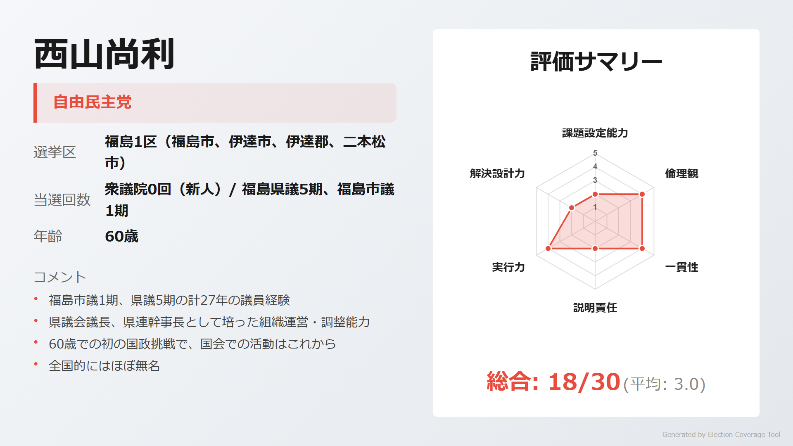

> **ウサギ**: 「福島市議1期、県議5期の27年間の地方議員経験。県議会議長、県連幹事長として組織運営力が高い」

> **ネコ**: 「60歳での国政初挑戦で全国的知名度なし。具体的な政策ビジョンが見えにくい」

[詳細を見る](https://github.com/estela-works/poliscore2026-/blob/main/result/07_福島県/01区/西山尚利.md)

#### 亀岡偉一（無所属）

<!-- NOTE: 1区 候補者3 画像 -->
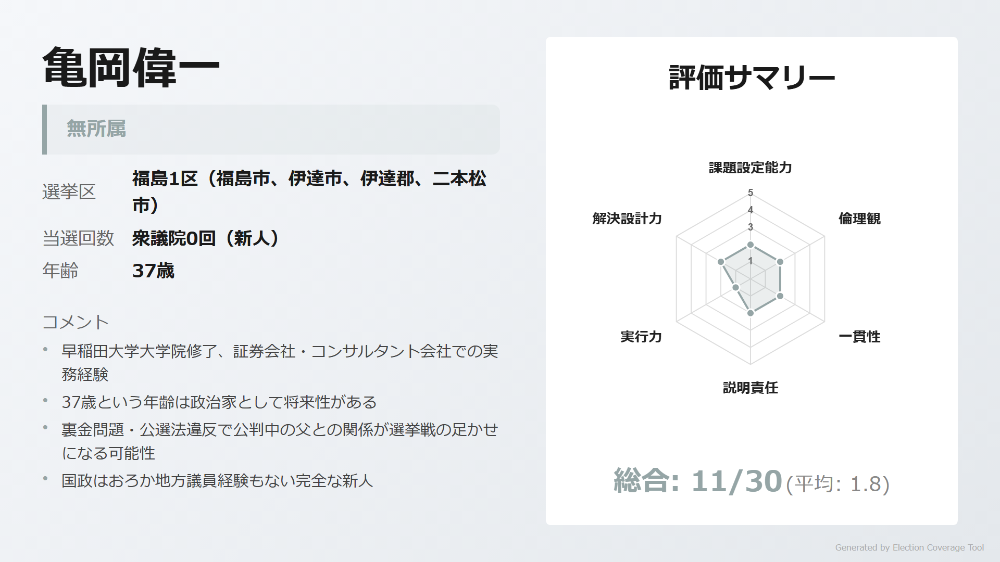

> **ウサギ**: 「早稲田大学大学院修了、証券・コンサル経験。37歳の若さで将来性がある」

> **ネコ**: 「父・亀岡偉民が裏金348万円・公選法違反で公判中という逆風。政治経験ゼロ、無所属で組織力なし」

[詳細を見る](https://github.com/estela-works/poliscore2026-/blob/main/result/07_福島県/01区/亀岡偉一.md)

---

## 2区

### 注目ポイント

- **玄葉光一郎の牙城**: 元外務大臣・玄葉光一郎（11期）が衆議院副議長として君臨。政界屈指の実力者
- **東大首席の世襲候補**: 元厚労大臣・根本匠の長男、東大首席・ハーバード大卒の弁護士・根本拓が挑戦
- **5候補の乱戦**: 参院選経験者2名含む5候補が出馬し、票の分散が焦点

### 候補者

#### 玄葉光一郎（中道改革連合）

<!-- NOTE: 2区 候補者1 画像 -->
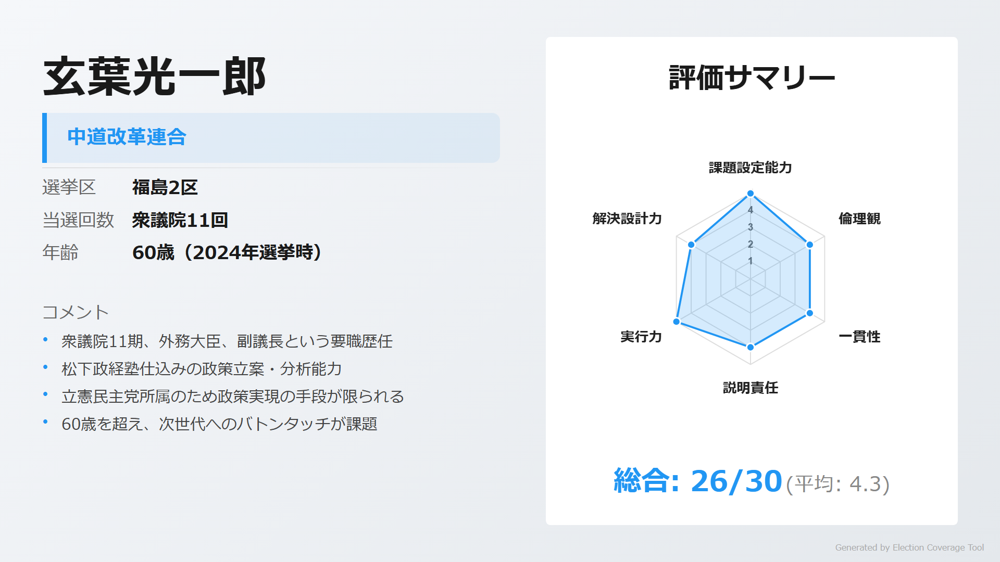

> **ウサギ**: 「衆議院11期、外務大臣、副議長という圧倒的実績。松下政経塾出身の政策通で、福島2区で連続当選を重ねる」

> **ネコ**: 「60歳を超え世代交代が課題。保守系として党内左派との距離感がある」

[詳細を見る](https://github.com/estela-works/poliscore2026-/blob/main/result/07_福島県/02区/玄葉光一郎.md)

#### 根本拓（自由民主党）

<!-- NOTE: 2区 候補者2 画像 -->
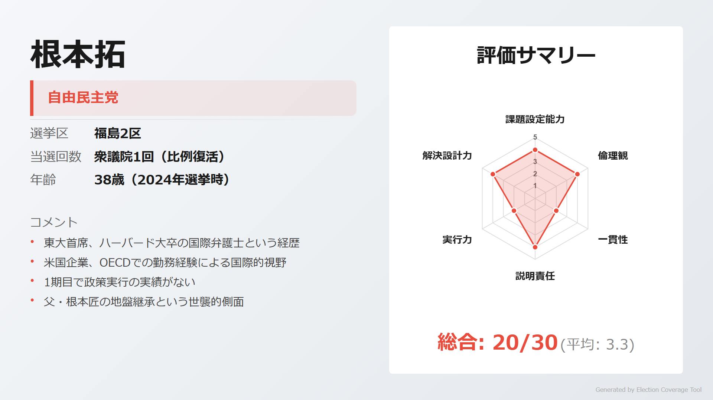

> **ウサギ**: 「東大法学部卒業生総代・首席、ハーバード大卒の国際弁護士。OECD勤務経験で国際的視野を持つ」

> **ネコ**: 「1期目で政治経験が浅い。父・根本匠の地盤継承という世襲批判、小選挙区では落選し比例復活」

[詳細を見る](https://github.com/estela-works/poliscore2026-/blob/main/result/07_福島県/02区/根本拓.md)

#### 遠藤雄大（無所属）

<!-- NOTE: 2区 候補者3 画像 -->
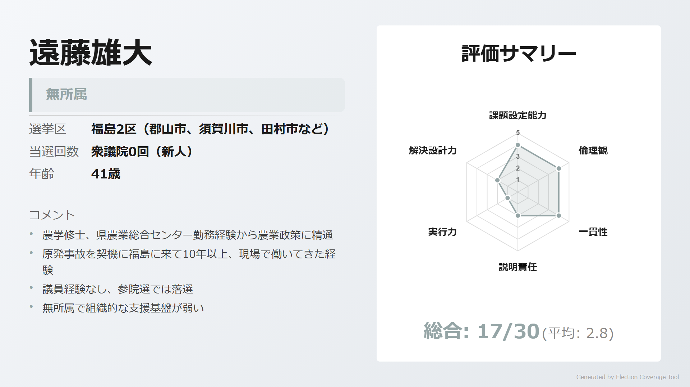

> **ウサギ**: 「農学修士、県農業総合センター勤務10年以上。震災後に福島に来て農業復興に取り組んできた現場経験」

> **ネコ**: 「2025年参院選で落選、政治経験不足。無所属で組織力がなく、農業政策以外のビジョンが不明確」

[詳細を見る](https://github.com/estela-works/poliscore2026-/blob/main/result/07_福島県/02区/遠藤雄大.md)

#### 大山里幸子（参政党）

<!-- NOTE: 2区 候補者4 画像 -->
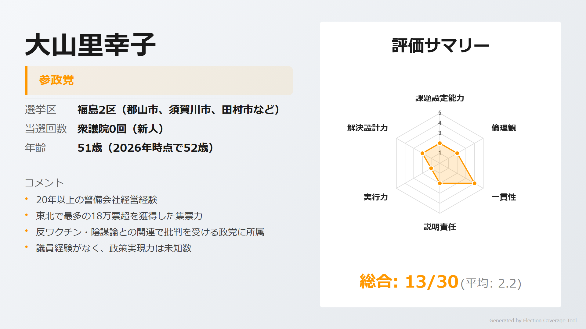

> **ウサギ**: 「2025年参院選で東北最多の18万票超を獲得。警備会社20年以上の経営経験、減税という明確なメッセージ」

> **ネコ**: 「参政党は反ワクチン・陰謀論との関連で批判を受ける。政治経験なし、政策は党方針の代弁にとどまる」

[詳細を見る](https://github.com/estela-works/poliscore2026-/blob/main/result/07_福島県/02区/大山里幸子.md)

#### 丸本由美子（日本共産党）

<!-- NOTE: 2区 候補者5 画像 -->
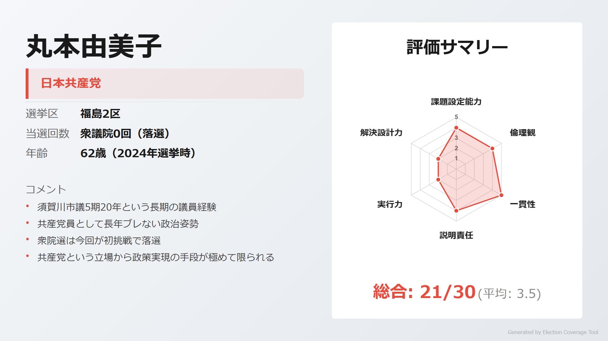

> **ウサギ**: 「須賀川市議5期20年の豊富な地方議員経験。保育士出身で生活者目線の政策提言、政策の一貫性は抜群」

> **ネコ**: 「2024年衆院選で落選、国政経験なし。共産党という立場から政策実現の手段が極めて限られる」

[詳細を見る](https://github.com/estela-works/poliscore2026-/blob/main/result/07_福島県/02区/丸本由美子.md)

---

## 3区

### 注目ポイント

- **裏金議員のリベンジ**: 309万円の裏金で非公認・落選した上杉謙太郎（自民・元2期）が支部長に復帰し再挑戦
- **政党遍歴6党の実力者**: 小熊慎司（中道改革連合・5期）は会津で強固な地盤。ただしウクライナ無断渡航で処分歴
- **85歳の泡沫候補**: 18年間で10回以上の選挙に全敗している金山屯が無所属で出馬

### 候補者

#### 小熊慎司（中道改革連合）

<!-- NOTE: 3区 候補者1 画像 -->
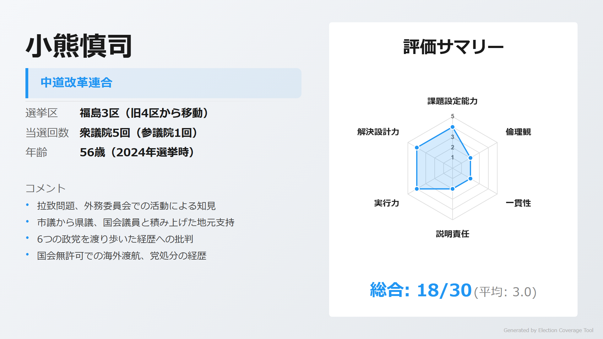

> **ウサギ**: 「拉致問題特別委員長として外交・安全保障に精通。会津で市議から県議、国会議員と積み上げた強固な地盤」

> **ネコ**: 「6つの政党を渡り歩いた政党遍歴。2022年ウクライナ無断渡航で党処分を受けた経歴」

[詳細を見る](https://github.com/estela-works/poliscore2026-/blob/main/result/07_福島県/03区/小熊慎司.md)

#### 上杉謙太郎（自由民主党）

<!-- NOTE: 3区 候補者2 画像 -->
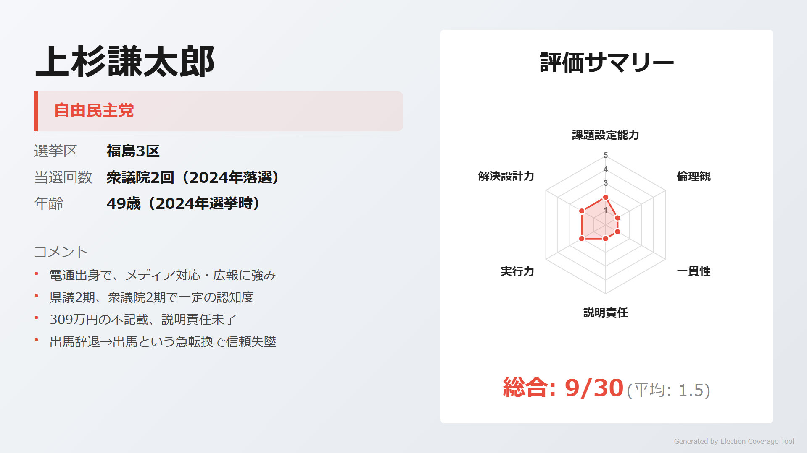

> **ウサギ**: 「電通出身でメディア対応・広報に強み。県議2期、衆議院2期の経験と地元での知名度」

> **ネコ**: 「309万円の裏金問題で2024年落選。出馬辞退→2日後に一転出馬という迷走で一貫性に大きな疑問」

[詳細を見る](https://github.com/estela-works/poliscore2026-/blob/main/result/07_福島県/03区/上杉謙太郎.md)

#### 金山屯（無所属）

<!-- NOTE: 3区 候補者3 画像 -->
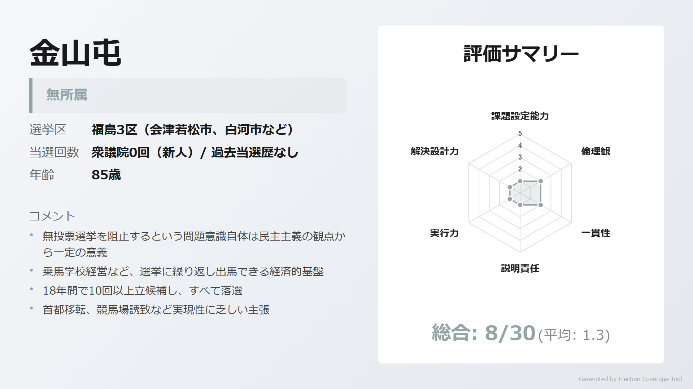

> **ウサギ**: 「無投票選挙への反対という民主主義への問題意識。乗馬学校経営で経済的基盤を持つ」

> **ネコ**: 「18年間で10回以上の選挙に全敗。85歳という年齢、首都移転など非現実的な政策」

[詳細を見る](https://github.com/estela-works/poliscore2026-/blob/main/result/07_福島県/03区/金山屯.md)

---

## 4区

### 注目ポイント

- **浜通り復興の最前線**: 原発廃炉、ALPS処理水、イノベーション・コースト構想が争点。唯一の小選挙区当選者・坂本竜太郎が議席を守れるか
- **医師の県議が国政へ**: れいわ推薦で県議当選した山口洋太が国民民主党公認で転身、医療政策を訴える
- **起業家vs世襲**: 富岡町で再エネ事業を経営する齋藤裕喜（中道改革連合）と、父の地盤を継いだ坂本竜太郎の対決

### 候補者

#### 坂本竜太郎（自由民主党）

<!-- NOTE: 4区 候補者1 画像 -->
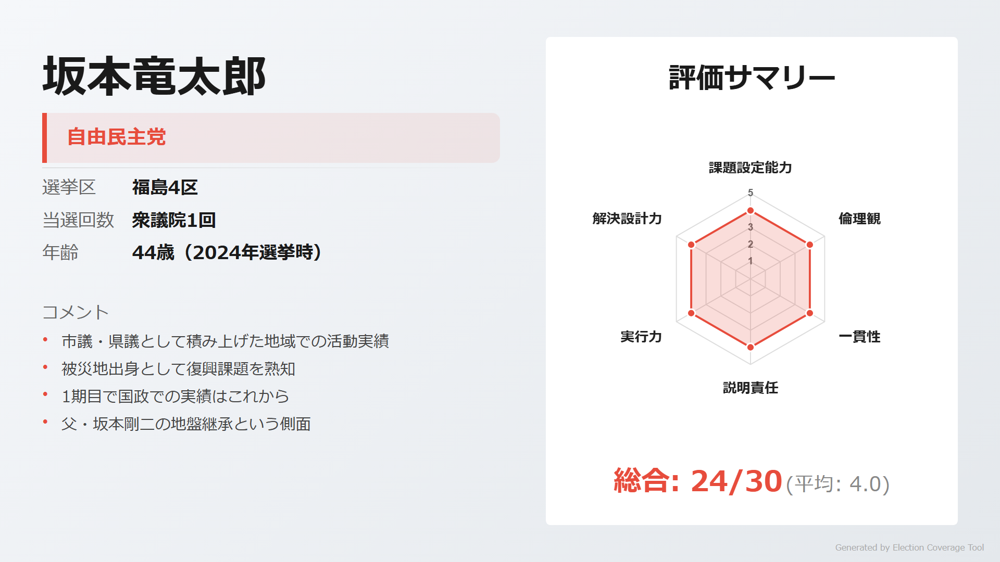

> **ウサギ**: 「2024年衆院選で福島県内唯一の小選挙区当選。県議として台湾の食品輸入規制緩和に貢献、復興政策に精通」

> **ネコ**: 「1期目で国政での実績はこれから。父・坂本剛二の地盤継承という世襲批判」

[詳細を見る](https://github.com/estela-works/poliscore2026-/blob/main/result/07_福島県/04区/坂本竜太郎.md)

#### 齋藤裕喜（中道改革連合）

<!-- NOTE: 4区 候補者2 画像 -->

> **ウサギ**: 「富岡町で再生可能エネルギー会社を経営し、復興の現場を熟知。泉健太代表の元秘書、起業家としての視点」

> **ネコ**: 「1期目で政治経験が浅い。小選挙区では敗北し比例復活、基盤の弱さが課題」

[詳細を見る](https://github.com/estela-works/poliscore2026-/blob/main/result/07_福島県/04区/齋藤裕喜.md)

#### 山口洋太（国民民主党）

<!-- NOTE: 4区 候補者3 画像 -->
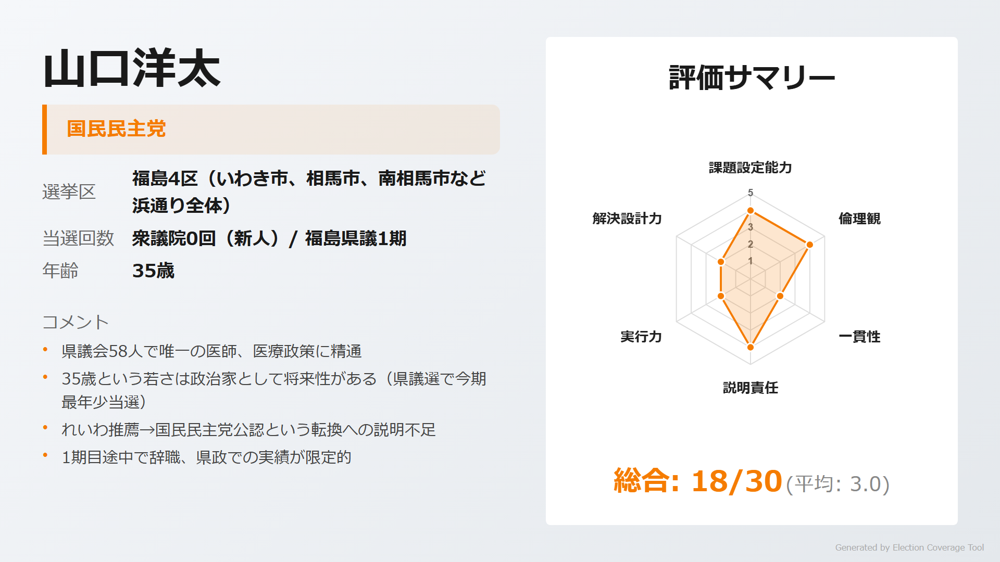

> **ウサギ**: 「県議会58人で唯一の医師。35歳で今期最年少、震災後に福島に移住し医療に従事してきた実績」

> **ネコ**: 「れいわ推薦→国民民主党公認と政治的立場が2年で変化。県議1期目途中で辞職、実績が限定的」

[詳細を見る](https://github.com/estela-works/poliscore2026-/blob/main/result/07_福島県/04区/山口洋太.md)

#### 熊谷智（日本共産党）

<!-- NOTE: 4区 候補者4 画像 -->
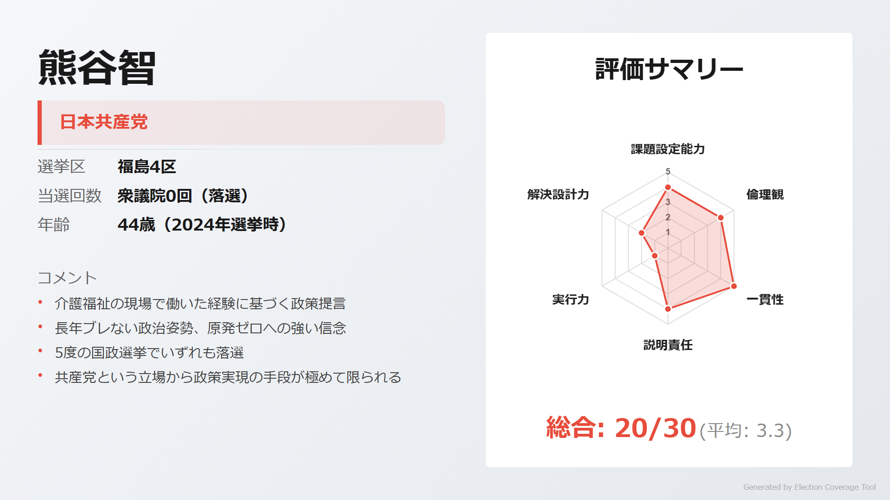

> **ウサギ**: 「介護福祉の現場経験に基づく政策提言。原発ゼロ、平和外交という政策軸は長年一貫してブレない」

> **ネコ**: 「参院選1回、衆院選4回で全て落選。共産党の立場から政策実現の手段が極めて限られる」

[詳細を見る](https://github.com/estela-works/poliscore2026-/blob/main/result/07_福島県/04区/熊谷智.md)

---

## 情報ソース

本記事の評価データは以下のリポジトリで公開しています。評価基準・根拠の詳細をご確認いただけます。

**GitHub**: [poliscore2026-](https://github.com/estela-works/poliscore2026-)

- 評価基準: [`data/politician_evaluation_criteria.md`](https://github.com/estela-works/poliscore2026-/blob/main/data/politician_evaluation_criteria.md)
- 各候補者の評価詳細: [`result/`](https://github.com/estela-works/poliscore2026-/tree/main/result)
