# 衆議院選挙 茨城県

> 第51回衆議院議員総選挙（2026年2月8日投開票）

## 茨城県の注目ポイント

- **衆議院議長のお膝元**: 2区・額賀福志郎（14期）が衆議院議長として君臨。81歳の長老政治vs若手候補の構図
- **国民民主党の牙城**: 5区の浅野哲（幹事長代行）、元日立研究所出身が3期連続当選。自民新人との対決
- **中村家の世代交代**: 7区で父・喜四郎（15期）から息子・勇太へバトンタッチ。元文科大臣・永岡桂子とのリベンジマッチ

## 目次

- [1区](#1区)
- [2区](#2区)
- [3区](#3区)
- [4区](#4区)
- [5区](#5区)
- [6区](#6区)
- [7区](#7区)

---

## 1区

### 注目ポイント

- **元経産官僚vs復興副大臣**: 福島伸享（無所属・4期）と田所嘉徳（自民・5期）の激突が続く
- **無所属の戦い**: 福島伸享は「党より人物」を掲げ、4回の落選を乗り越え連続当選中

### 候補者

#### 福島伸享（無所属）

<!-- NOTE: 1区 候補者1 画像 -->

> **ウサギ**: 「元経産官僚として議員立法12本を提出、トップクラスの政策立案能力。森友・加計問題では本質を突く追及で注目を集めた」

> **ネコ**: 「民主党→希望の党→無所属と政党遍歴が複雑。4回の落選経験があり、組織的支援基盤が弱い」

[詳細を見る](https://github.com/estela-works/poliscore2026-/blob/main/result/08_茨城県/01区/福島伸享.md)

#### 田所嘉徳（自由民主党）

<!-- NOTE: 1区 候補者2 画像 -->
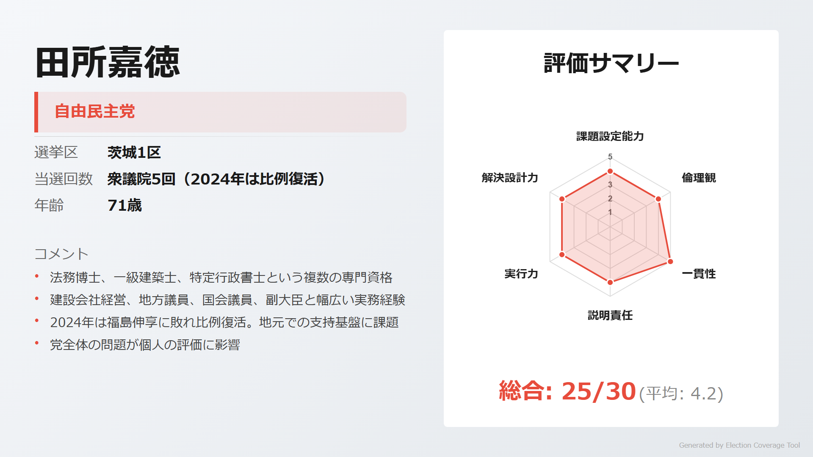

> **ウサギ**: 「法務博士、一級建築士、特定行政書士と専門資格を持つ。復興副大臣として被災地支援の実務を担当」

> **ネコ**: 「2024年衆院選は小選挙区で敗北し比例復活。地元・茨城1区での支持基盤に課題」

[詳細を見る](https://github.com/estela-works/poliscore2026-/blob/main/result/08_茨城県/01区/田所嘉徳.md)

#### 川端絢美（参政党）

<!-- NOTE: 1区 候補者3 画像 -->

> **ウサギ**: 「防衛大学校卒、陸上自衛隊15年勤務という異色の経歴。安全保障への専門知識を持つ」

> **ネコ**: 「政治経験なしの完全新人。選挙区内での知名度構築が課題」

[詳細を見る](https://github.com/estela-works/poliscore2026-/blob/main/result/08_茨城県/01区/川端絢美.md)

#### 大内久美子（日本共産党）

<!-- NOTE: 1区 候補者4 画像 -->
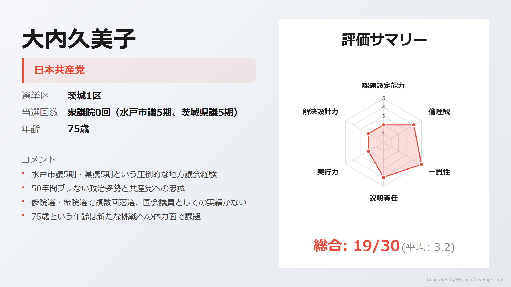

> **ウサギ**: 「水戸市議5期・県議5期と40年の地方議員経験。50年間共産党で一貫した活動を継続」

> **ネコ**: 「参院選・衆院選で複数回落選し国政経験なし。75歳という年齢も課題」

[詳細を見る](https://github.com/estela-works/poliscore2026-/blob/main/result/08_茨城県/01区/大内久美子.md)

---

## 2区

### 注目ポイント

- **衆議院議長の地盤**: 額賀福志郎（自民・14期）は81歳の現職議長。KSD事件など過去のスキャンダルを抱える
- **参院落選組の挑戦**: 小沼巧（中道改革連合）が2025年参院選落選後、衆院鞍替えを狙う

### 候補者

#### 額賀福志郎（自由民主党）

<!-- NOTE: 2区 候補者1 画像 -->
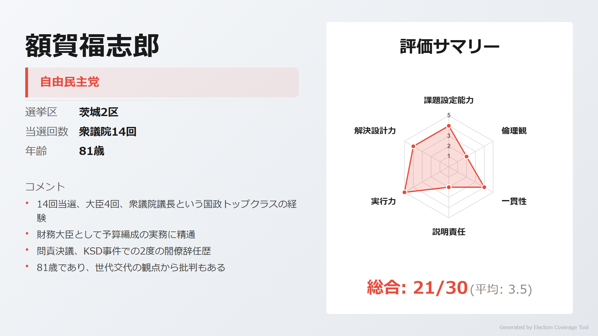

> **ウサギ**: 「14回当選、財務大臣・防衛庁長官を歴任し、現職・衆議院議長。日韓議員連盟会長として外交にも貢献」

> **ネコ**: 「KSD事件で2度の閣僚辞任、問責決議を受けた過去。81歳の高齢で世代交代の声も」

[詳細を見る](https://github.com/estela-works/poliscore2026-/blob/main/result/08_茨城県/02区/額賀福志郎.md)

#### 小沼巧（中道改革連合）

<!-- NOTE: 2区 候補者2 画像 -->
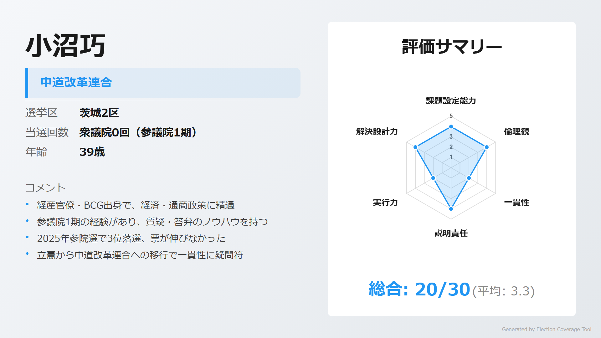

> **ウサギ**: 「経産官僚・BCG出身で経済政策に精通。参議院1期でアベノマスク466億円問題など鋭い追及」

> **ネコ**: 「2025年参院選で落選（3位）。立憲から中道改革連合への移行で政党変更あり」

[詳細を見る](https://github.com/estela-works/poliscore2026-/blob/main/result/08_茨城県/02区/小沼巧.md)

#### 谷川祐一（国民民主党）

<!-- NOTE: 2区 候補者3 画像 -->
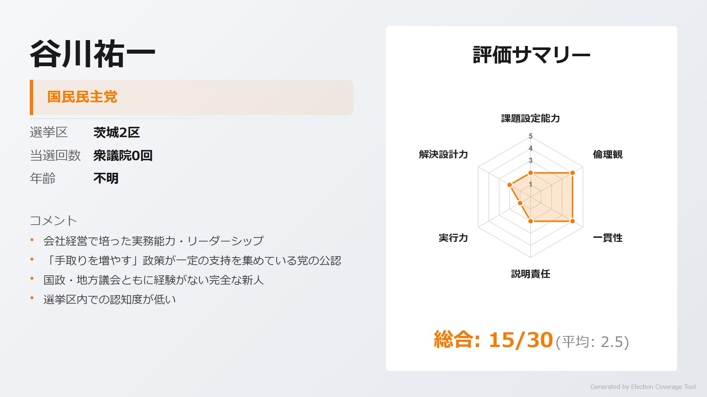

> **ウサギ**: 「会社経営者としての実務経験。国民民主党の『手取りを増やす』政策で中道層への訴求を狙う」

> **ネコ**: 「政治経験なしの完全新人。経歴・政策の公開情報が極めて乏しい」

[詳細を見る](https://github.com/estela-works/poliscore2026-/blob/main/result/08_茨城県/02区/谷川祐一.md)

#### 宮内匠（参政党）

<!-- NOTE: 2区 候補者4 画像 -->
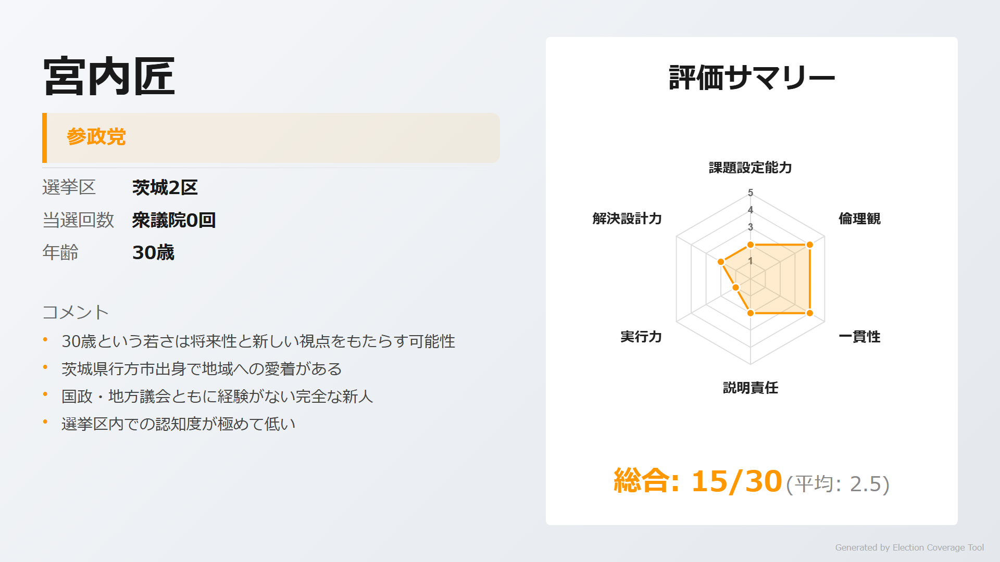

> **ウサギ**: 「30歳という若さで将来性あり。行方市出身で地元への愛着を持つ」

> **ネコ**: 「政治経験なし、選挙区内での認知度が極めて低い。公開情報が限定的」

[詳細を見る](https://github.com/estela-works/poliscore2026-/blob/main/result/08_茨城県/02区/宮内匠.md)

---

## 3区

### 注目ポイント

- **失言大臣のリベンジ**: 葉梨康弘（自民・7期）は「死刑のはんこ」発言で法務大臣を更迭された過去
- **県議2期の挑戦者**: 梶岡博樹（中道改革連合）は17年以上の駅頭活動で地元密着を続けるも、衆院選2度落選

### 候補者

#### 葉梨康弘（自由民主党）

<!-- NOTE: 3区 候補者1 画像 -->
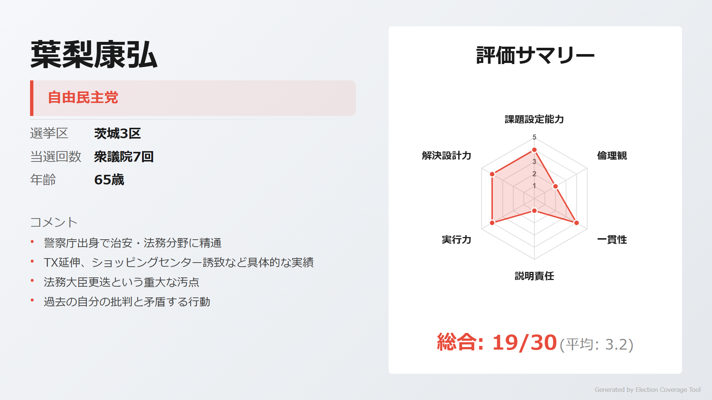

> **ウサギ**: 「元警察官僚で法務分野に精通。TX延伸、ショッピングセンター誘致など地域インフラでの実績」

> **ネコ**: 「『死刑のはんこを押す地味な役職』発言で法務大臣を更迭。過去に自分が批判した発言と同じことをした矛盾」

[詳細を見る](https://github.com/estela-works/poliscore2026-/blob/main/result/08_茨城県/03区/葉梨康弘.md)

#### 梶岡博樹（中道改革連合）

<!-- NOTE: 3区 候補者2 画像 -->
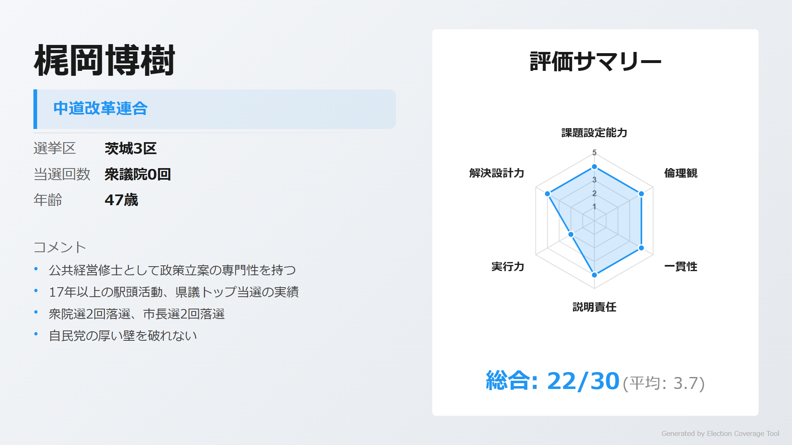

> **ウサギ**: 「早大院で北川正恭元知事に師事、公共経営修士。県議2期でトップ当選の実績、17年以上の駅頭活動」

> **ネコ**: 「衆院選2回、市長選2回と計4度の落選。国政への壁を破れていない」

[詳細を見る](https://github.com/estela-works/poliscore2026-/blob/main/result/08_茨城県/03区/梶岡博樹.md)

#### 加川裕美（れいわ新選組）

<!-- NOTE: 3区 候補者3 画像 -->
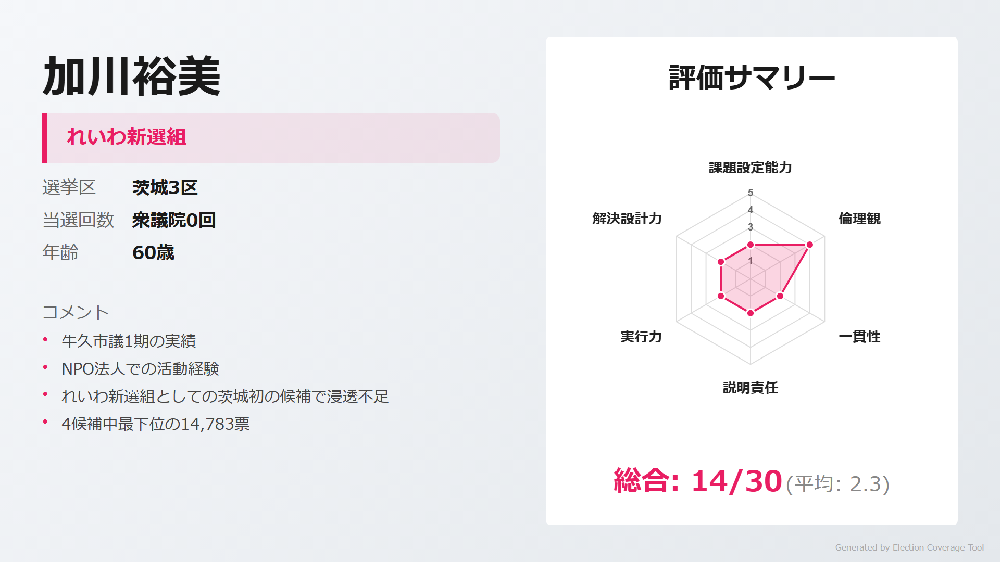

> **ウサギ**: 「牛久市議1期の経験。入管施設の人権問題など地域特有の課題を認識」

> **ネコ**: 「共産党→れいわへ党変更。2024年衆院選では4位で落選」

[詳細を見る](https://github.com/estela-works/poliscore2026-/blob/main/result/08_茨城県/03区/加川裕美.md)

#### 斎藤真衣（参政党）

<!-- NOTE: 3区 候補者4 画像 -->
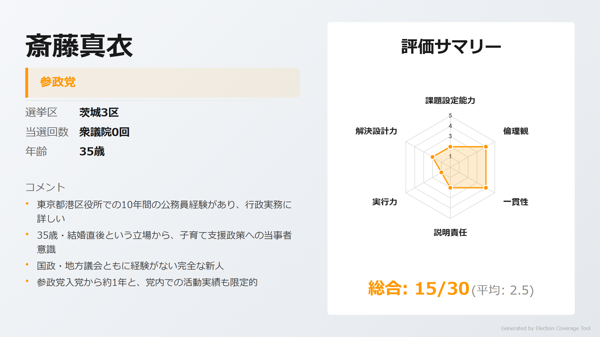

> **ウサギ**: 「港区役所で10年間の公務員経験、行政実務に詳しい。芝浦工大卒で理系の視点を持つ」

> **ネコ**: 「政治経験なし、参政党入党から約1年と活動期間が短い」

[詳細を見る](https://github.com/estela-works/poliscore2026-/blob/main/result/08_茨城県/03区/斎藤真衣.md)

---

## 4区

### 注目ポイント

- **経産大臣・国対委員長の牙城**: 梶山弘志（自民・9期）は2009年民主党ブームでも唯一茨城で小選挙区勝利した鉄壁の選挙力
- **父・梶山静六の地盤**: 世襲議員だが、圧倒的な実績で地位を確立

### 候補者

#### 梶山弘志（自由民主党）

<!-- NOTE: 4区 候補者1 画像 -->
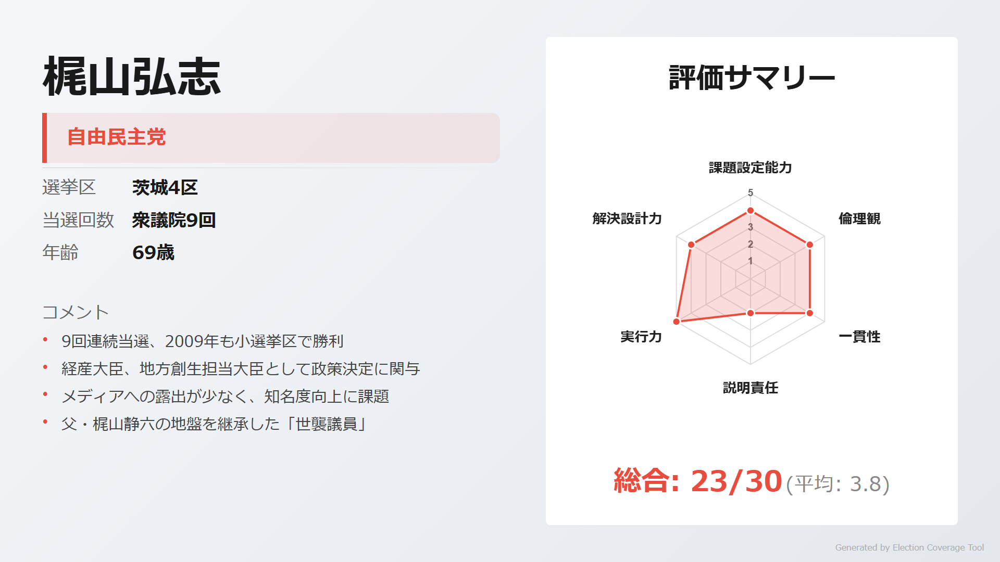

> **ウサギ**: 「経産大臣、地方創生担当大臣を歴任。現在は自民党国会対策委員長として国会運営を仕切る」

> **ネコ**: 「父・梶山静六の地盤を継承した世襲議員。メディア露出が少なく、一般有権者への発信力に課題」

[詳細を見る](https://github.com/estela-works/poliscore2026-/blob/main/result/08_茨城県/04区/梶山弘志.md)

#### 吉田翔（日本共産党）

<!-- NOTE: 4区 候補者2 画像 -->
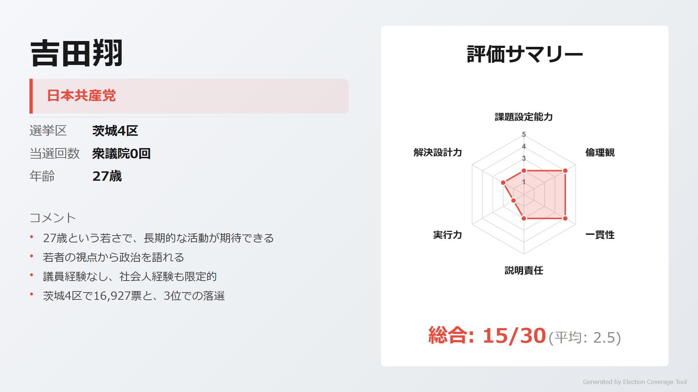

> **ウサギ**: 「27歳という若さで世代交代を象徴。学生赤十字奉仕団団長として社会貢献活動の経験」

> **ネコ**: 「議員経験なし、梶山弘志（9期）という鉄壁の相手との戦い」

[詳細を見る](https://github.com/estela-works/poliscore2026-/blob/main/result/08_茨城県/04区/吉田翔.md)

---

## 5区

### 注目ポイント

- **日立製作所出身の現職**: 浅野哲（国民民主・3期）は元日立研究所研究員。幹事長代行として党を支える
- **自民空白区**: 前回元職が出馬せず、新人・鈴木拓海が自民党の議席奪還を狙う

### 候補者

#### 浅野哲（国民民主党）

<!-- NOTE: 5区 候補者1 画像 -->
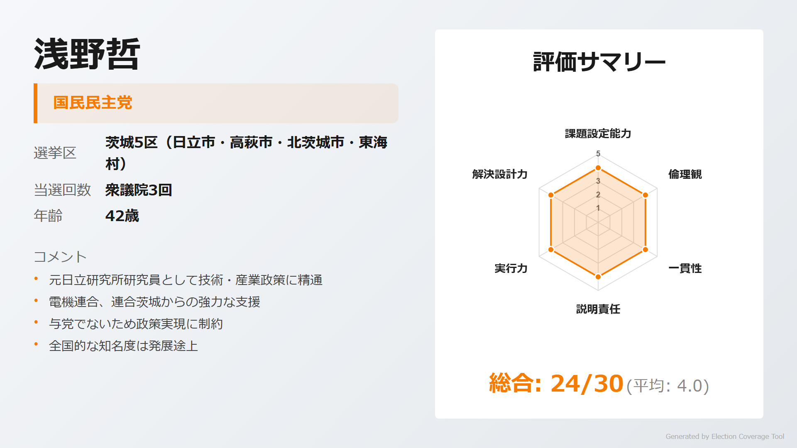

> **ウサギ**: 「元日立研究所研究員として技術・産業政策に精通。国民民主党幹事長代行として党運営の中枢を担う」

> **ネコ**: 「八王子出身で茨城との地縁は後天的。野党のため大規模政策の実現には制約」

[詳細を見る](https://github.com/estela-works/poliscore2026-/blob/main/result/08_茨城県/05区/浅野哲.md)

#### 鈴木拓海（自由民主党）

<!-- NOTE: 5区 候補者2 画像 -->
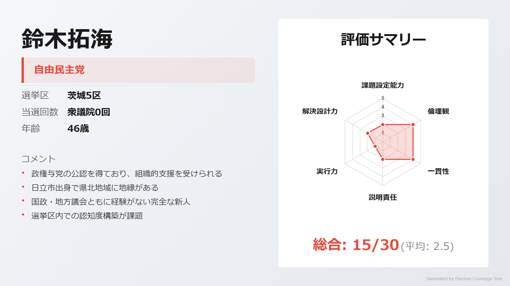

> **ウサギ**: 「日立市出身で地元への愛着。祖父は県議会議長経験者で政治家一族の血筋」

> **ネコ**: 「政治経験なしの完全新人。浅野哲という強力な現職との対決」

[詳細を見る](https://github.com/estela-works/poliscore2026-/blob/main/result/08_茨城県/05区/鈴木拓海.md)

---

## 6区

### 注目ポイント

- **医師vs地元密着**: 国光文乃（自民・3期）は医学博士・外務副大臣vs青山大人（無所属・3期）は18年間の駅頭活動
- **無所属の戦い**: 青山大人は立憲を離党し無所属で出馬。中道改革連合には合流せず

### 候補者

#### 国光文乃（自由民主党）

<!-- NOTE: 6区 候補者1 画像 -->
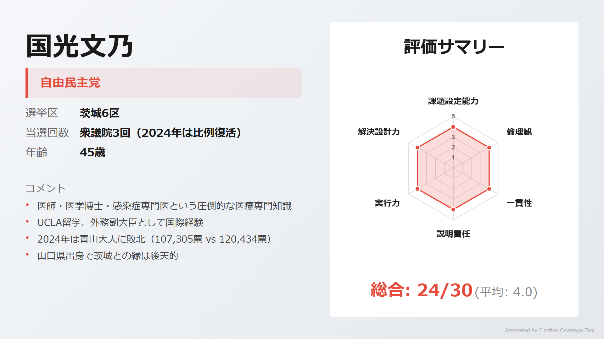

> **ウサギ**: 「医師・医学博士・感染症専門医として医療政策に精通。外務副大臣として国際経験も」

> **ネコ**: 「2024年衆院選で青山大人に敗北（比例復活）。山口県出身で茨城との地縁は後天的」

[詳細を見る](https://github.com/estela-works/poliscore2026-/blob/main/result/08_茨城県/06区/国光文乃.md)

#### 青山大人（無所属）

<!-- NOTE: 6区 候補者2 画像 -->
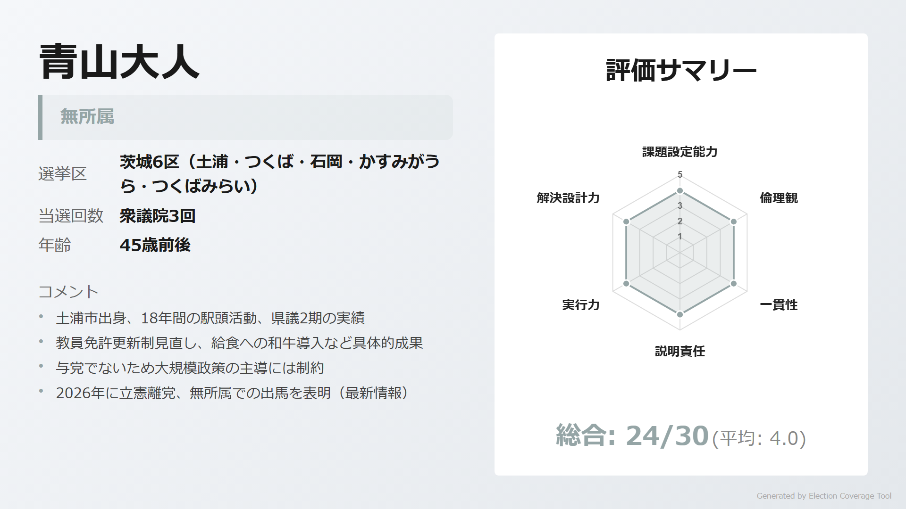

> **ウサギ**: 「土浦市出身、18年間の駅頭活動で地元密着。2024年に初の選挙区勝利、教員免許更新制見直しなど政策実現」

> **ネコ**: 「立憲を離党し無所属で出馬。中道改革連合に合流せず、組織的支援が弱まる可能性」

[詳細を見る](https://github.com/estela-works/poliscore2026-/blob/main/result/08_茨城県/06区/青山大人.md)

#### 中村吉男（無所属）

<!-- NOTE: 6区 候補者3 画像 -->
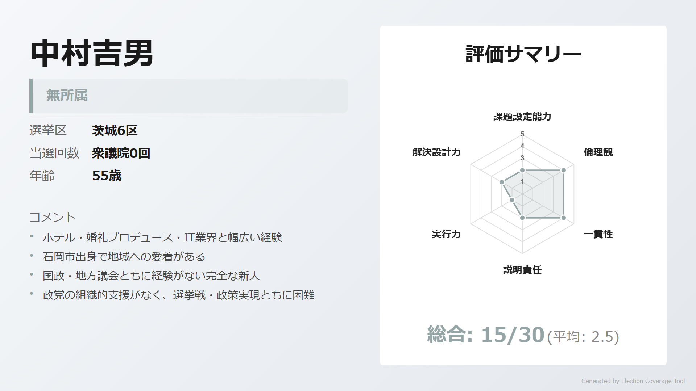

> **ウサギ**: 「石岡市出身で地元への愛着。憲法改正・航空宇宙産業など具体的な政策方向性を持つ」

> **ネコ**: 「政治経験なし、無所属で組織的支援なし。激戦区での新人出馬は厳しい」

[詳細を見る](https://github.com/estela-works/poliscore2026-/blob/main/result/08_茨城県/06区/中村吉男.md)

---

## 7区

### 注目ポイント

- **中村家の世代交代**: 父・喜四郎（15期）から息子・勇太へ。2024年衆院選で元文科大臣・永岡桂子を破り初当選
- **永岡桂子のリベンジ**: 7期当選、文科大臣経験者が議席奪還を狙う

### 候補者

#### 中村勇太（無所属）

<!-- NOTE: 7区 候補者1 画像 -->
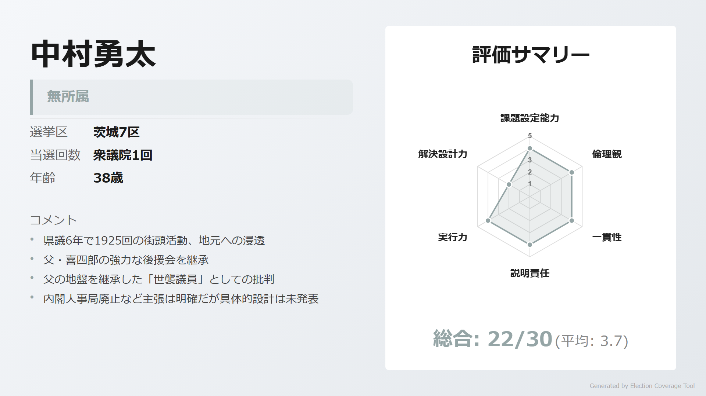

> **ウサギ**: 「県議6年で1925回の街頭活動という地道さ。2024年衆院選で永岡桂子を破り初当選、38歳の若さ」

> **ネコ**: 「父・喜四郎の地盤を継承した世襲議員。内閣人事局廃止など主張は明確だが具体的設計は未発表」

[詳細を見る](https://github.com/estela-works/poliscore2026-/blob/main/result/08_茨城県/07区/中村勇太.md)

#### 永岡桂子（自由民主党）

<!-- NOTE: 7区 候補者2 画像 -->
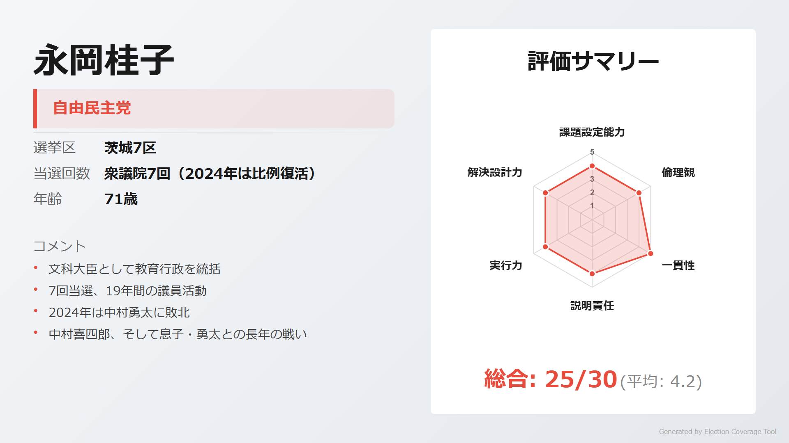

> **ウサギ**: 「7回当選、文部科学大臣を経験。夫を失ったひとり親としての経験を政策に反映」

> **ネコ**: 「2024年衆院選で中村勇太に敗北し比例復活。71歳という年齢、中村家との因縁」

[詳細を見る](https://github.com/estela-works/poliscore2026-/blob/main/result/08_茨城県/07区/永岡桂子.md)

---

## 情報ソース

本記事の評価データは以下のリポジトリで公開しています。評価基準・根拠の詳細をご確認いただけます。

**GitHub**: [poliscore2026-](https://github.com/estela-works/poliscore2026-)

- 評価基準: [`data/politician_evaluation_criteria.md`](https://github.com/estela-works/poliscore2026-/blob/main/data/politician_evaluation_criteria.md)
- 各候補者の評価詳細: [`result/`](https://github.com/estela-works/poliscore2026-/tree/main/result)
