# 衆議院選挙 栃木県

> 第51回衆議院議員総選挙（2026年2月8日投開票）

## 栃木県の注目ポイント

- **自民党重鎮2人の牙城**: 1区・船田元（14期）、5区・茂木敏充（11期）の超ベテランが君臨
- **裏金問題の渦中**: 3区・簗和生が1746万円不記載で処分を受けながら178票差で当選、次回への影響は
- **野党の躍進**: 4区で藤岡隆雄が5度目の挑戦で佐藤勉元総務会長を撃破、地殻変動の兆し

## 目次

- [1区](#1区)
- [2区](#2区)
- [3区](#3区)
- [4区](#4区)
- [5区](#5区)

---

## 1区

### 注目ポイント

- **最長老議員の戦い**: 船田元（自民・14期）は71歳、「政界失楽園」から30年を経て今なお現役
- **医師出身の維新候補**: 柏倉祐司（維新・元1期）がジョンズホプキンス大学での研究経験を活かし再挑戦

### 候補者

#### 船田元（自由民主党）

<!-- NOTE: 1区 候補者1 画像 -->
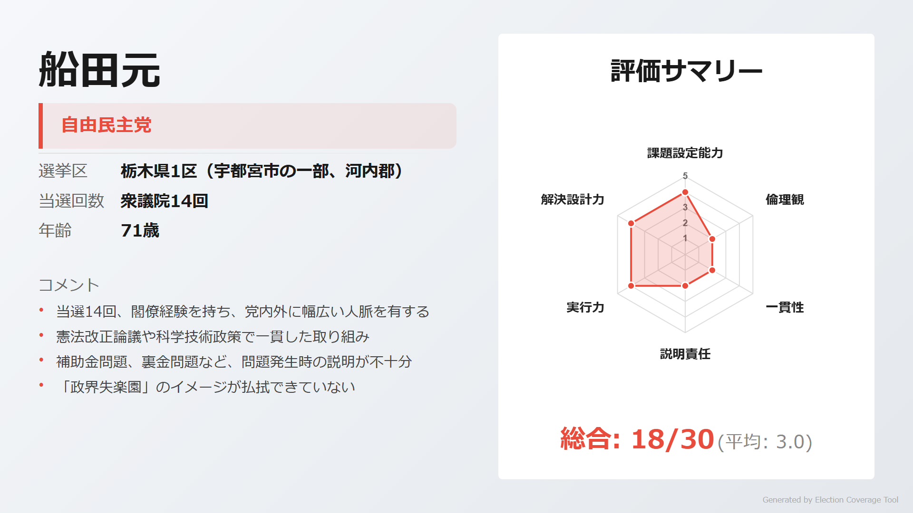

> **ウサギ**: 「当選14回、経済企画庁長官経験者。憲法改正推進本部長として憲法論議をリード、すばる望遠鏡建設も主導」

> **ネコ**: 「障害児施設での補助金不正受給問題、『政界失楽園』スキャンダル、新生党離党・復党の政党遍歴と問題が多い」

[詳細を見る](https://github.com/estela-works/poliscore2026-/blob/main/result/09_栃木県/01区/船田元.md)

#### 小池篤史（中道改革連合）

<!-- NOTE: 1区 候補者2 画像 -->
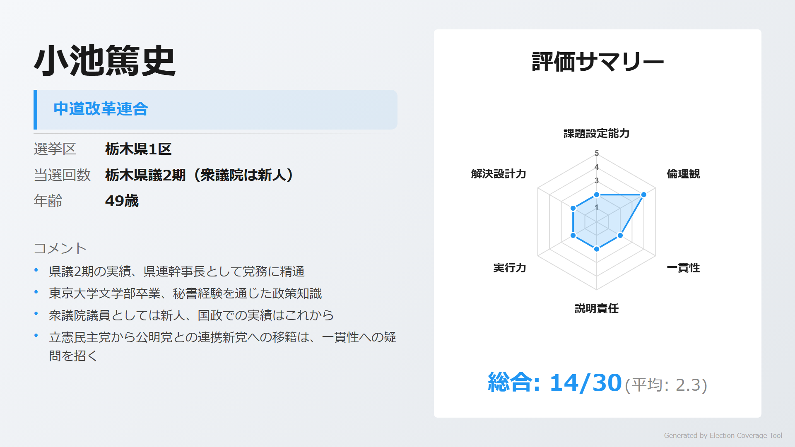

> **ウサギ**: 「東大卒、県議2期・県連幹事長として地盤を築く。福田昭夫議員の秘書経験で政策を学んだ」

> **ネコ**: 「国政経験なしの新人。立憲から公明との連携新党への移籍は一貫性への疑問を招く」

[詳細を見る](https://github.com/estela-works/poliscore2026-/blob/main/result/09_栃木県/01区/小池篤史.md)

#### 柏倉祐司（日本維新の会）

<!-- NOTE: 1区 候補者3 画像 -->
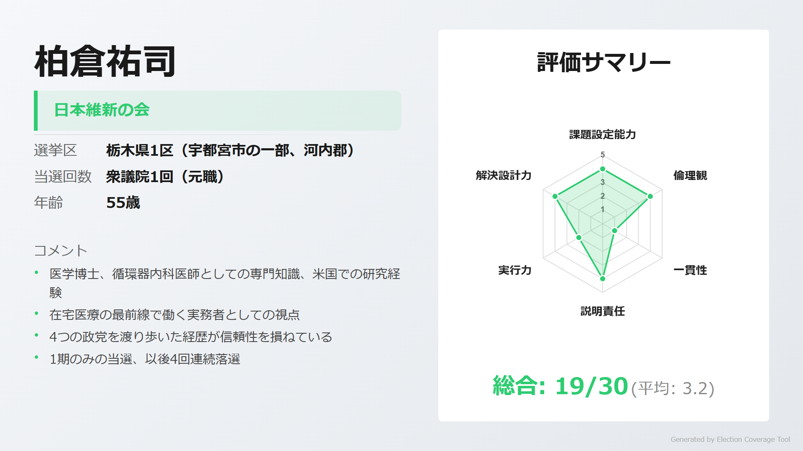

> **ウサギ**: 「医学博士・循環器内科医として医療政策に精通。ジョンズホプキンス大学での研究経験も」

> **ネコ**: 「みんなの党→民主党→希望の党→維新と4つの政党を渡り歩き、1期以降は4回連続落選」

[詳細を見る](https://github.com/estela-works/poliscore2026-/blob/main/result/09_栃木県/01区/柏倉祐司.md)

#### 青木弘（日本共産党）

<!-- NOTE: 1区 候補者4 画像 -->
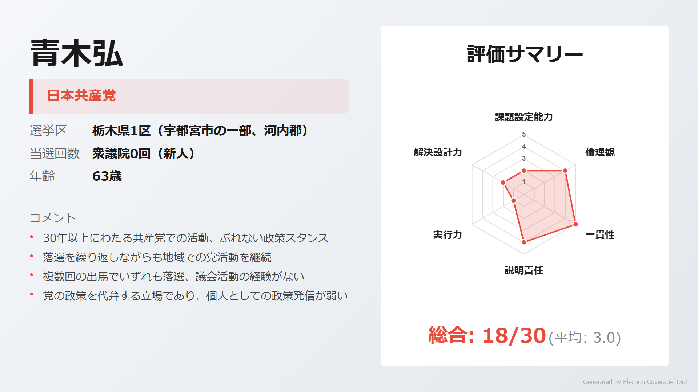

> **ウサギ**: 「1991年入党以来30年以上、共産党一筋でぶれない政治姿勢。クリーンなイメージを維持」

> **ネコ**: 「複数回の国政選挙で全て落選、議会活動の経験がない。独自の政策提言も限定的」

[詳細を見る](https://github.com/estela-works/poliscore2026-/blob/main/result/09_栃木県/01区/青木弘.md)

#### 大森紀明（参政党）

<!-- NOTE: 1区 候補者5 画像 -->
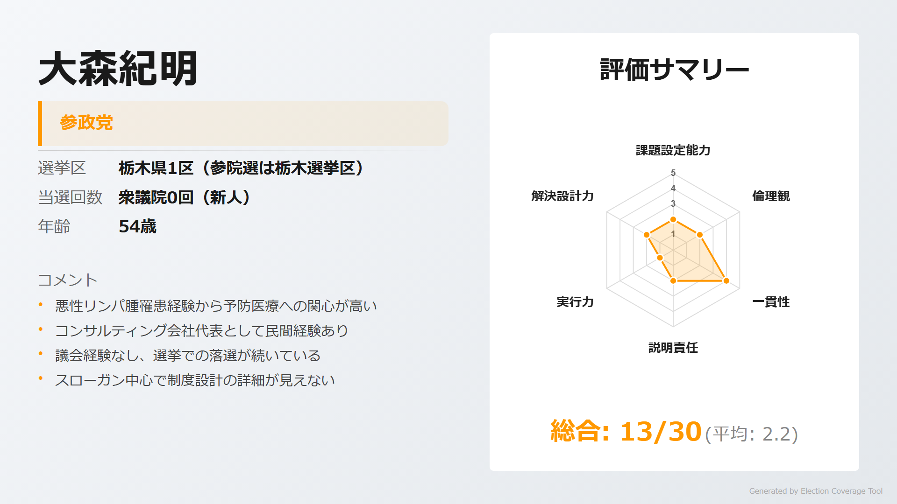

> **ウサギ**: 「悪性リンパ腫の闘病経験から予防医療に強い関心。コンサルティング会社経営の民間経験」

> **ネコ**: 「市議選・衆院選と連続落選。参政党への批判（反ワクチン、陰謀論）も考慮が必要」

[詳細を見る](https://github.com/estela-works/poliscore2026-/blob/main/result/09_栃木県/01区/大森紀明.md)

#### 石川文三郎（無所属）

<!-- NOTE: 1区 候補者6 画像 -->
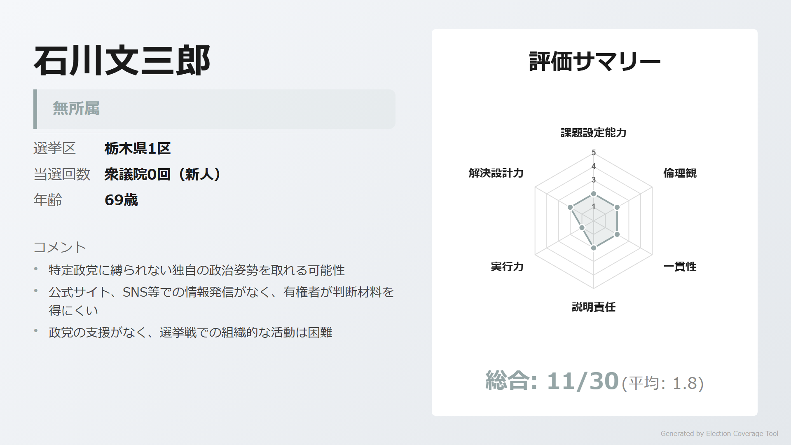

> **ウサギ**: 「無所属として特定政党に縛られない独自の政治姿勢を取れる可能性」

> **ネコ**: 「公式サイト、SNS等での情報発信がなく、有権者が判断する材料が極めて不足」

[詳細を見る](https://github.com/estela-works/poliscore2026-/blob/main/result/09_栃木県/01区/石川文三郎.md)

---

## 2区

### 注目ポイント

- **元県知事vs現政務官**: 福田昭夫（中道改革連合・7期）は元栃木県知事、五十嵐清（自民・2期）は環境大臣政務官
- **消費税減税の急先鋒**: 福田昭夫は消費増税反対で政務官を辞任した信念の人

### 候補者

#### 福田昭夫（中道改革連合）

<!-- NOTE: 2区 候補者1 画像 -->
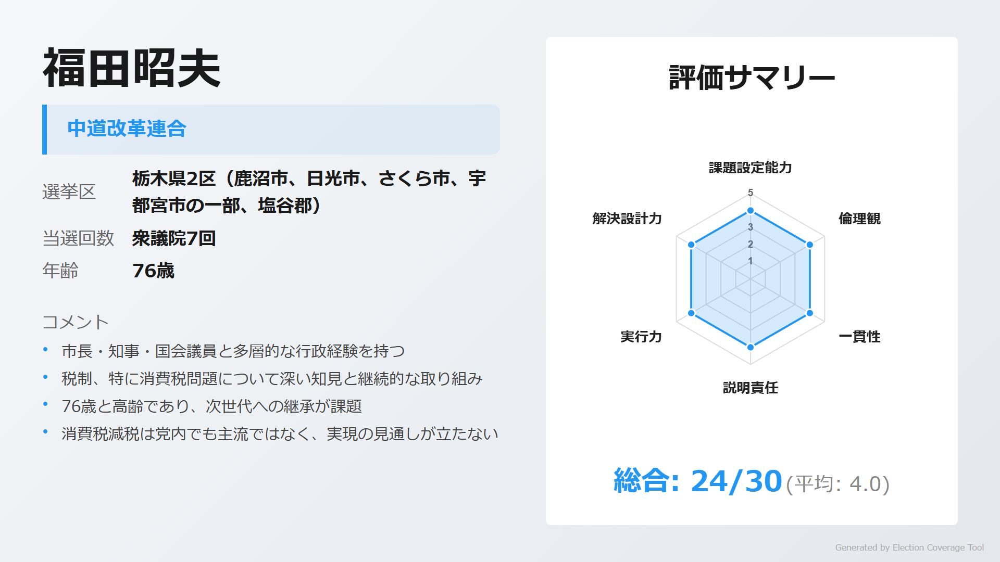

> **ウサギ**: 「元栃木県知事・元今市市長。消費税減税の急先鋒として、2012年に増税反対で政務官辞任の信念」

> **ネコ**: 「76歳と高齢。消費税減税は党内でも主流ではなく、政策実現の見通しが立たない」

[詳細を見る](https://github.com/estela-works/poliscore2026-/blob/main/result/09_栃木県/02区/福田昭夫.md)

#### 五十嵐清（自由民主党）

<!-- NOTE: 2区 候補者2 画像 -->
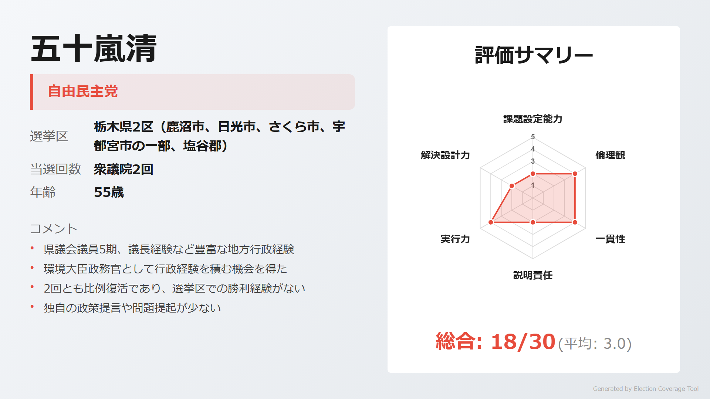

> **ウサギ**: 「県議5期、県議会議長を経験。環境大臣政務官として行政実務に携わる。裏金問題とは無縁」

> **ネコ**: 「2回連続で比例復活当選、小選挙区での勝利経験なし。政策発信力が弱い」

[詳細を見る](https://github.com/estela-works/poliscore2026-/blob/main/result/09_栃木県/02区/五十嵐清.md)

#### 藤田久美（参政党）

<!-- NOTE: 2区 候補者3 画像 -->
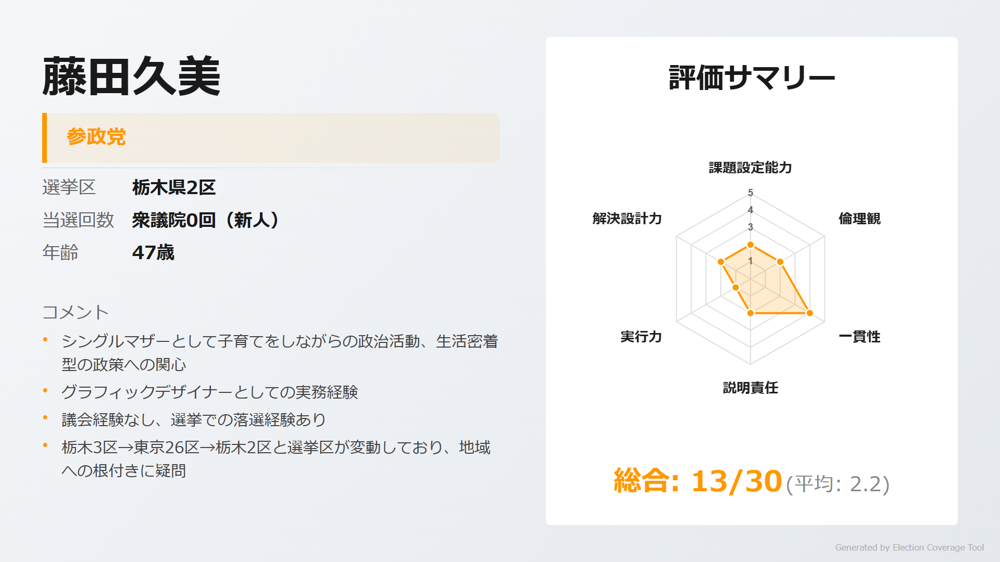

> **ウサギ**: 「シングルマザーとして子育て中、生活者目線での政策への関心。グラフィックデザイナーの民間経験」

> **ネコ**: 「選挙区が栃木3区→東京26区→栃木2区と転々。参政党への批判も考慮が必要」

[詳細を見る](https://github.com/estela-works/poliscore2026-/blob/main/result/09_栃木県/02区/藤田久美.md)

---

## 3区

### 注目ポイント

- **裏金問題の渦中**: 簗和生（自民・5期）は1746万円不記載で党処分、比例重複なしで178票差の薄氷勝利
- **若手無所属の善戦**: 渡辺真太朗（32歳）が初出馬で178票差まで迫る大健闘

### 候補者

#### 簗和生（自由民主党）

<!-- NOTE: 3区 候補者1 画像 -->
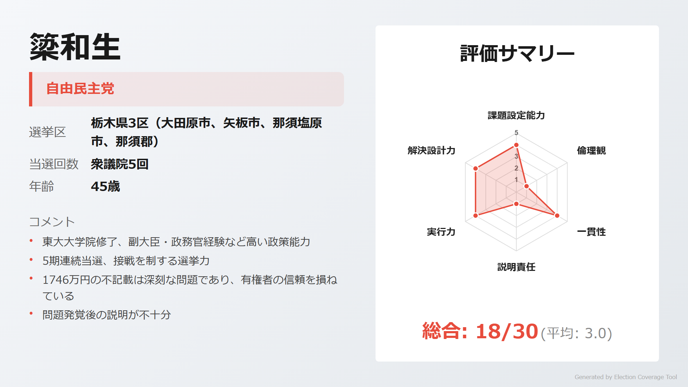

> **ウサギ**: 「東大院修了、文部科学副大臣・安全保障委員長を歴任。45歳と比較的若く政策能力は高い」

> **ネコ**: 「裏金1746万円不記載（公認議員中2位）で党処分。178票差の薄氷当選で次回は厳しい」

[詳細を見る](https://github.com/estela-works/poliscore2026-/blob/main/result/09_栃木県/03区/簗和生.md)

#### 伊賀央（中道改革連合）

<!-- NOTE: 3区 候補者2 画像 -->
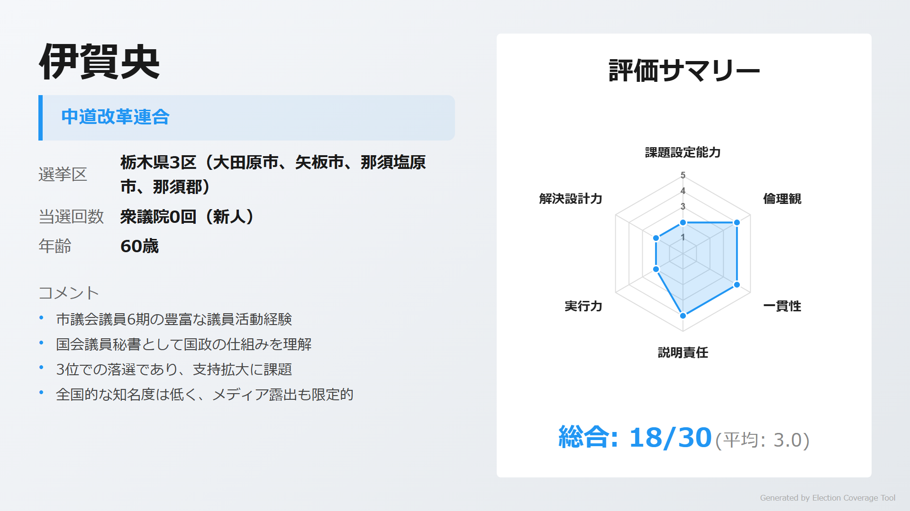

> **ウサギ**: 「市議6期の豊富な地方議員経験。国会議員秘書として国政の仕組みも理解」

> **ネコ**: 「2024年選挙は3位で落選。5年以上準備しながら支持拡大に課題」

[詳細を見る](https://github.com/estela-works/poliscore2026-/blob/main/result/09_栃木県/03区/伊賀央.md)

#### 渡辺真太朗（無所属）

<!-- NOTE: 3区 候補者3 画像 -->
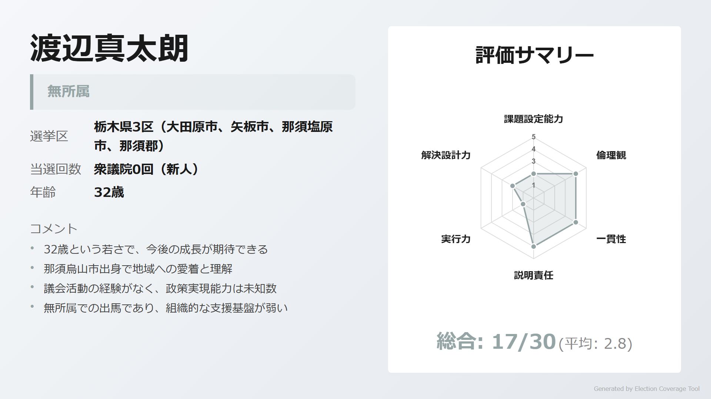

> **ウサギ**: 「32歳の若さで初出馬、178票差まで迫る善戦。松下政経塾出身、地元那須烏山市出身」

> **ネコ**: 「政治経験なし、無所属で組織基盤が弱い。松下政経塾は早期卒塾」

[詳細を見る](https://github.com/estela-works/poliscore2026-/blob/main/result/09_栃木県/03区/渡辺真太朗.md)

---

## 4区

### 注目ポイント

- **5度目の正直**: 藤岡隆雄（中道改革連合・2期）が4度落選を乗り越え、佐藤勉元総務会長を撃破
- **世代交代**: 引退した佐藤勉の後継として石坂太（県議）が出馬表明

### 候補者

#### 藤岡隆雄（中道改革連合）

<!-- NOTE: 4区 候補者1 画像 -->
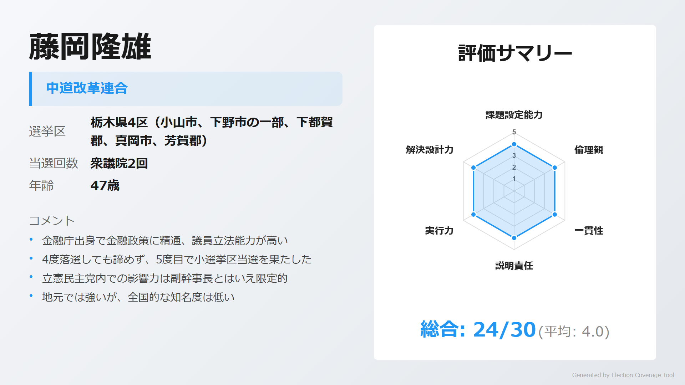

> **ウサギ**: 「金融庁出身で議員立法5本提出、『三ツ星議員』2年連続受賞。4度落選から5度目で小選挙区初当選」

> **ネコ**: 「立憲民主党内での影響力は副幹事長とはいえ限定的。議員立法は成立に至っていない」

[詳細を見る](https://github.com/estela-works/poliscore2026-/blob/main/result/09_栃木県/04区/藤岡隆雄.md)

#### 石坂太（自由民主党）

<!-- NOTE: 4区 候補者2 画像 -->
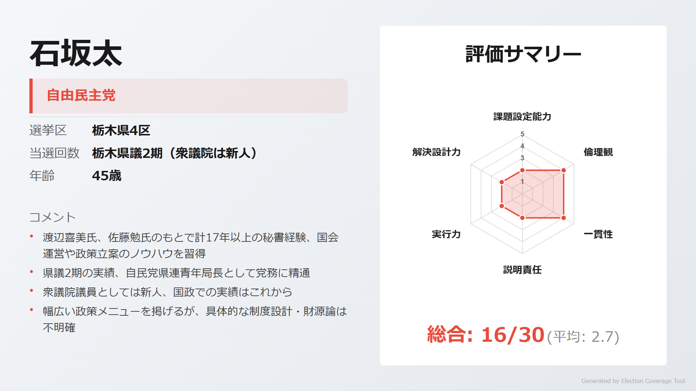

> **ウサギ**: 「佐藤勉元総務相の秘書を11年以上、県議2期。組織・支持基盤を継承する後継候補」

> **ネコ**: 「国政経験なしの新人。佐藤勉氏の後継としての側面が強く、独自色が薄い」

[詳細を見る](https://github.com/estela-works/poliscore2026-/blob/main/result/09_栃木県/04区/石坂太.md)

---

## 5区

### 注目ポイント

- **自民党幹事長の牙城**: 茂木敏充（自民・11期）は外相・経産相・幹事長を歴任、得票率62.8%で圧勝
- **異色の挑戦者**: 国民民主党が「ニコニコ超会議」プロデューサーの寺田和史を擁立

### 候補者

#### 茂木敏充（自由民主党）

<!-- NOTE: 5区 候補者1 画像 -->
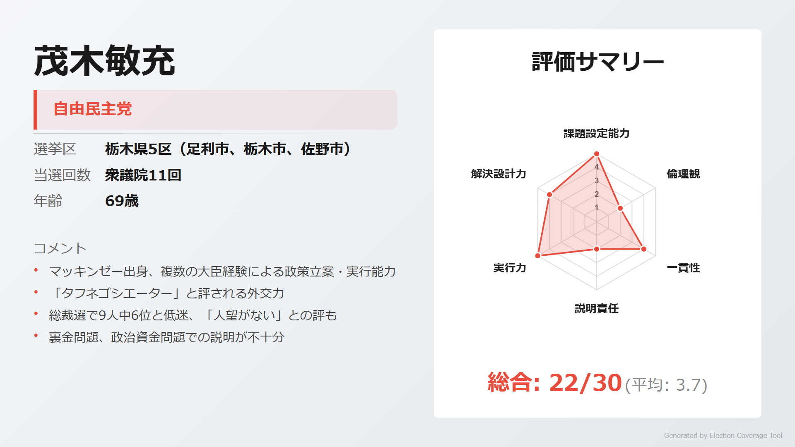

> **ウサギ**: 「東大卒・ハーバード大院・マッキンゼー出身。外相、経産相、幹事長を歴任し『タフネゴシエーター』と評される」

> **ネコ**: 「総裁選9人中6位で『人望がない』との評。政治資金4億4590万円の『脱法移動』批判、裏金問題対応への疑問」

[詳細を見る](https://github.com/estela-works/poliscore2026-/blob/main/result/09_栃木県/05区/茂木敏充.md)

#### 岡村恵子（日本共産党）

<!-- NOTE: 5区 候補者2 画像 -->
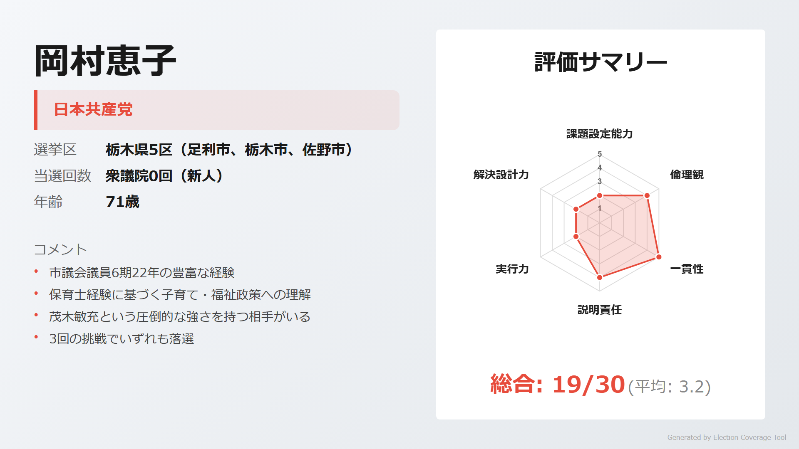

> **ウサギ**: 「佐野市議6期22年の豊富な経験。保育士出身で子育て・福祉政策に精通。50年以上共産党一筋」

> **ネコ**: 「国政選挙3回連続落選。茂木敏充という圧倒的強者がいる選挙区で勝ち目は厳しい」

[詳細を見る](https://github.com/estela-works/poliscore2026-/blob/main/result/09_栃木県/05区/岡村恵子.md)

#### 寺田和史（国民民主党）

<!-- NOTE: 5区 候補者3 画像 -->
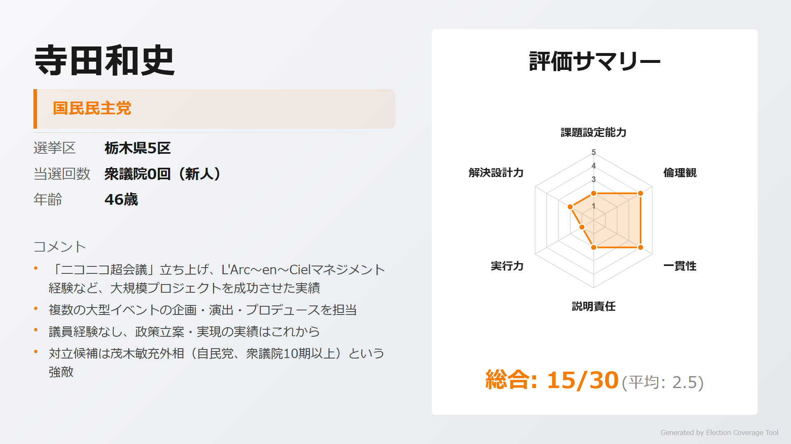

> **ウサギ**: 「『ニコニコ超会議』立ち上げメンバー、L'Arc〜en〜Cielマネジメント経験。若年層への訴求力」

> **ネコ**: 「政治経験ゼロ、政策の具体性が不明。茂木敏充という強敵がいる選挙区で初挑戦」

[詳細を見る](https://github.com/estela-works/poliscore2026-/blob/main/result/09_栃木県/05区/寺田和史.md)

---

## 情報ソース

本記事の評価データは以下のリポジトリで公開しています。評価基準・根拠の詳細をご確認いただけます。

**GitHub**: [poliscore2026-](https://github.com/estela-works/poliscore2026-)

- 評価基準: [`data/politician_evaluation_criteria.md`](https://github.com/estela-works/poliscore2026-/blob/main/data/politician_evaluation_criteria.md)
- 各候補者の評価詳細: [`result/`](https://github.com/estela-works/poliscore2026-/tree/main/result)
