# 衆議院選挙 群馬県

> 第51回衆議院議員総選挙（2026年2月8日投開票）

## 群馬県の注目ポイント

- **首相家系が3つ集結**: 中曽根康隆（1区）、福田達夫（4区）、小渕優子（5区）と、首相を輩出した家系の世襲議員が揃う「保守王国」
- **「ドリル優子」の選挙区**: 5区の小渕優子は政治資金問題で「ドリル事件」の異名が定着、それでも9回連続当選
- **過激パーティー問題**: 1区の中曽根康隆は青年局の不適切パーティーで辞任後、すぐに青年局長に就任という復活劇

## 目次

- [1区](#1区)
- [2区](#2区)
- [3区](#3区)
- [4区](#4区)
- [5区](#5区)

---

## 1区

### 注目ポイント

- **中曽根家3代目**: 祖父・中曽根康弘（元首相）、父・中曽根弘文（元外相）の地盤を継承した中曽根康隆が3期目
- **過激パーティー問題**: 青年局の不適切パーティーで辞任後、同年に青年局長就任という経緯に批判

### 候補者

#### 中曽根康隆（自由民主党）

<!-- NOTE: 1区 候補者1 画像 -->
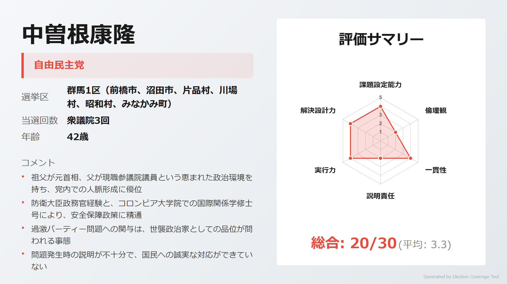

> **ウサギ**: 「防衛大臣政務官経験、コロンビア大学院修了。安全保障政策に深い理解を持つ若手ホープ」

> **ネコ**: 「過激パーティー問題で辞任後、すぐ青年局長就任。説明責任を果たさず、倫理面で脆弱」

[詳細を見る](https://github.com/estela-works/poliscore2026-/blob/main/result/10_群馬県/01区/中曽根康隆.md)

#### 店橋世津子（日本共産党）

<!-- NOTE: 1区 候補者2 画像 -->
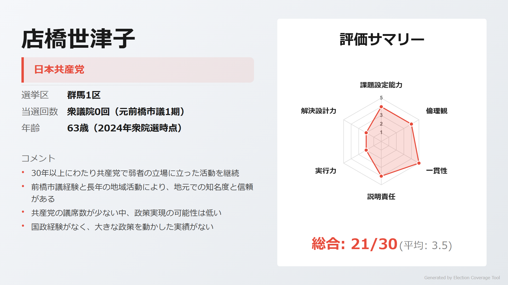

> **ウサギ**: 「前橋市議1期の経験、保育士出身で福祉政策に精通。30年以上の一貫した共産党活動」

> **ネコ**: 「国政経験なし。保守王国群馬で共産党候補としての当選は困難」

[詳細を見る](https://github.com/estela-works/poliscore2026-/blob/main/result/10_群馬県/01区/店橋世津子.md)

#### 河村正剛（中道改革連合）

<!-- NOTE: 1区 候補者3 画像 -->
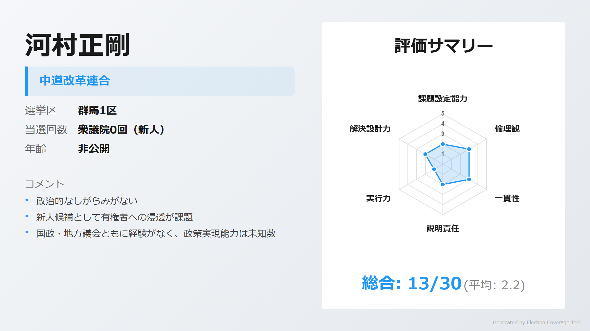

> **ウサギ**: 「新人として清新さをアピール。中道改革連合から挑戦」

> **ネコ**: 「政治経験なし、公開情報が限定的。知名度不足が課題」

[詳細を見る](https://github.com/estela-works/poliscore2026-/blob/main/result/10_群馬県/01区/河村正剛.md)

---

## 2区

### 注目ポイント

- **弁護士出身の副大臣**: 井野俊郎（自民・5期）は経済産業副大臣、統一教会との関係が報道されるも説明を拒否
- **5人乱立の激戦区**: 自民・無所属・共産・国民民主・参政と各党から候補者が出馬

### 候補者

#### 井野俊郎（自由民主党）

<!-- NOTE: 2区 候補者1 画像 -->
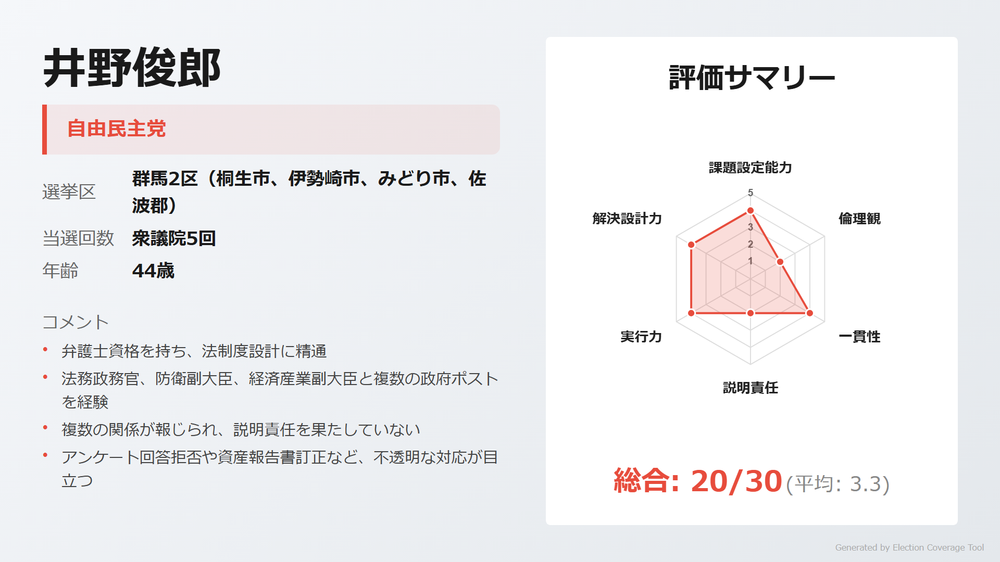

> **ウサギ**: 「弁護士資格を持ち法制度設計に精通。法務政務官、防衛副大臣、経済産業副大臣と政府要職を歴任」

> **ネコ**: 「統一教会との複数の関係が報道されながらアンケート回答を拒否。説明責任を果たしていない」

[詳細を見る](https://github.com/estela-works/poliscore2026-/blob/main/result/10_群馬県/02区/井野俊郎.md)

#### 石関貴史（無所属）

<!-- NOTE: 2区 候補者2 画像 -->
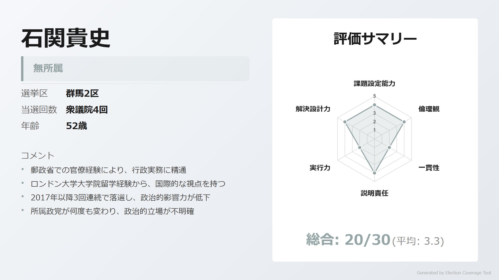

> **ウサギ**: 「郵政省出身の元官僚、ロンドン大学院留学経験。衆議院決算委員長を務めた国会運営の経験者」

> **ネコ**: 「2017年以降3回連続落選。5つの政党を渡り歩き、政治的立場が不明確」

[詳細を見る](https://github.com/estela-works/poliscore2026-/blob/main/result/10_群馬県/02区/石関貴史.md)

#### 高橋保（日本共産党）

<!-- NOTE: 2区 候補者3 画像 -->
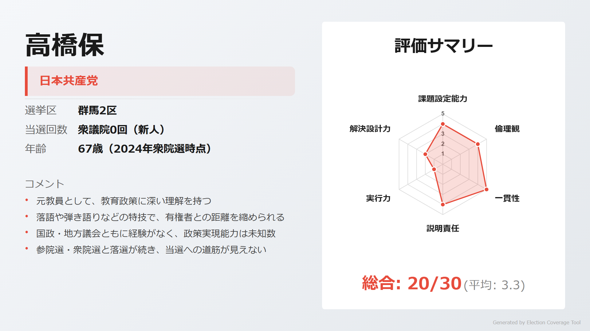

> **ウサギ**: 「元小中学校教諭として教育政策に精通。落語、弾き語りなど親しみやすさが武器」

> **ネコ**: 「参院選・衆院選と連続落選。当選への道筋が見えない」

[詳細を見る](https://github.com/estela-works/poliscore2026-/blob/main/result/10_群馬県/02区/高橋保.md)

#### 原和隆（国民民主党）

<!-- NOTE: 2区 候補者4 画像 -->
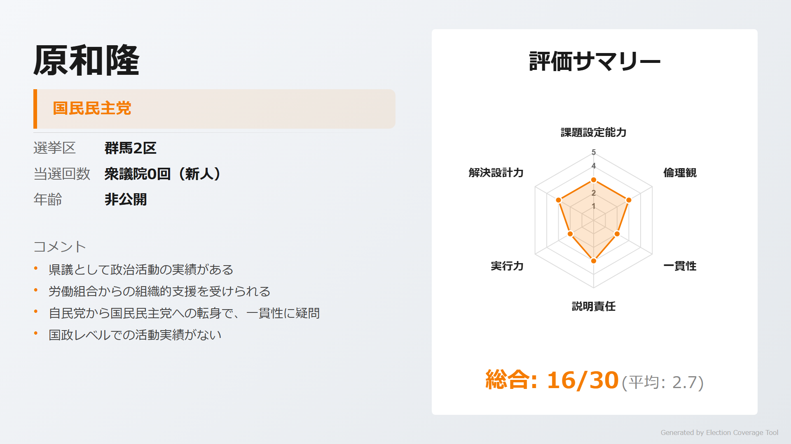

> **ウサギ**: 「元群馬県議会議員としての地方政治経験。連合群馬の支援を受ける」

> **ネコ**: 「自民党県議から国民民主党への転身で、政策的一貫性に疑問」

[詳細を見る](https://github.com/estela-works/poliscore2026-/blob/main/result/10_群馬県/02区/原和隆.md)

#### 熊井戸園子（参政党）

<!-- NOTE: 2区 候補者5 画像 -->
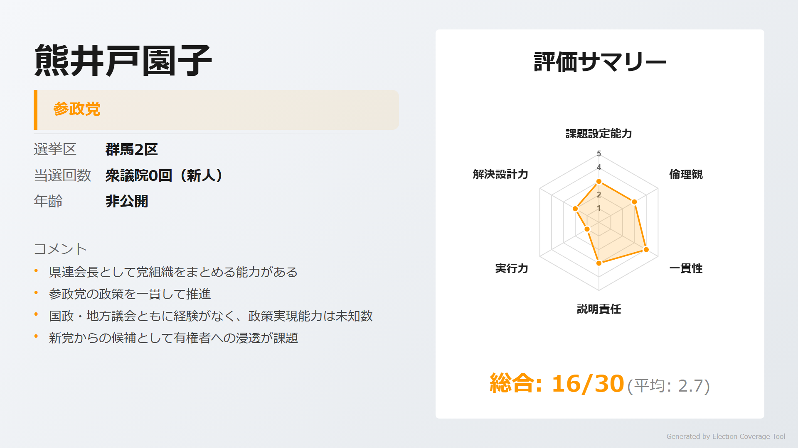

> **ウサギ**: 「参政党群馬県連会長として組織をまとめる能力を持つ」

> **ネコ**: 「政治経験なし。新党からの候補として有権者への浸透が課題」

[詳細を見る](https://github.com/estela-works/poliscore2026-/blob/main/result/10_群馬県/02区/熊井戸園子.md)

---

## 3区

### 注目ポイント

- **笹川家の世襲**: 笹川博義（自民・5期）は祖父・笹川良一、父・笹川堯の地盤を継承、農林水産副大臣
- **歯科医師vs農水副大臣**: 長谷川嘉一（中道改革連合・2期）は歯科医師出身、比例復活での戦い

### 候補者

#### 笹川博義（自由民主党）

<!-- NOTE: 3区 候補者1 画像 -->
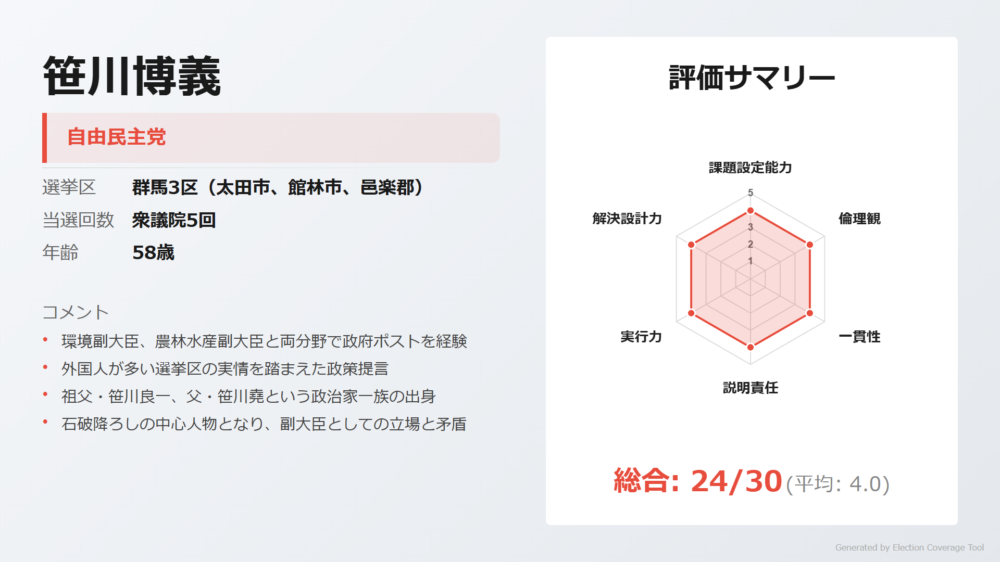

> **ウサギ**: 「環境副大臣、農林水産副大臣と両分野で政府ポスト経験。多文化共生政策にも積極的」

> **ネコ**: 「石破降ろしの中心人物となり、現役副大臣としての立場との矛盾を指摘される」

[詳細を見る](https://github.com/estela-works/poliscore2026-/blob/main/result/10_群馬県/03区/笹川博義.md)

#### 長谷川嘉一（中道改革連合）

<!-- NOTE: 3区 候補者2 画像 -->
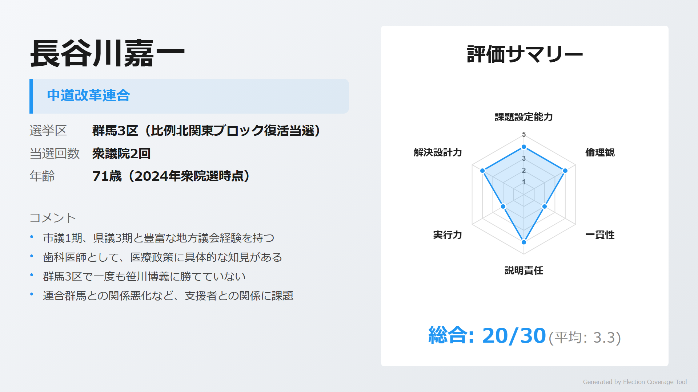

> **ウサギ**: 「市議1期、県議3期の地方政治経験。歯科医師として医療政策に具体的知見」

> **ネコ**: 「小選挙区で一度も勝てず、比例復活のみ。自民→野党への転換で一貫性に疑問」

[詳細を見る](https://github.com/estela-works/poliscore2026-/blob/main/result/10_群馬県/03区/長谷川嘉一.md)

---

## 4区

### 注目ポイント

- **福田家3代目**: 福田達夫（自民・5期）は祖父・福田赳夫、父・福田康夫と首相を2人輩出した名門の跡継ぎ
- **裏金問題への関与**: 幹事長代行の福田達夫は安倍派から94万円の還流を受け、厳重注意処分

### 候補者

#### 福田達夫（自由民主党）

<!-- NOTE: 4区 候補者1 画像 -->
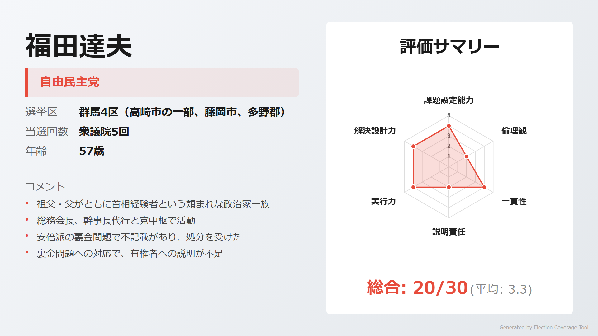

> **ウサギ**: 「ジョンズホプキンス大学留学、三菱商事経験。党総務会長、幹事長代行と党中枢で活躍」

> **ネコ**: 「安倍派から94万円の裏金還流で処分。首相家系としてより高い倫理観が求められる立場」

[詳細を見る](https://github.com/estela-works/poliscore2026-/blob/main/result/10_群馬県/04区/福田達夫.md)

#### 山田博規（中道改革連合）

<!-- NOTE: 4区 候補者2 画像 -->
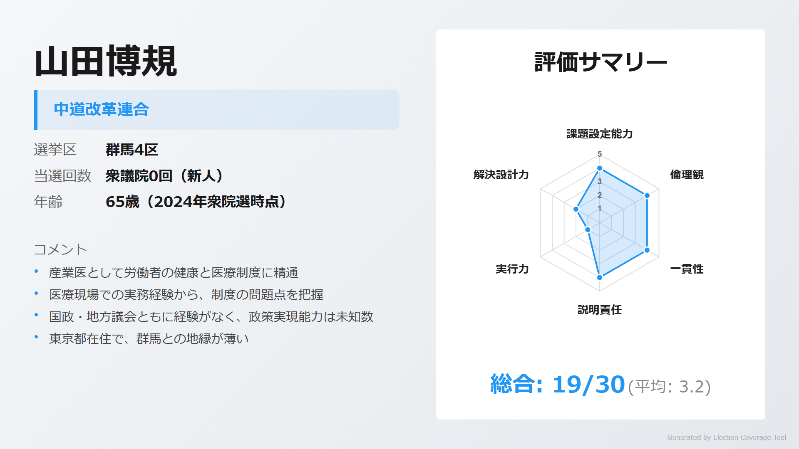

> **ウサギ**: 「産業医として労働者の健康問題に精通。医療制度改革への明確な問題意識」

> **ネコ**: 「政治経験なし、東京都在住で地元との結びつきが薄い」

[詳細を見る](https://github.com/estela-works/poliscore2026-/blob/main/result/10_群馬県/04区/山田博規.md)

#### 伊藤達也（日本共産党）

<!-- NOTE: 4区 候補者3 画像 -->
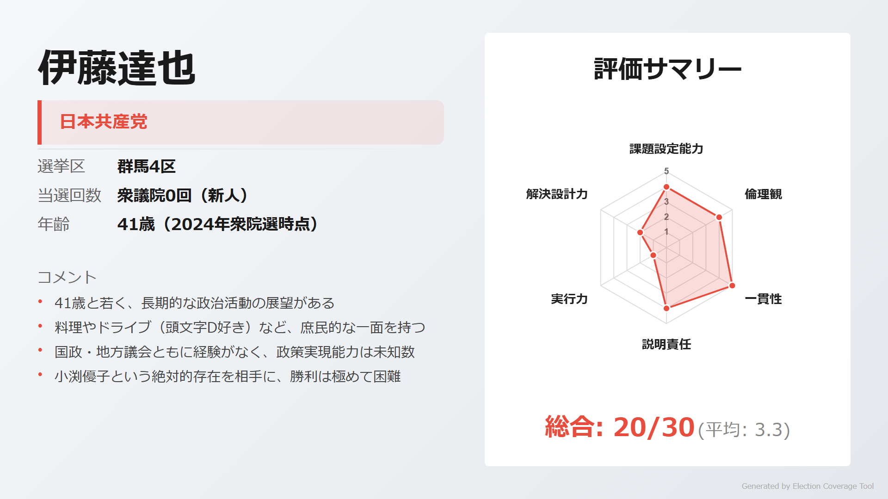

> **ウサギ**: 「41歳の若さで党県書記長。消費税廃止、裏金追及と明確な政策軸を持つ」

> **ネコ**: 「国政経験なし。首相家系の福田達夫相手に勝利は困難」

[詳細を見る](https://github.com/estela-works/poliscore2026-/blob/main/result/10_群馬県/04区/伊藤達也.md)

#### 青木ひとみ（参政党）

<!-- NOTE: 4区 候補者4 画像 -->
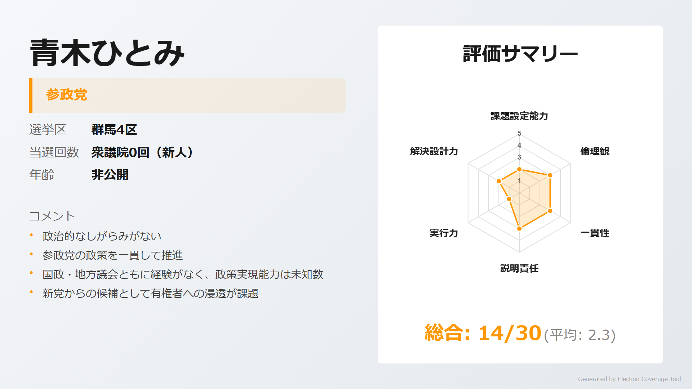

> **ウサギ**: 「新人として清新さをアピール。参政党の政策を一貫して推進」

> **ネコ**: 「政治経験なし、公開情報が限定的。知名度不足が課題」

[詳細を見る](https://github.com/estela-works/poliscore2026-/blob/main/result/10_群馬県/04区/青木ひとみ.md)

---

## 5区

### 注目ポイント

- **「ドリル優子」の牙城**: 小渕優子（自民・9期）は父・小渕恵三元首相の地盤で圧倒的強さ
- **政治とカネの問題**: 観劇会の収支不一致、ハードディスク破壊疑惑など、政治資金の透明性に重大な疑義

### 候補者

#### 小渕優子（自由民主党）

<!-- NOTE: 5区 候補者1 画像 -->
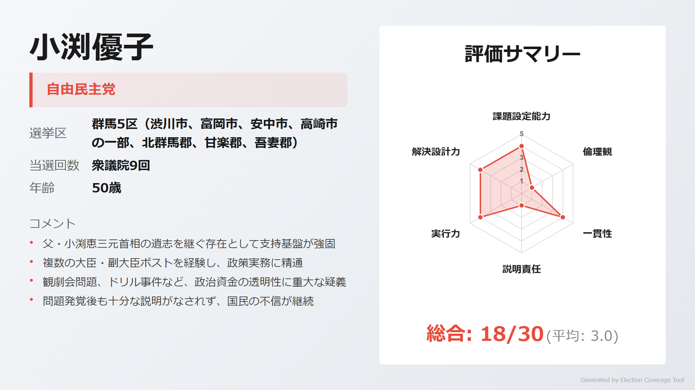

> **ウサギ**: 「戦後最年少閣僚、女性初の選対委員長。少子化対策、エネルギー政策で閣僚経験豊富」

> **ネコ**: 「観劇会問題で6000万円の差額、『ドリル事件』で証拠隠滅疑惑。元秘書2名が有罪判決」

[詳細を見る](https://github.com/estela-works/poliscore2026-/blob/main/result/10_群馬県/05区/小渕優子.md)

#### 木暮智貴（参政党）

<!-- NOTE: 5区 候補者2 画像 -->
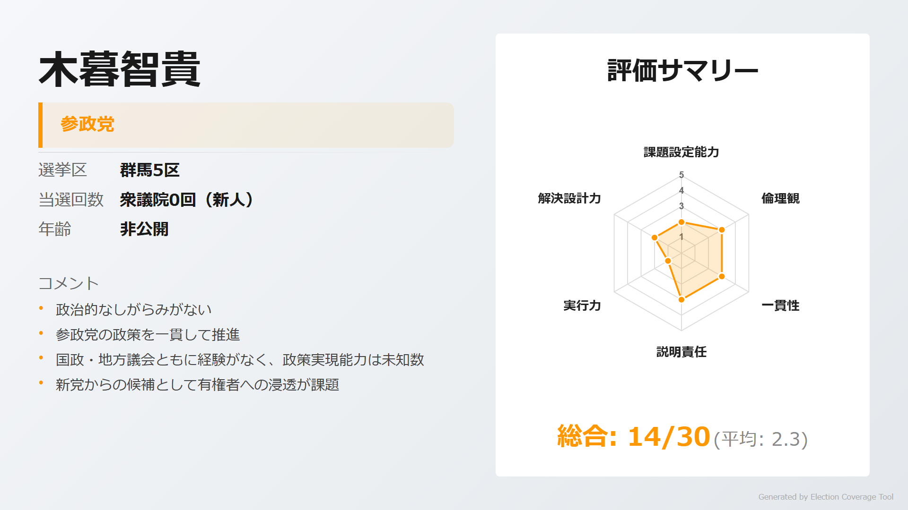

> **ウサギ**: 「新人として清新さをアピール。参政党の理念に沿った一貫した姿勢」

> **ネコ**: 「政治経験なし。小渕優子の圧倒的地盤では苦戦必至」

[詳細を見る](https://github.com/estela-works/poliscore2026-/blob/main/result/10_群馬県/05区/木暮智貴.md)

---

## 情報ソース

本記事の評価データは以下のリポジトリで公開しています。評価基準・根拠の詳細をご確認いただけます。

**GitHub**: [poliscore2026-](https://github.com/estela-works/poliscore2026-)

- 評価基準: [`data/politician_evaluation_criteria.md`](https://github.com/estela-works/poliscore2026-/blob/main/data/politician_evaluation_criteria.md)
- 各候補者の評価詳細: [`result/`](https://github.com/estela-works/poliscore2026-/tree/main/result)
