# 衆議院選挙 埼玉県

> 第51回衆議院議員総選挙（2026年2月8日投開票）

**⚠️ ご注意ください**
本記事の評価はAIが一定の基準に基づいて算出したものです。AI及び評価システムはまだ発展途上であり、同様の経歴や実績を持つ候補者であっても、情報の取得状況や解釈により異なる評価となる場合があります。**本記事はあくまで参考情報としてご活用ください。投票の際は、ご自身で各候補者の情報を確認し、ご判断いただくようお願いいたします。**

---

## 埼玉県の注目ポイント

- **枝野王国vs自民若手**: 5区で枝野幸男（11期）が圧倒的強さ、元官房長官に天文学博士の新人・井原ゆたかが挑戦
- **裏金議員への審判**: 8区・柴山昌彦（896万円未記載）、9区・大塚拓（994万円未記載）が前回落選からリベンジを狙う
- **国民民主党の躍進**: 13区で防衛大卒29歳・橋本幹彦が裏金議員を破り初当選、14区で鈴木義弘が公明党代表・石井啓一を撃破

## 目次

- [1区](#1区)
- [2区](#2区)
- [3区](#3区)
- [4区](#4区)
- [5区](#5区)
- [6区](#6区)
- [7区](#7区)
- [8区](#8区)
- [9区](#9区)
- [10区](#10区)
- [11区](#11区)
- [12区](#12区)
- [13区](#13区)
- [14区](#14区)
- [15区](#15区)
- [16区](#16区)

---

## 1区

### 注目ポイント

- **元官房副長官vs元外務副大臣**: 村井英樹（自民・5期）と武正公一（中道改革連合・7期）の実力者対決
- **埼玉初の総理候補**: 44歳で官房副長官を務めた村井英樹に将来の総理候補との期待

### 候補者

#### 村井英樹（自由民主党）

<!-- NOTE: 1区 候補者1 画像 -->

> **ウサギ**: 「財務省出身でハーバード大学院修了。43歳で内閣官房副長官就任、岸田政権の政策中枢を担った若手のホープ」

> **ネコ**: 「エリートコースを歩み草の根活動は相対的に少ない。政権の一員としての活動が中心で独自色が見えにくい」

[詳細を見る](https://github.com/estela-works/poliscore2026-/blob/main/result/11_埼玉県/01区/村井英樹.md)

#### 武正公一（中道改革連合）

<!-- NOTE: 1区 候補者2 画像 -->
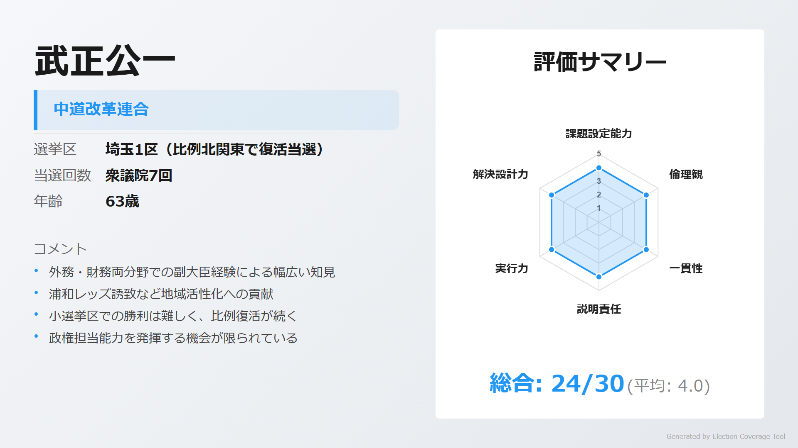

> **ウサギ**: 「外務・財務両分野で副大臣経験。松下政経塾出身で政策通、浦和レッズ誘致にも貢献した地域の顔」

> **ネコ**: 「小選挙区での勝利が難しく比例復活が続く。野党経験が長く政権担当能力を発揮する機会が限られている」

[詳細を見る](https://github.com/estela-works/poliscore2026-/blob/main/result/11_埼玉県/01区/武正公一.md)

#### 菅又士廊（参政党）

<!-- NOTE: 1区 候補者3 画像 -->
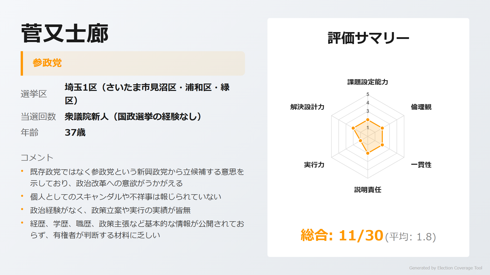

> **ウサギ**: 「新人として清新さをアピール。参政党の国政改革委員として活動」

> **ネコ**: 「政治経験・実績が皆無で公開情報が極めて限定的。有権者が判断する材料に乏しい」

[詳細を見る](https://github.com/estela-works/poliscore2026-/blob/main/result/11_埼玉県/01区/菅又士廊.md)

#### 羽田一樹（無所属）

<!-- NOTE: 1区 候補者4 画像 -->
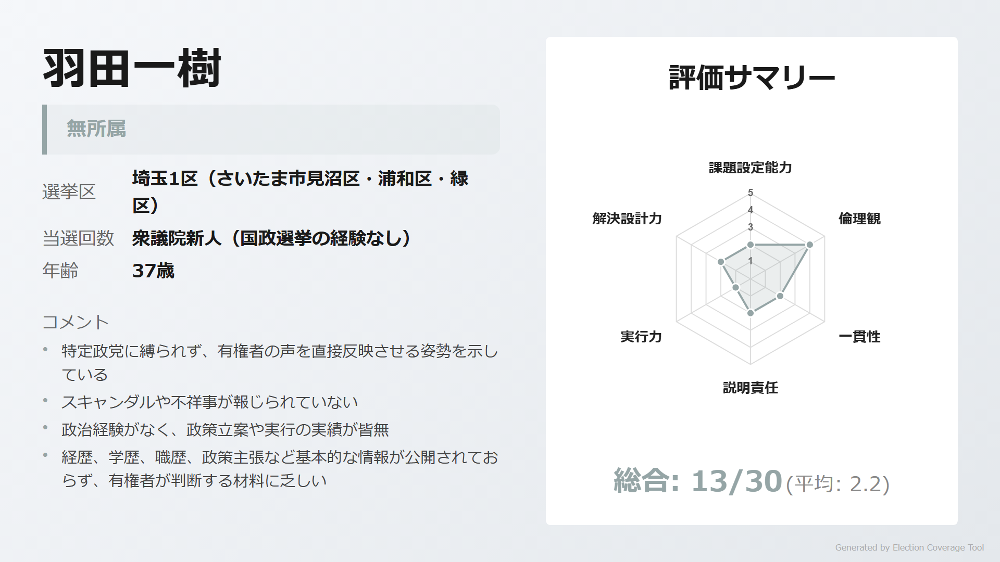

> **ウサギ**: 「37歳で無所属から挑戦。特定政党に縛られない姿勢、複数のSNSで情報発信」

> **ネコ**: 「政治経験なし、政策や経歴など基本情報が公開されておらず評価材料に乏しい」

[詳細を見る](https://github.com/estela-works/poliscore2026-/blob/main/result/11_埼玉県/01区/羽田一樹.md)

---

## 2区

### 注目ポイント

- **2度の閣僚経験を持つ重鎮**: 新藤義孝（自民・9期）は総務大臣・経済再生担当大臣を歴任した政策のベテラン
- **川口市の外国人問題**: クルド人問題で注目を集める選挙区、維新・高橋英明が積極的に取り上げるも発言が物議

### 候補者

#### 新藤義孝（自由民主党）

<!-- NOTE: 2区 候補者1 画像 -->
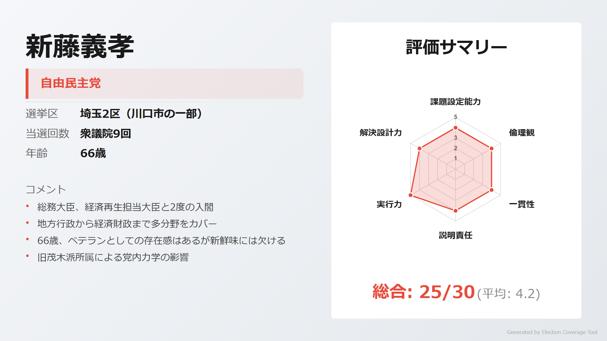

> **ウサギ**: 「総務大臣・経済再生担当大臣と2度の入閣経験。9期連続当選で川口市に安定した支持基盤を持つ」

> **ネコ**: 「66歳でベテランの存在感はあるが新鮮味には欠ける。旧茂木派所属による党内力学の影響」

[詳細を見る](https://github.com/estela-works/poliscore2026-/blob/main/result/11_埼玉県/02区/新藤義孝.md)

#### 細谷はやと（国民民主党）

<!-- NOTE: 2区 候補者2 画像 -->
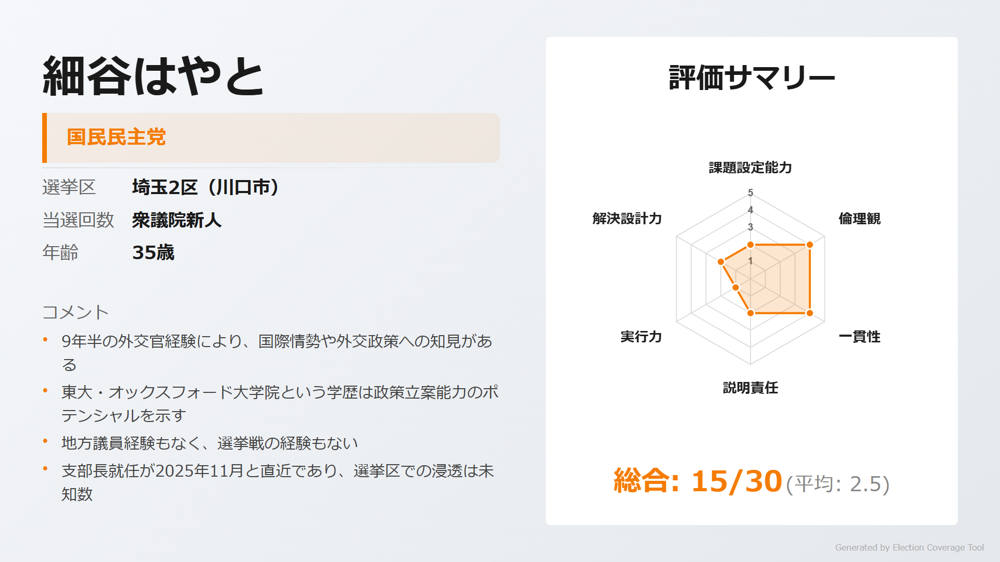

> **ウサギ**: 「東大・オックスフォード大学院卒、外務省9年半勤務。35歳の若さで国際経験と行政・民間両方の視点を持つ」

> **ネコ**: 「政治経験が完全にゼロ。2025年11月に支部長就任したばかりで選挙区での浸透は未知数」

[詳細を見る](https://github.com/estela-works/poliscore2026-/blob/main/result/11_埼玉県/02区/細谷はやと.md)

#### 高橋英明（日本維新の会）

<!-- NOTE: 2区 候補者3 画像 -->
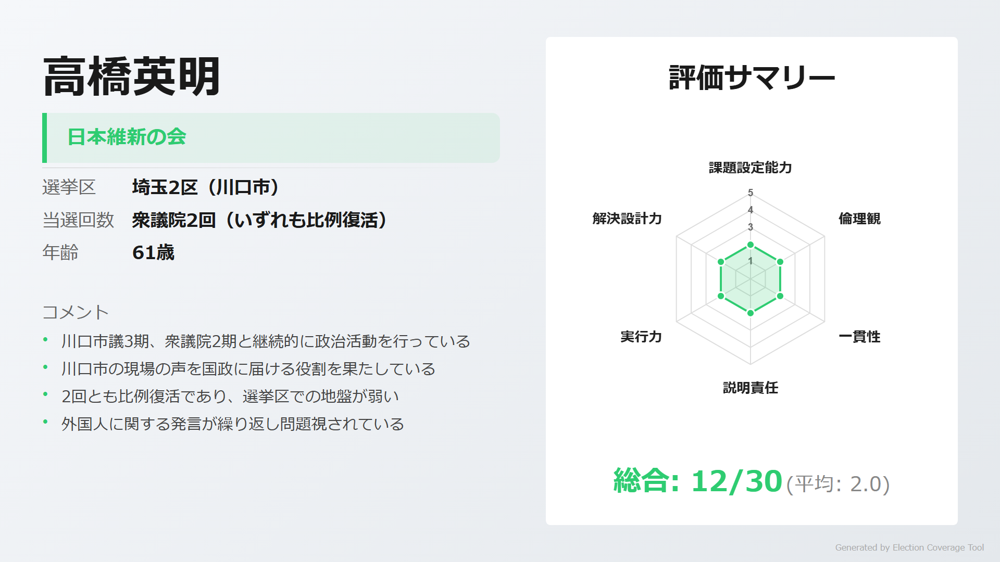

> **ウサギ**: 「川口市議3期の地元経験、埼玉維新の会代表。外国人問題を国会で積極的に取り上げる」

> **ネコ**: 「外国人に関する発言がヘイトスピーチと批判される。トルコ視察で外交問題、旧統一教会との接点も」

[詳細を見る](https://github.com/estela-works/poliscore2026-/blob/main/result/11_埼玉県/02区/高橋英明.md)

#### 菅野静華（参政党）

<!-- NOTE: 2区 候補者4 画像 -->
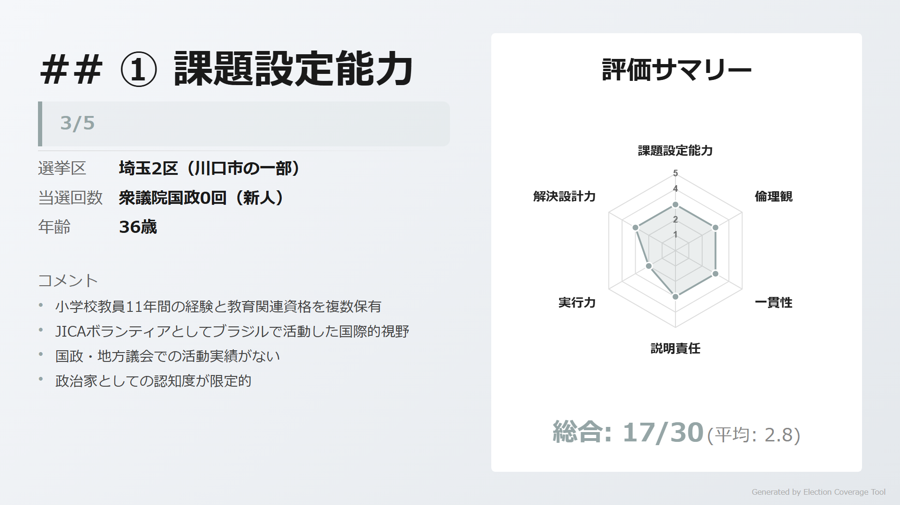

> **ウサギ**: 「小学校教員11年間の経験、JICAボランティアでブラジル派遣。教育・子育て政策に専門性」

> **ネコ**: 「政治経験が全くなく国政での実績はこれから。知名度が限定的で選挙区での浸透が課題」

[詳細を見る](https://github.com/estela-works/poliscore2026-/blob/main/result/11_埼玉県/02区/菅野静華.md)

---

## 3区

### 注目ポイント

- **現職閣僚vs弁護士**: 黄川田仁志（自民・5期）はこども政策担当大臣として政策中枢を担う
- **裏金問題の影響**: 黄川田は2024年選挙で約1万票差まで詰められ苦戦

### 候補者

#### 黄川田仁志（自由民主党）

<!-- NOTE: 3区 候補者1 画像 -->
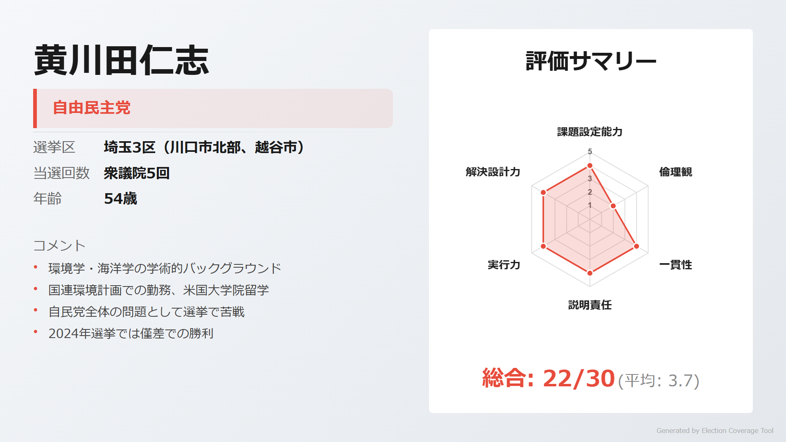

> **ウサギ**: 「環境学・海洋学の専門家で松下政経塾出身。内閣府特命担当大臣としてこども政策・少子化対策を主導」

> **ネコ**: 「裏金問題の影響で2024年選挙は僅差での勝利。選挙基盤が脆弱化している」

[詳細を見る](https://github.com/estela-works/poliscore2026-/blob/main/result/11_埼玉県/03区/黄川田仁志.md)

#### 竹内千春（中道改革連合）

<!-- NOTE: 3区 候補者2 画像 -->
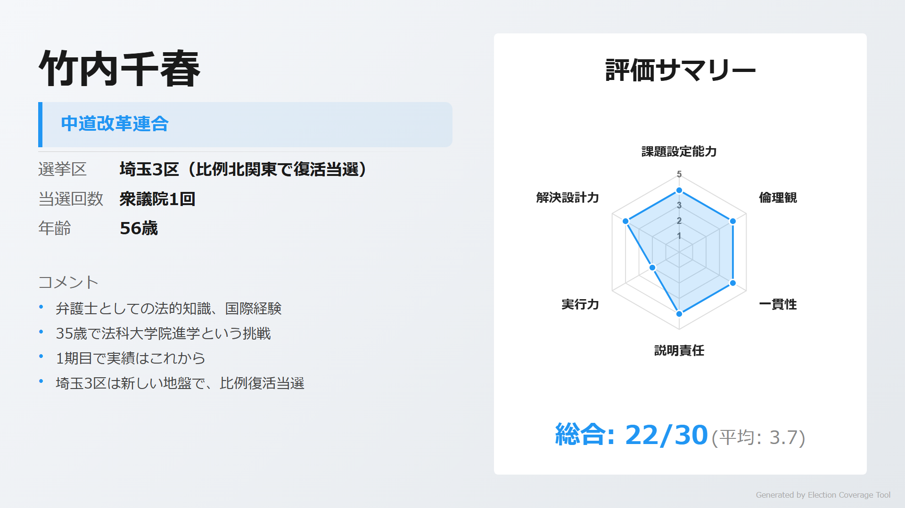

> **ウサギ**: 「弁護士・元大学助教授。日弁連国際室長として国際経験も豊富。35歳で法科大学院に進学した挑戦者」

> **ネコ**: 「国会議員1期目で実績はこれから。埼玉3区は新しい地盤で比例復活当選」

[詳細を見る](https://github.com/estela-works/poliscore2026-/blob/main/result/11_埼玉県/03区/竹内千春.md)

#### 中村尚子（参政党）

<!-- NOTE: 3区 候補者3 画像 -->
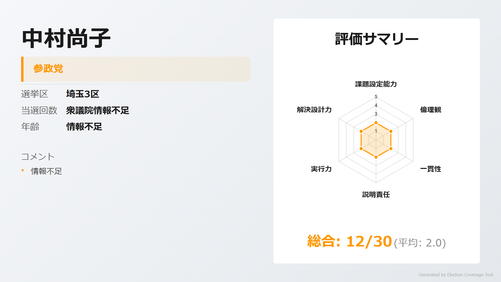

> **ウサギ**: 「参政党から新人として挑戦。既存政党とは異なる政治参加の形を目指す」

> **ネコ**: 「公開情報が極めて限定的で経歴・政策が不明。有権者が判断する材料に乏しい」

[詳細を見る](https://github.com/estela-works/poliscore2026-/blob/main/result/11_埼玉県/03区/中村尚子.md)

---

## 4区

### 注目ポイント

- **税理士の現職副大臣**: 穂坂泰（自民・3期）はデジタル副大臣として行政改革を担当
- **中小企業支援の専門家**: 税理士資格を持ち、医療・介護施設での勤務経験もある実務派

### 候補者

#### 穂坂泰（自由民主党）

<!-- NOTE: 4区 候補者1 画像 -->
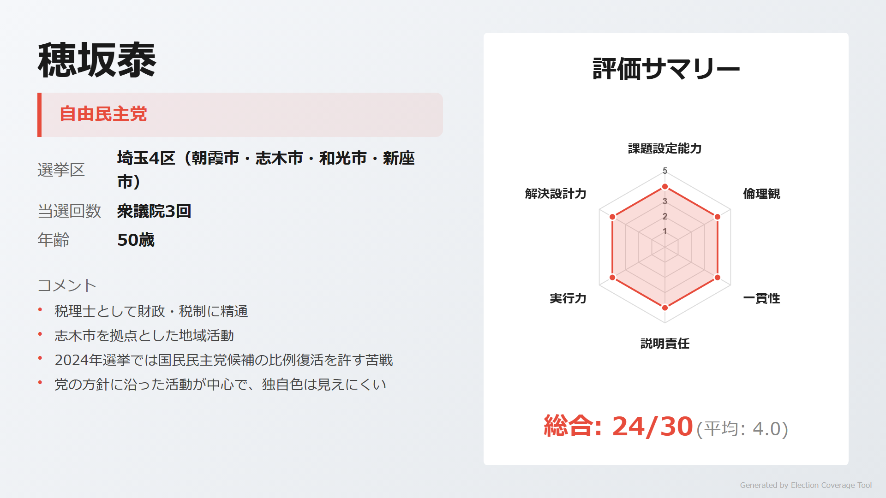

> **ウサギ**: 「税理士として中小企業に精通。政務官から副大臣へと着実にキャリアアップ、50歳の若さで成長途上」

> **ネコ**: 「2024年選挙では国民民主党候補に比例復活を許す苦戦。党の方針に沿った活動が中心で独自色は薄い」

[詳細を見る](https://github.com/estela-works/poliscore2026-/blob/main/result/11_埼玉県/04区/穂坂泰.md)

#### 岸田光広（国民民主党）

<!-- NOTE: 4区 候補者2 画像 -->
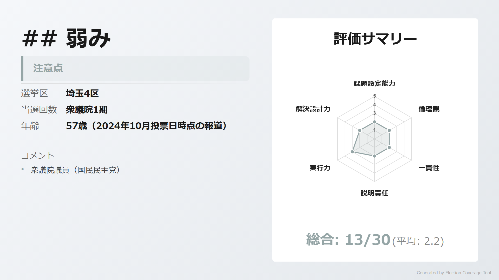

> **ウサギ**: 「早稲田大卒、米MBA取得。金融・製造業の民間経験と尼崎市議の経歴を持つ多様なキャリア」

> **ネコ**: 「国政1期目で実績はこれから。政策の具体性を評価できる情報が限定的」

[詳細を見る](https://github.com/estela-works/poliscore2026-/blob/main/result/11_埼玉県/04区/岸田光広.md)

#### 工藤薫（日本共産党）

<!-- NOTE: 4区 候補者3 画像 -->

> **ウサギ**: 「新座市議7期の豊富な地方議会経験。元小学校教諭で教育現場の視点を持つ」

> **ネコ**: 「74歳で国政初挑戦。国政での実績はなく、政策の具体性を示す情報が限定的」

[詳細を見る](https://github.com/estela-works/poliscore2026-/blob/main/result/11_埼玉県/04区/工藤薫.md)

#### 伊勢田享子（日本維新の会）

<!-- NOTE: 4区 候補者4 画像 -->
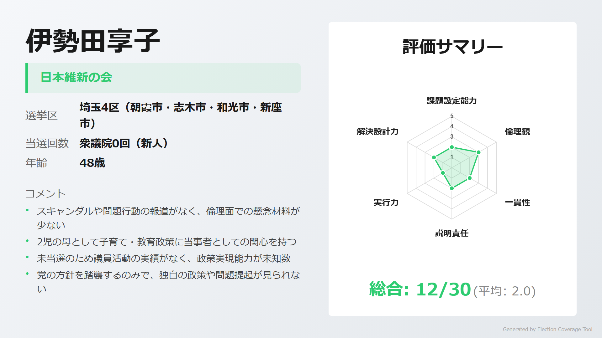

> **ウサギ**: 「貿易会社・百貨店など民間経験を持つ2児の母。子育て世代の当事者として教育政策に関心」

> **ネコ**: 「未当選で実績なし、選挙区を7区→4区に変更。独自の政策や問題提起が見られない」

[詳細を見る](https://github.com/estela-works/poliscore2026-/blob/main/result/11_埼玉県/04区/伊勢田享子.md)

---

## 5区

### 注目ポイント

- **枝野王国**: 枝野幸男（中道改革連合・11期）が11連勝中の圧倒的強さを誇る選挙区
- **天文学博士の挑戦**: JAXA宇宙飛行士選抜TOP50の井原ゆたか（自民新人）が「枝野王国」に挑む

### 候補者

#### 枝野幸男（中道改革連合）

<!-- NOTE: 5区 候補者1 画像 -->
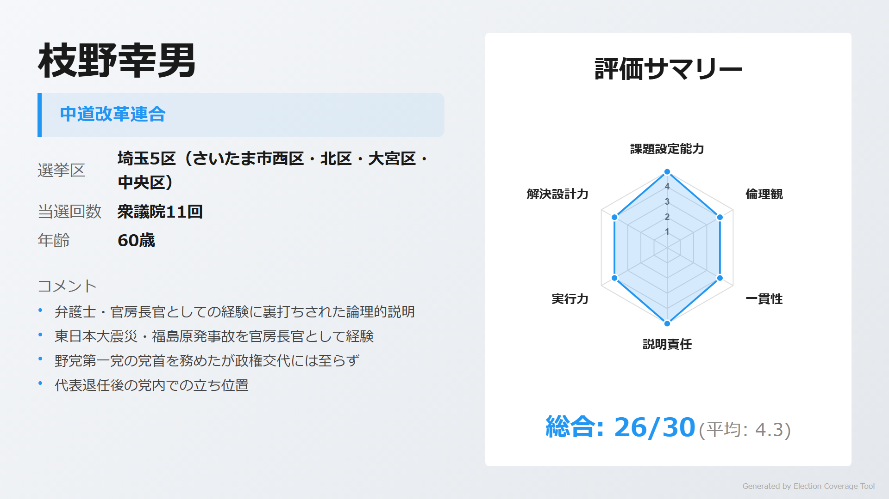

> **ウサギ**: 「元官房長官・外務大臣。東日本大震災時の危機対応で『枝野寝ろ』と称えられた説明力の達人」

> **ネコ**: 「野党第一党の党首を務めたが政権交代には至らず。代表退任後の党内での立ち位置に課題」

[詳細を見る](https://github.com/estela-works/poliscore2026-/blob/main/result/11_埼玉県/05区/枝野幸男.md)

#### 井原ゆたか（自由民主党）

<!-- NOTE: 5区 候補者2 画像 -->
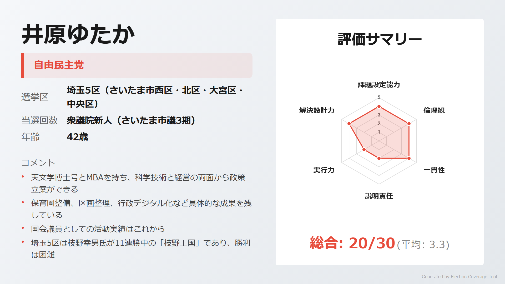

> **ウサギ**: 「天文学博士・MBA取得の異色経歴。市議10年で保育園整備、区画整理など具体的成果を残す」

> **ネコ**: 「国政経験なし。11連勝中の『枝野王国』への挑戦は極めて困難、前任者（牧原秀樹法相）も落選」

[詳細を見る](https://github.com/estela-works/poliscore2026-/blob/main/result/11_埼玉県/05区/井原ゆたか.md)

#### 飯塚佳佑（参政党）

<!-- NOTE: 5区 候補者3 画像 -->
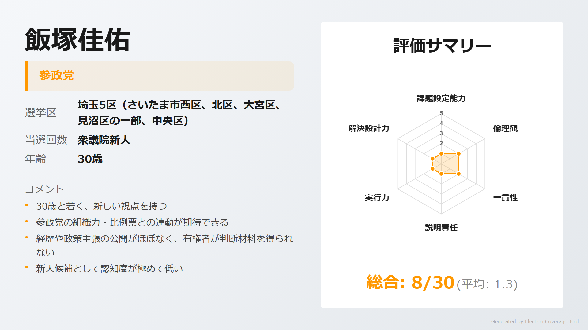

> **ウサギ**: 「30歳の若さで参政党から挑戦。新しい視点を持つ若手候補」

> **ネコ**: 「経歴・政策の公開情報が極めて乏しい。有権者が判断する材料に欠ける」

[詳細を見る](https://github.com/estela-works/poliscore2026-/blob/main/result/11_埼玉県/05区/飯塚佳佑.md)

---

## 6区

### 注目ポイント

- **民間出身の実力者**: 大島敦（中道改革連合・9期）は鉄鋼メーカー・保険会社出身の現場感覚を持つ政治家
- **裏金議員との対決で圧勝**: 2024年選挙で裏金問題の中根一幸に大差で勝利

### 候補者

#### 大島敦（中道改革連合）

<!-- NOTE: 6区 候補者1 画像 -->

> **ウサギ**: 「日本鋼管・ソニー生命での民間経験。9期連続当選で埼玉6区では7勝1敗の強さ」

> **ネコ**: 「67歳でベテラン、世代交代の課題。長期間野党にあり政策実現の機会が限られている」

[詳細を見る](https://github.com/estela-works/poliscore2026-/blob/main/result/11_埼玉県/06区/大島敦.md)

#### 秋山もえ（日本共産党）

<!-- NOTE: 6区 候補者2 画像 -->
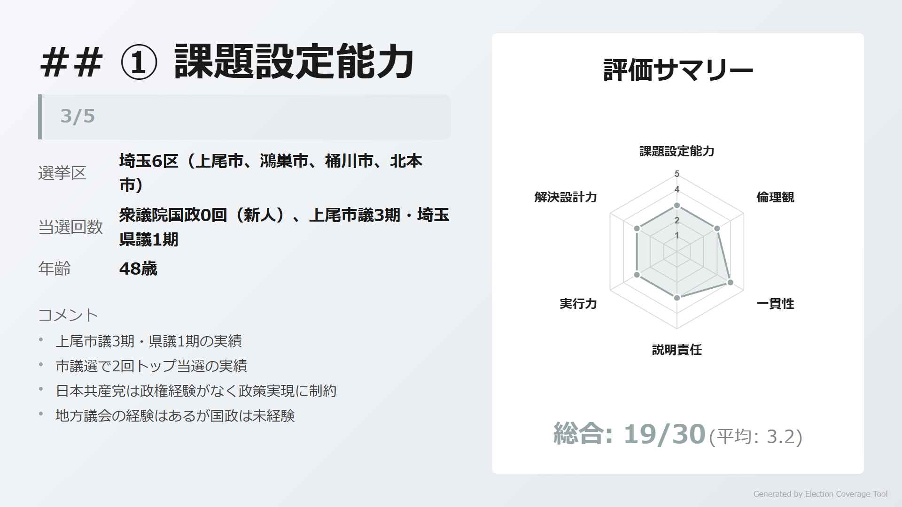

> **ウサギ**: 「上尾市議3期・県議1期の経験。市議選で2回トップ当選、市議会史上初の産休取得を実現」

> **ネコ**: 「2023年県議選で落選。国政経験はなく、共産党は政権経験がないため政策実現に制約」

[詳細を見る](https://github.com/estela-works/poliscore2026-/blob/main/result/11_埼玉県/06区/秋山もえ.md)

#### 尾花瑛仁（自由民主党）

<!-- NOTE: 6区 候補者3 画像 -->
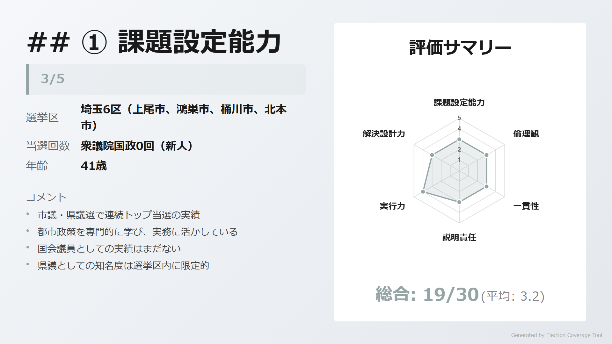

> **ウサギ**: 「上尾市議・県議で連続トップ当選の実績。都市政策専攻で30年滞っていた事業を再起動」

> **ネコ**: 「国政経験なし。大島敦が圧倒的に強い選挙区で、勝利は極めて困難」

[詳細を見る](https://github.com/estela-works/poliscore2026-/blob/main/result/11_埼玉県/06区/尾花瑛仁.md)

#### 津田賢伯（日本維新の会）

<!-- NOTE: 6区 候補者4 画像 -->
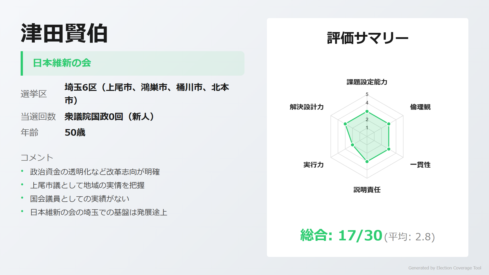

> **ウサギ**: 「元上尾市議。政治資金の透明化など改革志向が明確で、クリーンな政治を志向」

> **ネコ**: 「国政経験なし。維新の埼玉での基盤は発展途上で、知名度向上が課題」

[詳細を見る](https://github.com/estela-works/poliscore2026-/blob/main/result/11_埼玉県/06区/津田賢伯.md)

#### 長島美子（参政党）

<!-- NOTE: 6区 候補者5 画像 -->
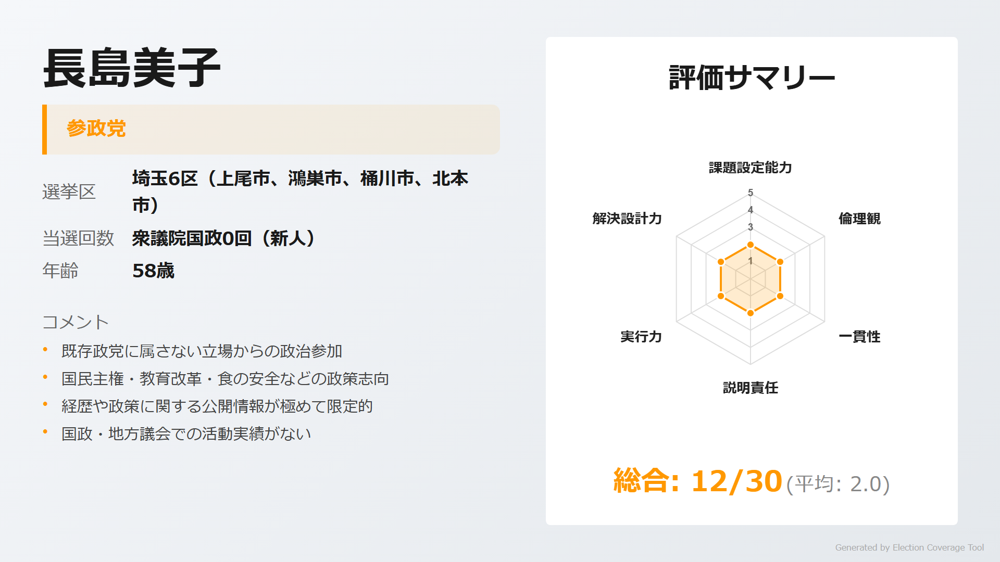

> **ウサギ**: 「参政党から新人として挑戦。国民主権・教育改革・食の安全を重視する姿勢」

> **ネコ**: 「経歴・政策の公開情報が極めて限定的。有権者が判断する材料に乏しい」

[詳細を見る](https://github.com/estela-works/poliscore2026-/blob/main/result/11_埼玉県/06区/長島美子.md)

---

## 7区

### 注目ポイント

- **15年ぶりの小選挙区復活**: 小宮山泰子（中道改革連合・8期）が比例復活から小選挙区当選を奪還
- **二世議員対決**: 両候補とも父が国会議員という政治家一家の対決

### 候補者

#### 小宮山泰子（中道改革連合）

<!-- NOTE: 7区 候補者1 画像 -->
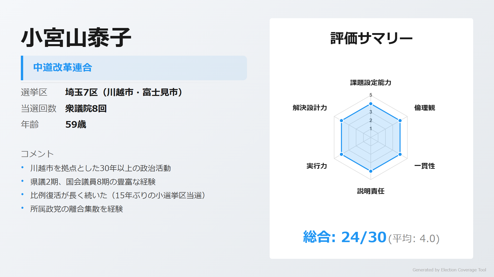

> **ウサギ**: 「県議2期、国会議員8期の豊富な経験。拉致問題特別委員長として外交課題に取り組む」

> **ネコ**: 「比例復活が15年続いた。所属政党の離合集散を経験し、党の変遷が多い」

[詳細を見る](https://github.com/estela-works/poliscore2026-/blob/main/result/11_埼玉県/07区/小宮山泰子.md)

#### 中野英幸（自由民主党）

<!-- NOTE: 7区 候補者2 画像 -->
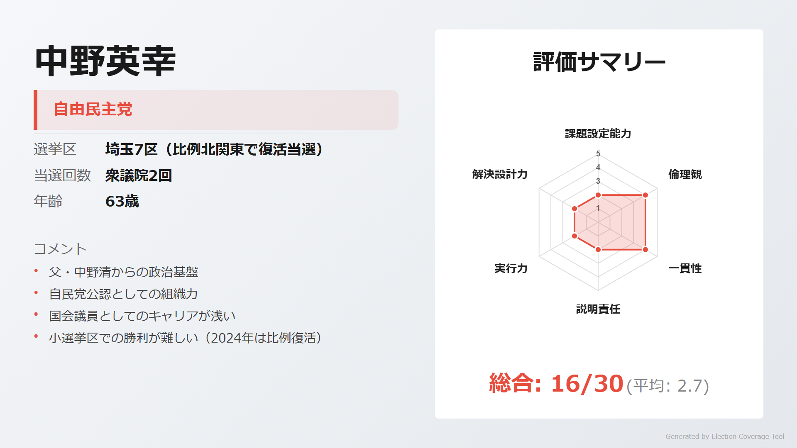

> **ウサギ**: 「父・中野清からの政治基盤を継承。自民党公認としての組織力」

> **ネコ**: 「国会議員としてのキャリアが浅く実績が乏しい。2024年選挙で小宮山に敗れ比例復活」

[詳細を見る](https://github.com/estela-works/poliscore2026-/blob/main/result/11_埼玉県/07区/中野英幸.md)

---

## 8区

### 注目ポイント

- **裏金896万円の元文科大臣**: 柴山昌彦（自民・8期）が裏金問題で2024年落選からリベンジを狙う
- **貧困支援活動家の挑戦**: 市来伴子（中道改革連合・1期）はNGO・ホームレス支援出身

### 候補者

#### 柴山昌彦（自由民主党）

<!-- NOTE: 8区 候補者1 画像 -->
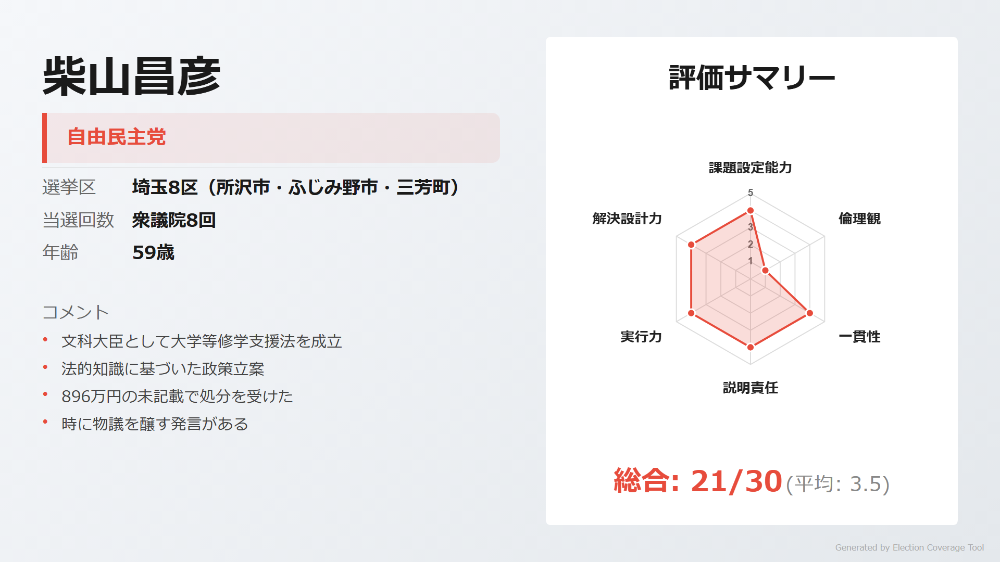

> **ウサギ**: 「弁護士資格を持ち、文科大臣として大学等修学支援法を成立させた政策実績」

> **ネコ**: 「裏金896万円の未記載で処分。2024年落選、説明責任を果たしていない」

[詳細を見る](https://github.com/estela-works/poliscore2026-/blob/main/result/11_埼玉県/08区/柴山昌彦.md)

#### 市来伴子（中道改革連合）

<!-- NOTE: 8区 候補者2 画像 -->
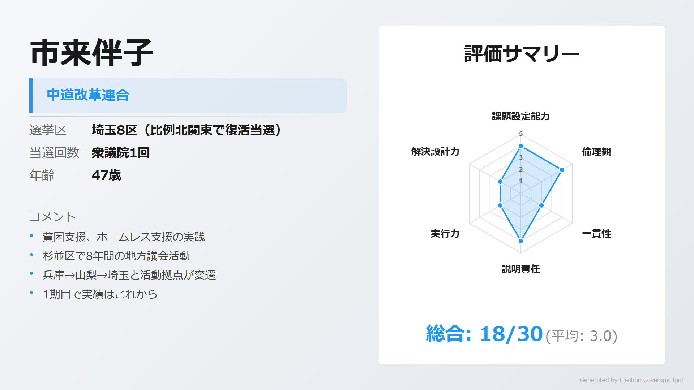

> **ウサギ**: 「貧困支援・ホームレス支援の現場経験。杉並区議8年間の地方議会経験」

> **ネコ**: 「選挙区の移動が多い（兵庫→山梨→埼玉）。複数回の落選を経ての当選で実績はこれから」

[詳細を見る](https://github.com/estela-works/poliscore2026-/blob/main/result/11_埼玉県/08区/市来伴子.md)

#### 岡田静佳（無所属）

<!-- NOTE: 8区 候補者3 画像 -->
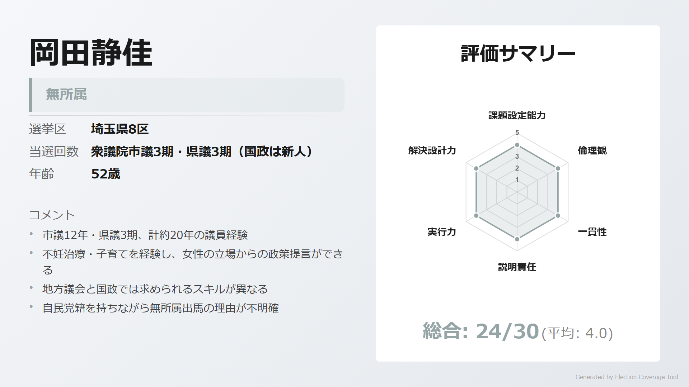

> **ウサギ**: 「所沢市議3期連続トップ当選、県議3期。西埼玉中央病院の産科復活を実現した実績」

> **ネコ**: 「国政経験なし。自民党籍を持ちながら無所属出馬の理由が不明確」

[詳細を見る](https://github.com/estela-works/poliscore2026-/blob/main/result/11_埼玉県/08区/岡田静佳.md)

---

## 9区

### 注目ポイント

- **裏金994万円の元安保委員長**: 大塚拓（自民・元5期）が裏金問題で2024年落選、政倫審拒否で批判
- **テレビマンの初当選**: 日本テレビ出身の杉村慎治（中道改革連合・1期）が15年ぶりの非自民当選

### 候補者

#### 杉村慎治（中道改革連合）

<!-- NOTE: 9区 候補者1 画像 -->
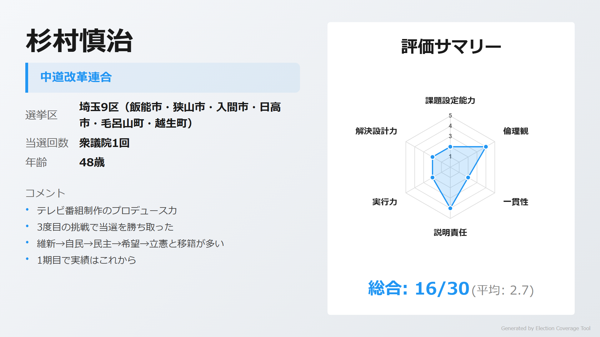

> **ウサギ**: 「日本テレビでの番組制作経験、分かりやすい伝え方に長けている。3度目の挑戦で初当選」

> **ネコ**: 「政党遍歴が多い（維新→自民秘書→民主→希望→立憲）。国政経験1期目で実績はこれから」

[詳細を見る](https://github.com/estela-works/poliscore2026-/blob/main/result/11_埼玉県/09区/杉村慎治.md)

#### 大塚拓（自由民主党）

<!-- NOTE: 9区 候補者2 画像 -->
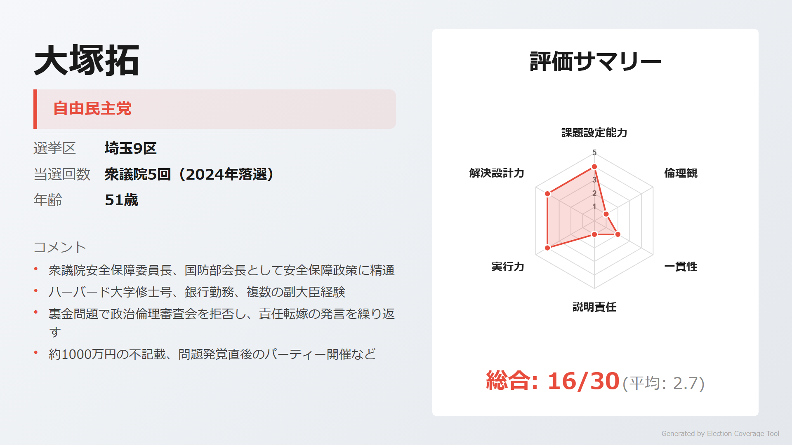

> **ウサギ**: 「安全保障委員長として安保政策に精通。ハーバード大学修士号、財務副大臣など要職を歴任」

> **ネコ**: 「裏金994万円で処分、政倫審への出席拒否。問題発覚直後のパーティー開催など倫理感覚の欠如」

[詳細を見る](https://github.com/estela-works/poliscore2026-/blob/main/result/11_埼玉県/09区/大塚拓.md)

---

## 10区

### 注目ポイント

- **元市長vs世襲議員**: 坂本祐之輔（中道改革連合・4期）は東松山市長4期の行政経験者
- **不同意わいせつ疑惑**: 山口晋（自民・元1期）は書類送検され2024年落選

### 候補者

#### 坂本祐之輔（中道改革連合）

<!-- NOTE: 10区 候補者1 画像 -->
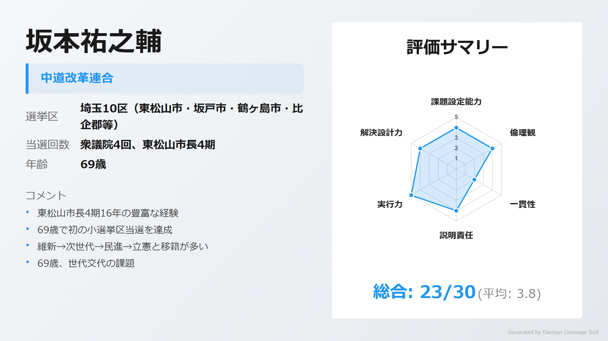

> **ウサギ**: 「東松山市長4期16年の豊富な行政経験。69歳で初の小選挙区当選を達成した粘り強さ」

> **ネコ**: 「政党遍歴が多い（維新→次世代→民進→立憲）。維新から立憲への移籍は政策路線の転換」

[詳細を見る](https://github.com/estela-works/poliscore2026-/blob/main/result/11_埼玉県/10区/坂本祐之輔.md)

#### 山口晋（自由民主党）

<!-- NOTE: 10区 候補者2 画像 -->

> **ウサギ**: 「一橋大学、シンガポール大学の公共政策大学院修了。東南アジアへの国際経験」

> **ネコ**: 「不同意わいせつ疑惑で書類送検（不起訴）。公選法違反疑惑で検察審査会が『不起訴不当』と議決」

[詳細を見る](https://github.com/estela-works/poliscore2026-/blob/main/result/11_埼玉県/10区/山口晋.md)

---

## 11区

### 注目ポイント

- **元法務大臣の地盤**: 小泉龍司（自民・8期）は埼玉県で最も自民党が強い選挙区で圧倒的な強さ
- **裏金問題への対応**: 二階派からのキックバックを認め、派閥退会届を提出

### 候補者

#### 小泉龍司（自由民主党）

<!-- NOTE: 11区 候補者1 画像 -->
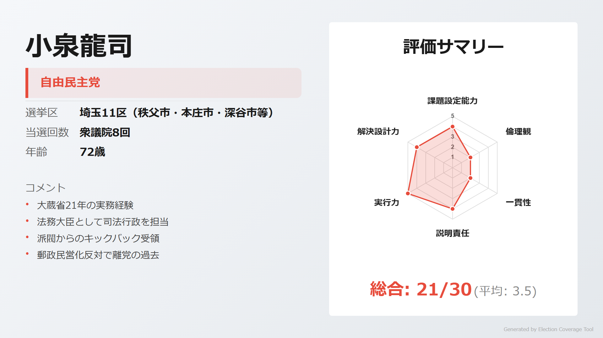

> **ウサギ**: 「大蔵官僚21年の行政経験。法務大臣として司法行政を担当、選挙に圧倒的に強い」

> **ネコ**: 「裏金問題（二階派からのキックバック）。郵政民営化反対で離党後に復党という経緯」

[詳細を見る](https://github.com/estela-works/poliscore2026-/blob/main/result/11_埼玉県/11区/小泉龍司.md)

#### 島田誠（中道改革連合）

<!-- NOTE: 11区 候補者2 画像 -->
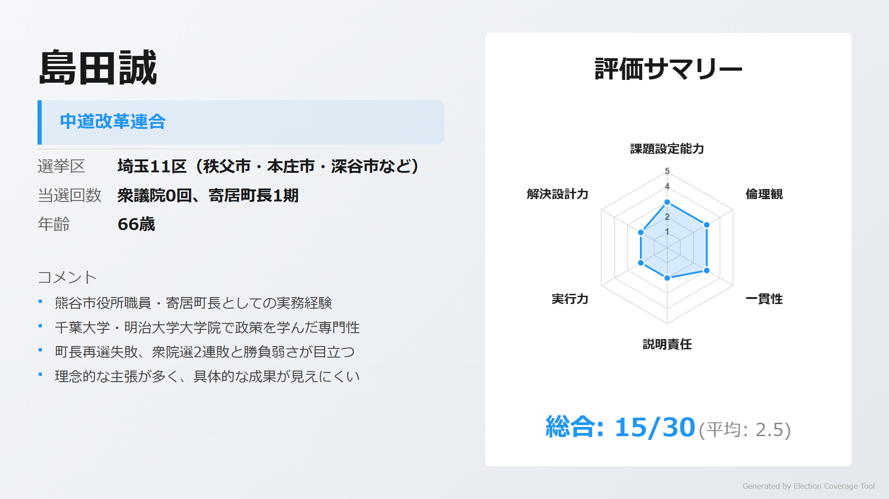

> **ウサギ**: 「熊谷市役所・寄居町長経験。千葉大学・明治大学大学院で政策を学んだ専門性」

> **ネコ**: 「町長再選失敗、衆院選2連敗と勝負弱さが目立つ。政策が抽象的で具体的成果が見えにくい」

[詳細を見る](https://github.com/estela-works/poliscore2026-/blob/main/result/11_埼玉県/11区/島田誠.md)

#### 柿沼遥輝（日本共産党）

<!-- NOTE: 11区 候補者3 画像 -->
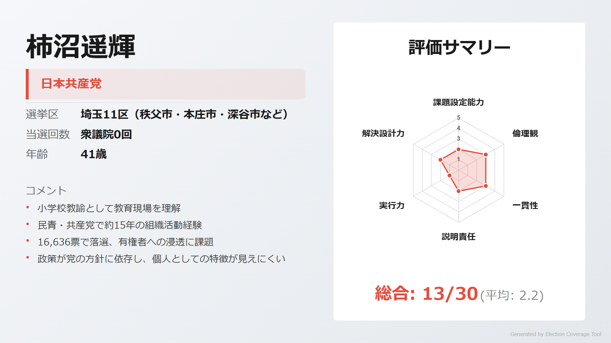

> **ウサギ**: 「元小学校教諭で教育現場を理解。41歳と比較的若い世代の候補者」

> **ネコ**: 「2024年衆院選で落選（得票16,636票）。政策が党方針に依存し個人の特徴が見えにくい」

[詳細を見る](https://github.com/estela-works/poliscore2026-/blob/main/result/11_埼玉県/11区/柿沼遥輝.md)

#### 布施卓人（国民民主党）

<!-- NOTE: 11区 候補者4 画像 -->
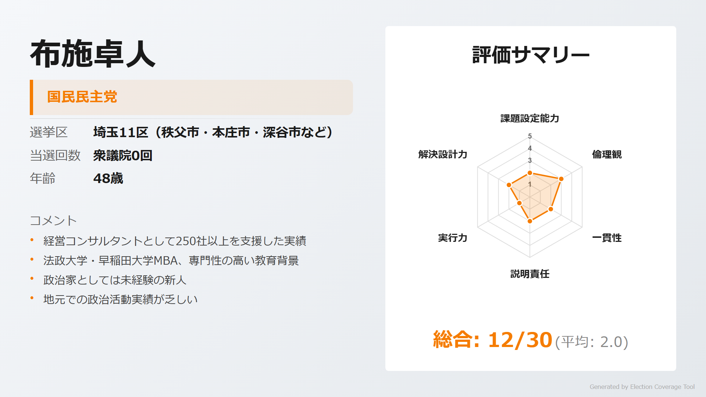

> **ウサギ**: 「経営コンサルタントとして250社以上を支援。早稲田MBA取得、40カ国以上の訪問経験」

> **ネコ**: 「政治家としては未経験の新人。地元での政治活動実績が乏しく、知名度向上が課題」

[詳細を見る](https://github.com/estela-works/poliscore2026-/blob/main/result/11_埼玉県/11区/布施卓人.md)

#### 甲斐隆（参政党）

<!-- NOTE: 11区 候補者5 画像 -->
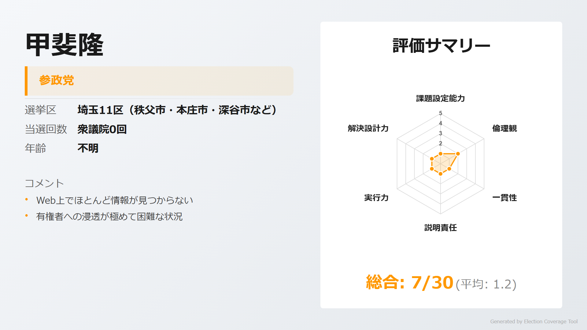

> **ウサギ**: 「参政党から新人として挑戦。既存政党とは異なる政治参加を目指す」

> **ネコ**: 「公開情報が極めて限定的で経歴・政策が不明。有権者が判断する材料に乏しい」

[詳細を見る](https://github.com/estela-works/poliscore2026-/blob/main/result/11_埼玉県/11区/甲斐隆.md)

---

## 12区

### 注目ポイント

- **介護事業経営者vs農政のスペシャリスト**: 現場経験を持つ両候補の対決
- **森田俊和2連勝**: 野中厚（自民・5期）との対決で2連勝中

### 候補者

#### 森田俊和（中道改革連合）

<!-- NOTE: 12区 候補者1 画像 -->
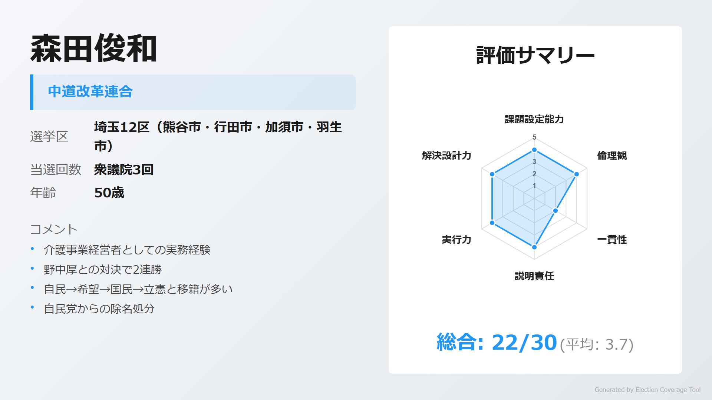

> **ウサギ**: 「介護事業経営者として高齢化社会の現場を知る。野中厚との対決で2連勝の選挙力」

> **ネコ**: 「政党遍歴が多い（自民会派→除名→希望→国民→立憲）。自民支部長公募落選後に野党から出馬」

[詳細を見る](https://github.com/estela-works/poliscore2026-/blob/main/result/11_埼玉県/12区/森田俊和.md)

#### 野中厚（自由民主党）

<!-- NOTE: 12区 候補者2 画像 -->
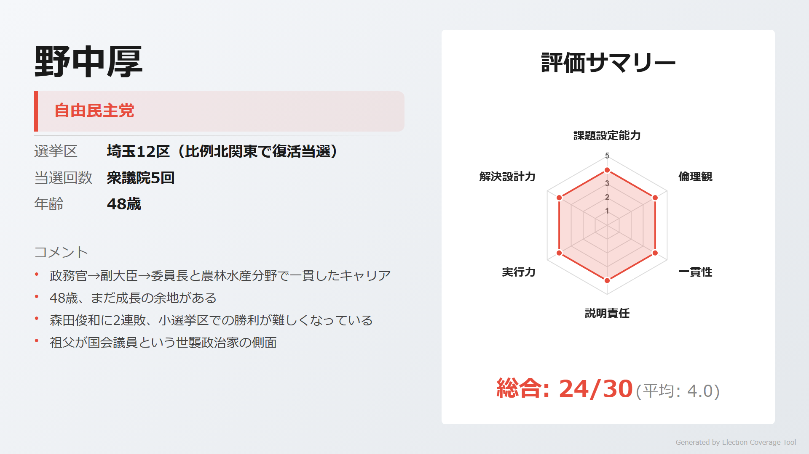

> **ウサギ**: 「農林水産分野のスペシャリスト。政務官→副大臣→委員長と着実にキャリアを積む」

> **ネコ**: 「森田俊和に2連敗。小選挙区での勝利が難しくなっており、2024年も比例復活」

[詳細を見る](https://github.com/estela-works/poliscore2026-/blob/main/result/11_埼玉県/12区/野中厚.md)

---

## 13区

### 注目ポイント

- **29歳の防衛大卒が裏金議員を撃破**: 橋本幹彦（国民民主党・1期）が三ッ林裕巳を破り初当選
- **国会最若手の一人**: 自衛隊幹部出身で安全保障に詳しい若手のホープ

### 候補者

#### 橋本幹彦（国民民主党）

<!-- NOTE: 13区 候補者1 画像 -->
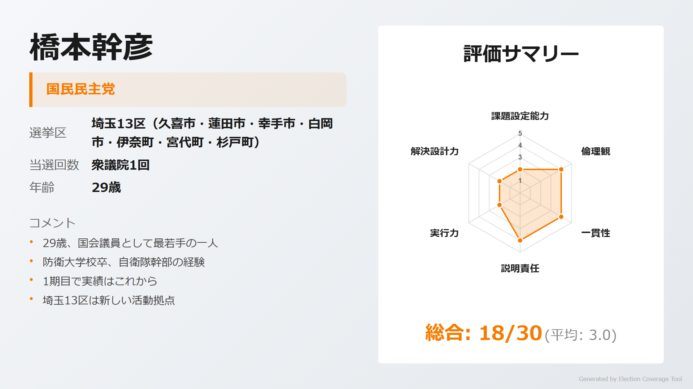

> **ウサギ**: 「29歳で国会議員最若手の一人。防衛大学校卒、自衛隊幹部経験で安全保障に精通」

> **ネコ**: 「国政経験1期目で実績はこれから。安全保障以外の政策分野での専門性は未知数」

[詳細を見る](https://github.com/estela-works/poliscore2026-/blob/main/result/11_埼玉県/13区/橋本幹彦.md)

#### 三ッ林裕巳（無所属・自由民主党系）

<!-- NOTE: 13区 候補者2 画像 -->

> **ウサギ**: 「医学教授・病院副院長の専門性。内閣府副大臣、厚労委員長を歴任」

> **ネコ**: 「裏金2954万円で処分、非公認。2024年衆院選で落選、『裏公認』と批判される」

[詳細を見る](https://github.com/estela-works/poliscore2026-/blob/main/result/11_埼玉県/13区/三ッ林裕巳.md)

#### 高井崇志（れいわ新選組）

<!-- NOTE: 13区 候補者3 画像 -->

> **ウサギ**: 「元郵政省官僚で情報通信政策に精通。れいわ新選組幹事長として党運営を担う」

> **ネコ**: 「2020年緊急事態宣言中のセクキャバ訪問で立憲除籍。政党遍歴が多い（民主→維新→立憲→れいわ）」

[詳細を見る](https://github.com/estela-works/poliscore2026-/blob/main/result/11_埼玉県/13区/高井崇志.md)

#### 沢口千枝子（日本共産党）

<!-- NOTE: 13区 候補者4 画像 -->
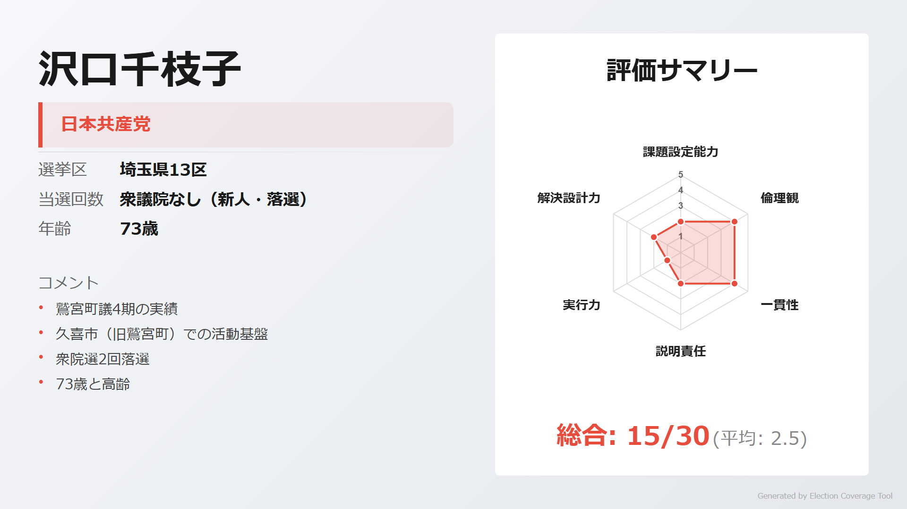

> **ウサギ**: 「鷲宮町議4期の実績。24年間にわたり衆院選への挑戦を継続する粘り強さ」

> **ネコ**: 「衆院選2回落選、73歳と高齢。2024年選挙での得票17,099票は6候補中5位」

[詳細を見る](https://github.com/estela-works/poliscore2026-/blob/main/result/11_埼玉県/13区/沢口千枝子.md)

---

## 14区

### 注目ポイント

- **公明党代表を撃破した大金星**: 鈴木義弘（国民民主党・4期）が石井啓一代表を1万票差で破る
- **「アリさんが象を倒した」**: 長年比例復活だった鈴木が公明党の牙城を崩した歴史的勝利

### 候補者

#### 鈴木義弘（国民民主党）

<!-- NOTE: 14区 候補者1 画像 -->
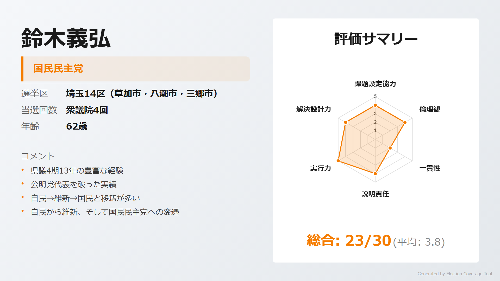

> **ウサギ**: 「県議4期13年の豊富な経験。決算行政監視委員長として行政チェック、公明党代表を撃破」

> **ネコ**: 「政党遍歴が多い（自民→維新→次世代→無所属→国民）。自民県連青年部長から維新への転身」

[詳細を見る](https://github.com/estela-works/poliscore2026-/blob/main/result/11_埼玉県/14区/鈴木義弘.md)

#### 藤田誠（自由民主党）

<!-- NOTE: 14区 候補者2 画像 -->
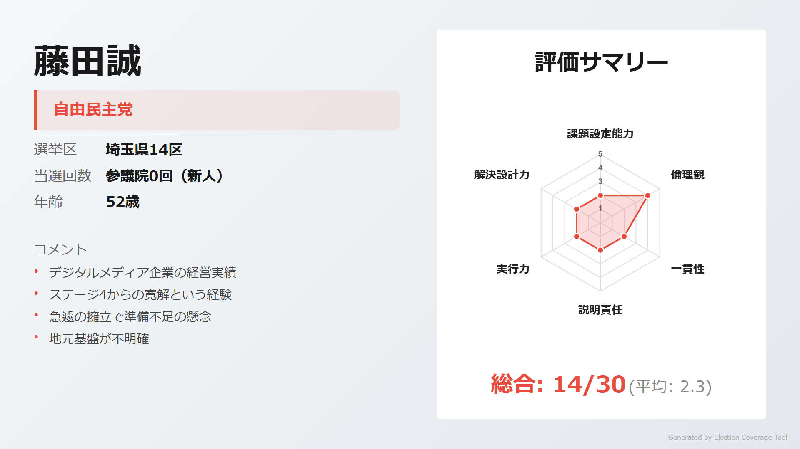

> **ウサギ**: 「デジタルメディア企業経営者。ステージ4の悪性リンパ腫を克服した経験を持つ」

> **ネコ**: 「政治経験ゼロ。公明党撤退による急遽の擁立で準備期間が短く、地元基盤も不明確」

[詳細を見る](https://github.com/estela-works/poliscore2026-/blob/main/result/11_埼玉県/14区/藤田誠.md)

#### 雨宮裕子（参政党）

<!-- NOTE: 14区 候補者3 画像 -->
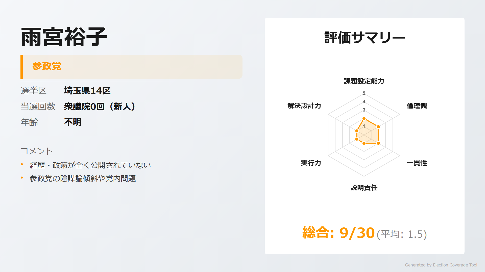

> **ウサギ**: 「参政党から新人として挑戦。既存政党とは異なる政治参加を目指す」

> **ネコ**: 「経歴・政策の公開情報が極めて乏しい。有権者が判断する材料がない状況」

[詳細を見る](https://github.com/estela-works/poliscore2026-/blob/main/result/11_埼玉県/14区/雨宮裕子.md)

#### 苗村京子（日本共産党）

<!-- NOTE: 14区 候補者4 画像 -->
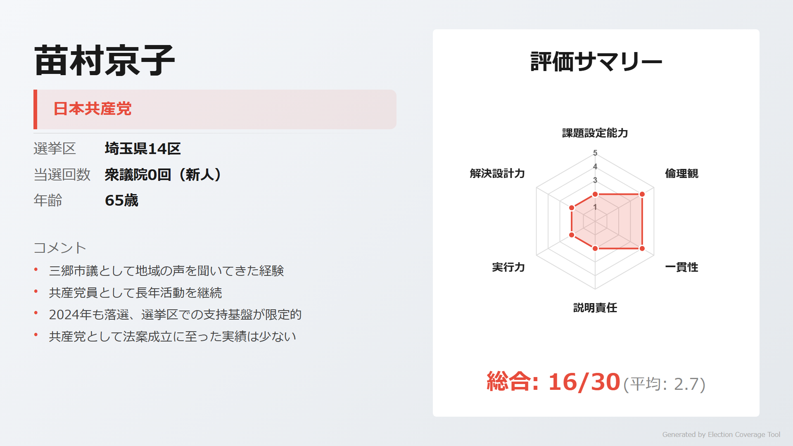

> **ウサギ**: 「元三郷市議。共産党員として長年活動を継続、2024年落選後も再挑戦する姿勢」

> **ネコ**: 「2024年衆院選も落選、選挙区での支持基盤が限定的。約18,000票にとどまる」

[詳細を見る](https://github.com/estela-works/poliscore2026-/blob/main/result/11_埼玉県/14区/苗村京子.md)

---

## 15区

### 注目ポイント

- **無派閥の自民ベテラン**: 田中良生（自民・6期）は一貫して無派閥を貫く
- **新人の挑戦**: おやまだ経子（中道改革連合）が挑戦

### 候補者

#### 田中良生（自由民主党）

<!-- NOTE: 15区 候補者1 画像 -->
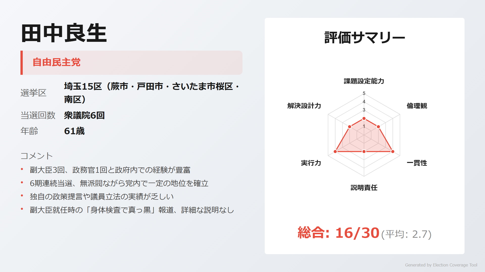

> **ウサギ**: 「6期連続当選、副大臣3回の実務経験。無派閥を貫きながら党筆頭副幹事長に就任した実力派」

> **ネコ**: 「独自の政策提言や議員立法の実績が乏しい。副大臣就任時の『身体検査で真っ黒』報道の説明もない」

[詳細を見る](https://github.com/estela-works/poliscore2026-/blob/main/result/11_埼玉県/15区/田中良生.md)

#### おやまだ経子（中道改革連合）

<!-- NOTE: 15区 候補者2 画像 -->
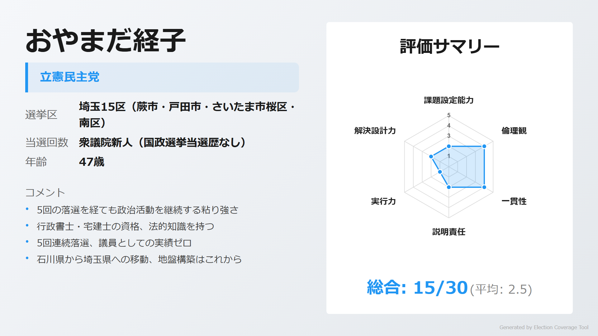

> **ウサギ**: 「5回落選しても挑戦を続ける粘り強さ。行政書士・宅建士の資格を持ち、自死遺族としての経験から福祉政策に強い関心」

> **ネコ**: 「国政選挙5回連続落選。石川から埼玉への選挙区移動で地盤構築はこれから、議員実績ゼロ」

[詳細を見る](https://github.com/estela-works/poliscore2026-/blob/main/result/11_埼玉県/15区/おやまだ経子.md)

---

## 16区

### 注目ポイント

- **女性初の復興大臣**: 土屋品子（自民・9期）は父から地盤を継承した世襲議員
- **若手の挑戦**: 三角そうた（中道改革連合・前職）が38歳で戦う
- **共産党新人参戦**: ながほり健が初挑戦

### 候補者

#### 土屋品子（自由民主党）

<!-- NOTE: 16区 候補者1 画像 -->
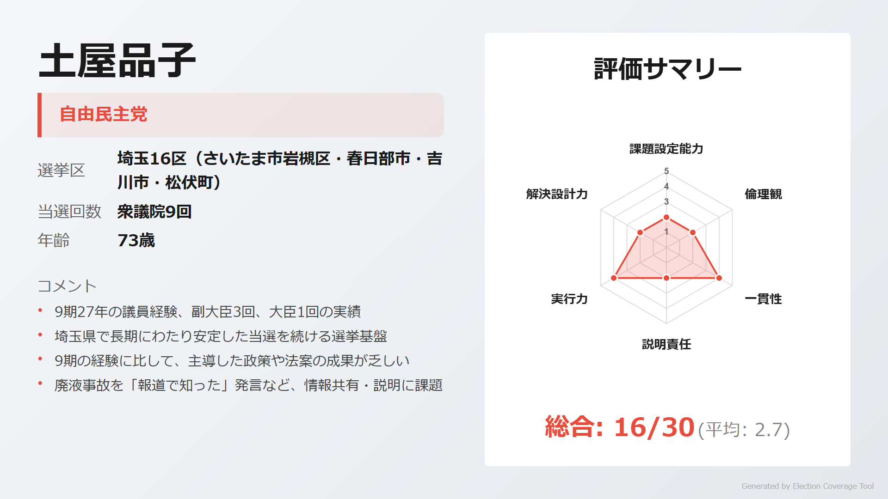

> **ウサギ**: 「9期27年の議員経験、副大臣3回・大臣1回。女性初の復興大臣として象徴的な存在」

> **ネコ**: 「9期の経験に比して主導した政策や法案の成果が乏しい。廃液事故を『報道で知った』発言など説明責任に課題」

[詳細を見る](https://github.com/estela-works/poliscore2026-/blob/main/result/11_埼玉県/16区/土屋品子.md)

#### 三角そうた（中道改革連合）

<!-- NOTE: 16区 候補者2 画像 -->

> **ウサギ**: 「公認会計士・税理士・証券アナリストの資格持ち。三菱東京UFJ銀行出身、8年の浪人を経て37歳で初当選」

> **ネコ**: 「民主→希望→立憲→中道改革連合と政党移籍が多い。選挙区では3回連続敗北、比例復活での当選」

[詳細を見る](https://github.com/estela-works/poliscore2026-/blob/main/result/11_埼玉県/16区/三角そうた.md)

#### ながほり健（日本共産党）

<!-- NOTE: 16区 候補者3 画像 -->

> **ウサギ**: 「地区委員会常任委員として継続的に党活動に貢献。共産党の明確な政策に沿った立場、企業献金を受けないクリーンさ」

> **ネコ**: 「2024年衆院選で得票率7.2%と低迷。経歴や具体的な活動実績の公開情報が乏しく、知名度も限定的」

[詳細を見る](https://github.com/estela-works/poliscore2026-/blob/main/result/11_埼玉県/16区/ながほり健.md)

---

## 情報ソース

本記事の評価データは以下のリポジトリで公開しています。評価基準・根拠の詳細をご確認いただけます。

**GitHub**: https://github.com/estela-works/poliscore2026-

- 評価基準: https://github.com/estela-works/poliscore2026-/blob/main/data/politician_evaluation_criteria.md
- 各候補者の評価詳細: https://github.com/estela-works/poliscore2026-/tree/main/result/11_埼玉県
